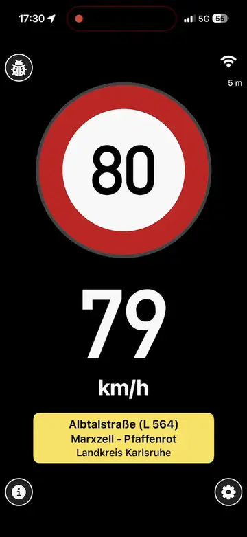
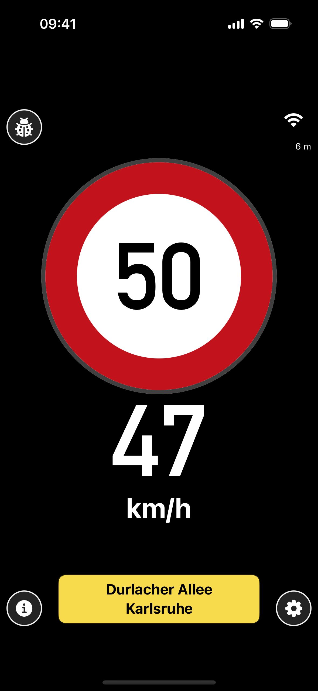
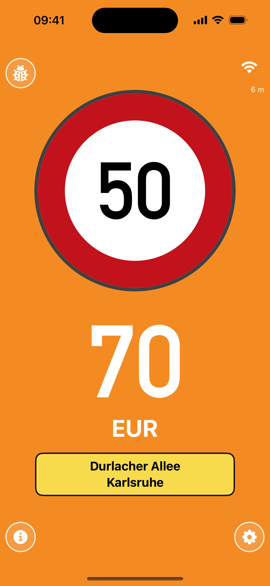
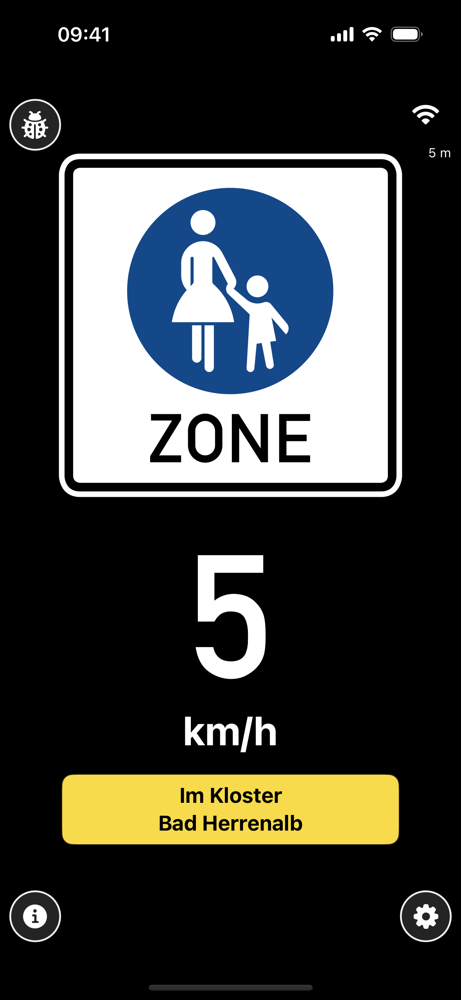
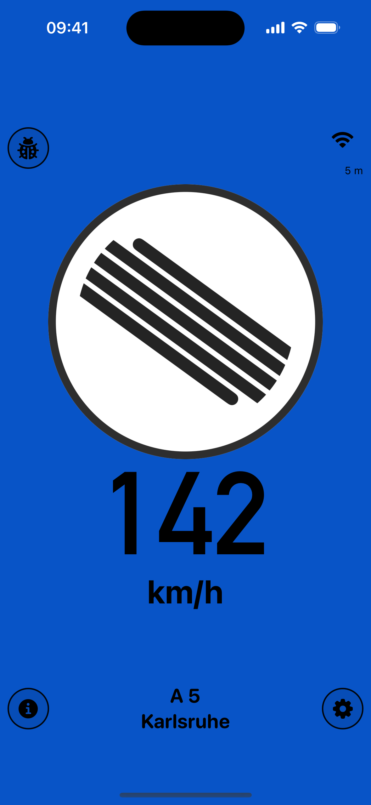
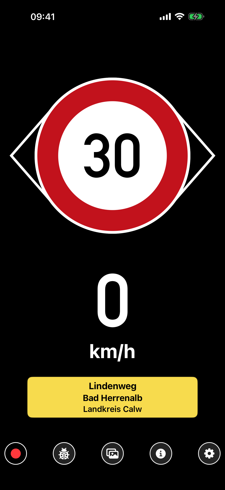
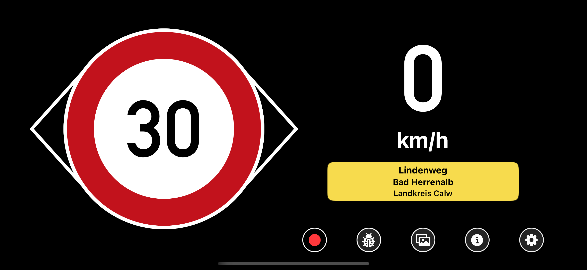

# YouSpeed

YouSpeed is an open-source, offline-first intelligent speed-assistance app for iPhone and Android. It matches the phone's location to OpenStreetMap-derived road data, shows the applicable speed limit, and can warn when the vehicle is travelling too fast. YouSpeed is an advisory aid: road signs and traffic rules always take precedence. 


**Public launch: 29 August 2026 15:40 as part of State of the map conference, Paris, France**


## Demo



## Recent development status

The September 2026 development builds extend the map-matching speed display
with a shared, feature-neutral rear-camera session on iPhone and Android:

- **On-device traffic-sign recognition:** opt-in live recognition uses Core ML
  on iPhone and LiteRT with CameraX on Android. A detector/classifier pipeline
  combines candidate bursts over time and only a validated sign passage may
  affect the active speed context. The current field-test pack is
  Germany-first and focused on primary speed-relevant signs; supplementary
  plates are not interpreted in live inference and town-entry recognition is
  still limited. Ordinary recognition keeps no frame stream and sends no video
  or inference to the cloud. See the [TSR contracts](shared/tsr/README.md) and
  [implementation specification](docs/VIDEO_TRAFFIC_SIGN_RECOGNITION_YOLO_SPEC.md).
- **Screenshots:** the public screenshot sets now cover safe-speed, fine,
  points, driving-ban, pedestrian-zone, and autobahn states in multiple
  locales. They are generated from reproducible simulator/emulator fixtures;
  see the [Android listing assets](store/android/listing/en-US/phone-screenshots/),
  [iPhone listing assets](store/apple/screenshots/en-US/iphone-6.9/),
  [`android/scripts/recreate_store_screenshots.sh`](android/scripts/recreate_store_screenshots.sh),
  and [`scripts/iphone/recreate_store_screenshots.sh`](scripts/iphone/recreate_store_screenshots.sh).
- **Dashcam:** the same camera session can independently provide an explicit,
  local-only dashcam recording, live preview, TSR frames, and Panoramax stills.
  Recordings are playable, shareable, and deletable from the local library;
  storage is capped at 5 GB per movie and 10 GB for the library. Controls wait
  for successful video finalization before navigating or changing state.
- **Panoramax upload:** distance- or time-sampled JPEGs are kept in a durable
  local review queue with GPS metadata, optional altitude/course, and sign annotations. Users can
  favorite, include or exclude, and inspect originals before explicitly
  approving a batch for upload to the [YouSpeed Panoramax instance](https://panoramax.youspeed.de/).
  Uploads support progress, cancellation, resumption, and server-processing
  completion tracking. Upload never starts during or automatically after a
  drive, and local images are retained unless the user enables cleanup after
  successful remote completion. See the [Panoramax client contract](shared/PanoramaxUploadProtocol.md).

<table>
  <tr>
    <td></td>
    <td></td>
    <td></td>
    <td></td>
  </tr>
</table>

### On-device TSR

These screenshots show the camera-derived speed-limit state from the shared
`camera-limit-active` fixture. The eye-shaped marker identifies the camera
source around the active 30 km/h sign; the fixture is deterministic UI evidence
and does not retain or publish a camera frame.

<table>
  <tr>
    <td></td>
    <td></td>
  </tr>
</table>


## Get YouSpeed

- [Google Play](https://play.google.com/store/apps/details?id=de.youspeed.android)
- [iPhone on the App Store](https://apps.apple.com/de/app/youspeed-de/id6787469256)

Scan to download the app or open its source code:

<table>
  <tr>
    <th width="33%">Android (Google Play)</th>
    <th width="34%">Apple iPhone (App Store)</th>
    <th width="33%">this.repo</th>
  </tr>
  <tr>
    <td align="center"><a href="https://play.google.com/store/apps/details?id=de.youspeed.android"></a></td>
    <td align="center"><a href="https://apps.apple.com/de/app/youspeed-de/id6787469256"></a></td>
    <td align="center"><a href="https://github.com/volzinnovation/youspeed.de"></a></td>
  </tr>
</table>

All help welcome, contact [Raphael Volz on GitHub](https://github.com/volzinnovation). 

Just want to use it?  Learn more at [**Visit youspeed.de**](https://youspeed.de/)

User guides: [English](docs/USER_GUIDE.md) · [Deutsch](docs/USER_GUIDE_DE.md) · [Français](docs/USER_GUIDE_FR.md) · [Nederlands](docs/USER_GUIDE_NL.md)


The mobile apps perform matching and warning logic on the device. Map bundles are downloaded from public GitHub releases and checked against their published metadata. No account or client-side GitHub credential is required.

## Repository contents

- [`iphone/`](iphone/): iPhone app, tests, and Xcode project
- [`android/`](android/): Android app, tests, and Gradle project
- [`scripts/map/`](scripts/map/): OpenStreetMap bundle builders, validators, and release helpers
- [`mapdata/`](mapdata/): map-data formats, lightweight fixtures, and reproducibility metadata
- [`inspector/`](inspector/): local matcher and log-inspection tools
- [`Web/`](Web/): source for the public website
- [`sites/`](sites/): generated static website published by GitHub Pages
- [`docs/`](docs/): technical and release documentation

## Scientific paper 
Read the [youspeed.de paper](https://zenodo.org/records/21626565) for a high-level technical description.

## Build and test

Common prerequisites are Python 3, SQLite, `jq`, Git, and optionally `osmium-tool`/`pyosmium` for map processing. The iPhone app requires Xcode 16 or newer. The Android app requires Java 17 and an Android SDK.

Android:

```bash
cd android
./gradlew :app:testDebugUnitTest :app:assembleDebug
```

iPhone simulator:

```bash
./scripts/iphone/build_consumer_app.sh
xcodebuild test \
  -project iphone/SpeedDBBench.xcodeproj \
  -scheme SpeedConsumer \
  -destination 'platform=iOS Simulator,name=iPhone 16'
```

See [`android/README.md`](android/README.md), [`iphone/SpeedConsumerApp/README.md`](iphone/SpeedConsumerApp/README.md), and [`docs/README.md`](docs/README.md) for details.

## Privacy and safety

YouSpeed is designed to keep driving data local. Exports and diagnostics are explicit user actions, and local recordings and build products are excluded from version control. The apps must not embed repository credentials or private release tokens.

The software is provided without warranty and does not replace attentive driving, posted signs, or applicable law. See [`LICENSE`](LICENSE), [`SECURITY.md`](SECURITY.md), and the in-app legal and privacy information.

## Traffic-sign model attribution

The current two-stage traffic-sign recognition field-test pack uses these
off-the-shelf Panoramax components:

- Detector: [`models/yolo11n_panoramax.pt`](https://github.com/cquest/sgblur/blob/169451970702aca0dde9ff3106dba0f67e0b88a8/models/yolo11n_panoramax.pt) from [`cquest/sgblur`](https://github.com/cquest/sgblur/tree/169451970702aca0dde9ff3106dba0f67e0b88a8), pinned to commit `169451970702aca0dde9ff3106dba0f67e0b88a8` and provided under the [MIT License](https://github.com/cquest/sgblur/blob/169451970702aca0dde9ff3106dba0f67e0b88a8/LICENSE).
- Classifier: [`Panoramax/classify_de_road_signs`](https://huggingface.co/Panoramax/classify_de_road_signs/tree/5360aa6f4ef6c7b1998044b18d00b4d0b1a5a790), pinned to commit `5360aa6f4ef6c7b1998044b18d00b4d0b1a5a790`; its [model card](https://huggingface.co/Panoramax/classify_de_road_signs/blob/5360aa6f4ef6c7b1998044b18d00b4d0b1a5a790/README.md) declares the Etalab Open License 2.0. It was trained from [`Panoramax/classified_de_road_signs`](https://huggingface.co/datasets/Panoramax/classified_de_road_signs/tree/b4856947ed7cb6312587258acc90e8cf88a4aa13), pinned to commit `b4856947ed7cb6312587258acc90e8cf88a4aa13` and published under CC BY-SA 4.0.
- Model architecture and conversion stack: [`ultralytics`](https://github.com/ultralytics/ultralytics/tree/v8.4.56) 8.4.56 under AGPL-3.0 supplies the YOLO architecture and export tooling; [`coremltools`](https://github.com/apple/coremltools/tree/9.0) 9.0 and [`PyTorch`](https://github.com/pytorch/pytorch/tree/v2.13.0) 2.13.0, both under BSD-3-Clause, were also used to create the bundled Core ML artifacts.
- Test frames: Panoramax pictures [`0906fc23-7175-430e-acc0-106e7d45eca7`](https://panoramax.openstreetmap.fr/?background=streets&focus=pic&map=17/48.779997/8.402469&pic=0906fc23-7175-430e-acc0-106e7d45eca7&seq=f2266cf8-eb84-4ff8-990e-133edb8b9e4c) and [`49e25e66-1614-44c0-96bb-d7fb6faa74b1`](https://panoramax.openstreetmap.fr/?s=fp;s2;p49e25e66-1614-44c0-96bb-d7fb6faa74b1;c184.00/0.00/30;m17/48.780303/8.402511;vd;bs;udefault) from sequence `f2266cf8-eb84-4ff8-990e-133edb8b9e4c`, published by “youspeed DOT de - mapping speed limits” under CC BY-SA 4.0.

Both mobile apps expose **Info → Sources and credits**, including each sign image's author, permanent source page, licence basis and changes. The [shared attribution catalog](shared/attributions/README.md) also covers map and rule sources, model provenance, fonts, runtime libraries and conversion tools. Full notices are readable offline, including the existing [model-pack licences](iphone/SpeedConsumerApp/TSRModelPacks/DE.panoramax-bootstrap.tsrmodelpack/THIRD_PARTY_NOTICES.txt) and the [shared notices](shared/attributions/THIRD_PARTY_NOTICES.txt).

The [2026-09-10 source audit](docs/license-audit-2026-09-10/README.md) records the verified artwork declarations, corrected mapping provenance and the remaining model-release licence review items.

## Contributing

Keep changes focused, add or update tests for behavioural changes, and do not commit generated builds, credentials, precise personal traces, or local machine configuration. Before opening a change, run the relevant platform tests and `git diff --check`.

## Map bundles

The following map bundles are available from their continuously updated [GitHub releases](https://github.com/volzinnovation/youspeed.de/releases). Each link opens the latest release for that bundle.

- [Belgium](https://github.com/volzinnovation/youspeed.de/releases/tag/belgium)
- France
  - [Alsace](https://github.com/volzinnovation/youspeed.de/releases/tag/alsace)
  - [Aquitaine](https://github.com/volzinnovation/youspeed.de/releases/tag/aquitaine)
  - [Auvergne](https://github.com/volzinnovation/youspeed.de/releases/tag/auvergne)
  - [Basse-Normandie](https://github.com/volzinnovation/youspeed.de/releases/tag/basse-normandie)
  - [Bourgogne](https://github.com/volzinnovation/youspeed.de/releases/tag/bourgogne)
  - [Bretagne](https://github.com/volzinnovation/youspeed.de/releases/tag/bretagne)
  - [Centre](https://github.com/volzinnovation/youspeed.de/releases/tag/centre)
  - [Champagne Ardenne](https://github.com/volzinnovation/youspeed.de/releases/tag/champagne-ardenne)
  - [Corse](https://github.com/volzinnovation/youspeed.de/releases/tag/corse)
  - [Franche Comte](https://github.com/volzinnovation/youspeed.de/releases/tag/franche-comte)
  - [Guadeloupe](https://github.com/volzinnovation/youspeed.de/releases/tag/guadeloupe)
  - [Haute-Normandie](https://github.com/volzinnovation/youspeed.de/releases/tag/haute-normandie)
  - [Ile-de-France](https://github.com/volzinnovation/youspeed.de/releases/tag/ile-de-france)
  - [Languedoc-Roussillon](https://github.com/volzinnovation/youspeed.de/releases/tag/languedoc-roussillon)
  - [Limousin](https://github.com/volzinnovation/youspeed.de/releases/tag/limousin)
  - [Lorraine](https://github.com/volzinnovation/youspeed.de/releases/tag/lorraine)
  - [Martinique](https://github.com/volzinnovation/youspeed.de/releases/tag/martinique)
  - [Mayotte](https://github.com/volzinnovation/youspeed.de/releases/tag/mayotte)
  - [Midi-Pyrenees](https://github.com/volzinnovation/youspeed.de/releases/tag/midi-pyrenees)
  - [Nord-Pas-de-Calais](https://github.com/volzinnovation/youspeed.de/releases/tag/nord-pas-de-calais)
  - [Pays de la Loire](https://github.com/volzinnovation/youspeed.de/releases/tag/pays-de-la-loire)
  - [Picardie](https://github.com/volzinnovation/youspeed.de/releases/tag/picardie)
  - [Poitou-Charentes](https://github.com/volzinnovation/youspeed.de/releases/tag/poitou-charentes)
  - [Provence Alpes-Cote-d'Azur](https://github.com/volzinnovation/youspeed.de/releases/tag/provence-alpes-cote-d-azur)
  - [Reunion](https://github.com/volzinnovation/youspeed.de/releases/tag/reunion)
  - [Rhone-Alpes](https://github.com/volzinnovation/youspeed.de/releases/tag/rhone-alpes)
- Germany
  - [Baden-Württemberg](https://github.com/volzinnovation/youspeed.de/releases/tag/baden-wuerttemberg)
  - [Bayern](https://github.com/volzinnovation/youspeed.de/releases/tag/bayern)
  - [Berlin](https://github.com/volzinnovation/youspeed.de/releases/tag/berlin)
  - [Brandenburg (including Berlin)](https://github.com/volzinnovation/youspeed.de/releases/tag/brandenburg)
  - [Bremen](https://github.com/volzinnovation/youspeed.de/releases/tag/bremen)
  - [Hamburg](https://github.com/volzinnovation/youspeed.de/releases/tag/hamburg)
  - [Hessen](https://github.com/volzinnovation/youspeed.de/releases/tag/hessen)
  - [Mecklenburg-Vorpommern](https://github.com/volzinnovation/youspeed.de/releases/tag/mecklenburg-vorpommern)
  - [Niedersachsen](https://github.com/volzinnovation/youspeed.de/releases/tag/niedersachsen)
  - [Nordrhein-Westfalen](https://github.com/volzinnovation/youspeed.de/releases/tag/nordrhein-westfalen)
  - [Rheinland-Pfalz](https://github.com/volzinnovation/youspeed.de/releases/tag/rheinland-pfalz)
  - [Saarland](https://github.com/volzinnovation/youspeed.de/releases/tag/saarland)
  - [Sachsen](https://github.com/volzinnovation/youspeed.de/releases/tag/sachsen)
  - [Sachsen-Anhalt](https://github.com/volzinnovation/youspeed.de/releases/tag/sachsen-anhalt)
  - [Schleswig-Holstein](https://github.com/volzinnovation/youspeed.de/releases/tag/schleswig-holstein)
  - [Thüringen](https://github.com/volzinnovation/youspeed.de/releases/tag/thueringen)
- [Iceland](https://github.com/volzinnovation/youspeed.de/releases/tag/iceland)
- [Liechtenstein](https://github.com/volzinnovation/youspeed.de/releases/tag/liechtenstein)
- [Luxembourg](https://github.com/volzinnovation/youspeed.de/releases/tag/luxembourg)
- [Monaco](https://github.com/volzinnovation/youspeed.de/releases/tag/monaco)
- [Netherlands](https://github.com/volzinnovation/youspeed.de/releases/tag/netherlands)
- [Romania](https://github.com/volzinnovation/youspeed.de/releases/tag/romania)
- [Sweden](https://github.com/volzinnovation/youspeed.de/releases/tag/sweden)
- [Switzerland](https://github.com/volzinnovation/youspeed.de/releases/tag/switzerland)

The bundle data is derived from [© OpenStreetMap contributors](https://www.openstreetmap.org/copyright) and is made available under the [Open Data Commons Open Database License (ODbL) 1.0](https://opendatacommons.org/licenses/odbl/1-0/).

### Max-speed provenance

The max-speed provenance tables from the paper shown below are a snapshot from 23 February 2026.


## Citation

BibTeX:

```bibtex
@Conference{volz_2026_21626565,
  author    = {Raphael Volz},
  title     = {youspeed.de - A system for Intelligent Speed Assistance (ISA) based on OpenStreetMap data},
  month     = aug,
  year      = {2026},
  booktitle = {Proceedings of OSM Science 2026},
  pages = {26-29},
  publisher = {Zenodo},
  organization = "OpenStreetMap",
  doi       = {10.5281/zenodo.21626565},
  url       = {https://doi.org/10.5281/zenodo.21626565}
}
```
