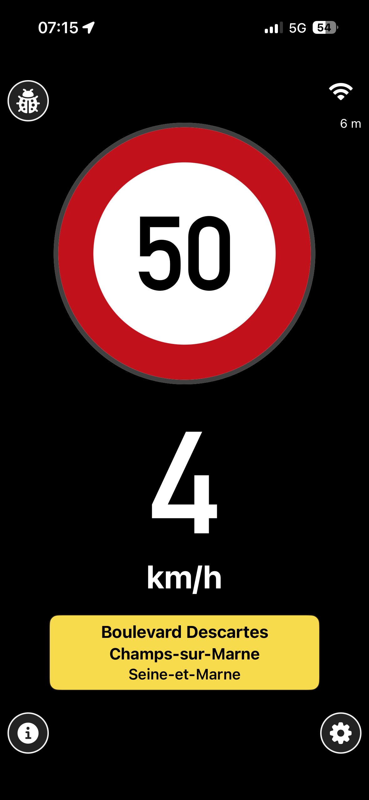
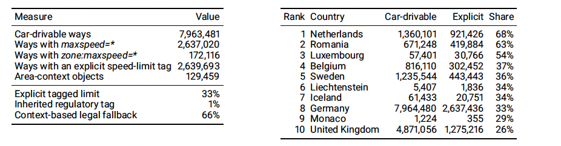

# YouSpeed

YouSpeed is an open-source, offline-first intelligent speed-assistance app for iPhone and Android. It matches the phone's location to OpenStreetMap-derived road data, shows the applicable speed limit, and can warn when the vehicle is travelling too fast. YouSpeed is an advisory aid: road signs and traffic rules always take precedence. 


**Public launch: 29 August 2026 15:40 as part of State of the map conference, Paris, France**




## Get YouSpeed

- [Google Play](https://play.google.com/store/apps/details?id=de.youspeed.android)
- [iPhone test on TestFlight](https://testflight.apple.com/join/k3a1pgce) (Apple App Store release pending review)

Scan to download the app or open its source code:

<table>
  <tr>
    <th width="33%">Android (Google Play)</th>
    <th width="34%">Apple iPhone (TestFlight)</th>
    <th width="33%">this.repo</th>
  </tr>
  <tr>
    <td align="center"><a href="https://play.google.com/store/apps/details?id=de.youspeed.android"></a></td>
    <td align="center"><a href="https://testflight.apple.com/join/k3a1pgce"></a></td>
    <td align="center"><a href="https://github.com/volzinnovation/youspeed.de"></a></td>
  </tr>
</table>

All help welcome, contact [Raphael Volz on GitHub](https://github.com/volzinnovation). 

Just want to use it?  Learn more at [**Visit youspeed.de**](https://youspeed.de/)


The mobile apps perform matching and warning logic on the device. Map bundles are downloaded from public GitHub releases and checked against their published metadata. No account or client-side GitHub credential is required.

## Repository contents

- [`iphone/`](iphone/): iPhone app, tests, and Xcode project
- [`android/`](android/): Android app, tests, and Gradle project
- [`scripts/map/`](scripts/map/): OpenStreetMap bundle builders, validators, and release helpers
- [`mapdata/`](mapdata/): map-data formats, lightweight fixtures, and reproducibility metadata
- [`inspector/`](inspector/): local matcher and log-inspection tools
- [`Web/`](Web/): source for the public website
- [`sites/`](sites/): generated static website published by GitHub Pages
- [`docs/`](docs/): technical and release documentation

Paper sources, submission material, and publication artifacts are maintained in the separate [youspeed.de-paper repository](https://github.com/volzinnovation/youspeed.de-paper).

## Build and test

Common prerequisites are Python 3, SQLite, `jq`, Git, and optionally `osmium-tool`/`pyosmium` for map processing. The iPhone app requires Xcode 16 or newer. The Android app requires Java 17 and an Android SDK.

Android:

```bash
cd android
./gradlew :app:testDebugUnitTest :app:assembleDebug
```

iPhone simulator:

```bash
./scripts/iphone/build_consumer_app.sh
xcodebuild test \
  -project iphone/SpeedDBBench.xcodeproj \
  -scheme SpeedConsumer \
  -destination 'platform=iOS Simulator,name=iPhone 16'
```

See [`android/README.md`](android/README.md), [`iphone/SpeedConsumerApp/README.md`](iphone/SpeedConsumerApp/README.md), and [`docs/README.md`](docs/README.md) for details.

## Privacy and safety

YouSpeed is designed to keep driving data local. Exports and diagnostics are explicit user actions, and local recordings and build products are excluded from version control. The apps must not embed repository credentials or private release tokens.

The software is provided without warranty and does not replace attentive driving, posted signs, or applicable law. See [`LICENSE`](LICENSE), [`SECURITY.md`](SECURITY.md), and the in-app legal and privacy information.

## Contributing

Keep changes focused, add or update tests for behavioural changes, and do not commit generated builds, credentials, precise personal traces, or local machine configuration. Before opening a change, run the relevant platform tests and `git diff --check`.

## Map bundles

The following map bundles are available from their continuously updated [GitHub releases](https://github.com/volzinnovation/youspeed.de/releases). Each link opens the latest release for that bundle.

- [Belgium](https://github.com/volzinnovation/youspeed.de/releases/tag/belgium)
- France
  - [Alsace](https://github.com/volzinnovation/youspeed.de/releases/tag/alsace)
  - [Aquitaine](https://github.com/volzinnovation/youspeed.de/releases/tag/aquitaine)
  - [Auvergne](https://github.com/volzinnovation/youspeed.de/releases/tag/auvergne)
  - [Basse-Normandie](https://github.com/volzinnovation/youspeed.de/releases/tag/basse-normandie)
  - [Bourgogne](https://github.com/volzinnovation/youspeed.de/releases/tag/bourgogne)
  - [Bretagne](https://github.com/volzinnovation/youspeed.de/releases/tag/bretagne)
  - [Centre](https://github.com/volzinnovation/youspeed.de/releases/tag/centre)
  - [Champagne Ardenne](https://github.com/volzinnovation/youspeed.de/releases/tag/champagne-ardenne)
  - [Corse](https://github.com/volzinnovation/youspeed.de/releases/tag/corse)
  - [Franche Comte](https://github.com/volzinnovation/youspeed.de/releases/tag/franche-comte)
  - [Guadeloupe](https://github.com/volzinnovation/youspeed.de/releases/tag/guadeloupe)
  - [Haute-Normandie](https://github.com/volzinnovation/youspeed.de/releases/tag/haute-normandie)
  - [Ile-de-France](https://github.com/volzinnovation/youspeed.de/releases/tag/ile-de-france)
  - [Languedoc-Roussillon](https://github.com/volzinnovation/youspeed.de/releases/tag/languedoc-roussillon)
  - [Limousin](https://github.com/volzinnovation/youspeed.de/releases/tag/limousin)
  - [Lorraine](https://github.com/volzinnovation/youspeed.de/releases/tag/lorraine)
  - [Martinique](https://github.com/volzinnovation/youspeed.de/releases/tag/martinique)
  - [Mayotte](https://github.com/volzinnovation/youspeed.de/releases/tag/mayotte)
  - [Midi-Pyrenees](https://github.com/volzinnovation/youspeed.de/releases/tag/midi-pyrenees)
  - [Nord-Pas-de-Calais](https://github.com/volzinnovation/youspeed.de/releases/tag/nord-pas-de-calais)
  - [Pays de la Loire](https://github.com/volzinnovation/youspeed.de/releases/tag/pays-de-la-loire)
  - [Picardie](https://github.com/volzinnovation/youspeed.de/releases/tag/picardie)
  - [Poitou-Charentes](https://github.com/volzinnovation/youspeed.de/releases/tag/poitou-charentes)
  - [Provence Alpes-Cote-d'Azur](https://github.com/volzinnovation/youspeed.de/releases/tag/provence-alpes-cote-d-azur)
  - [Reunion](https://github.com/volzinnovation/youspeed.de/releases/tag/reunion)
  - [Rhone-Alpes](https://github.com/volzinnovation/youspeed.de/releases/tag/rhone-alpes)
- Germany
  - [Baden-Württemberg](https://github.com/volzinnovation/youspeed.de/releases/tag/baden-wuerttemberg)
  - [Bayern](https://github.com/volzinnovation/youspeed.de/releases/tag/bayern)
  - [Berlin](https://github.com/volzinnovation/youspeed.de/releases/tag/berlin)
  - [Brandenburg (including Berlin)](https://github.com/volzinnovation/youspeed.de/releases/tag/brandenburg)
  - [Bremen](https://github.com/volzinnovation/youspeed.de/releases/tag/bremen)
  - [Hamburg](https://github.com/volzinnovation/youspeed.de/releases/tag/hamburg)
  - [Hessen](https://github.com/volzinnovation/youspeed.de/releases/tag/hessen)
  - [Mecklenburg-Vorpommern](https://github.com/volzinnovation/youspeed.de/releases/tag/mecklenburg-vorpommern)
  - [Niedersachsen](https://github.com/volzinnovation/youspeed.de/releases/tag/niedersachsen)
  - [Nordrhein-Westfalen](https://github.com/volzinnovation/youspeed.de/releases/tag/nordrhein-westfalen)
  - [Rheinland-Pfalz](https://github.com/volzinnovation/youspeed.de/releases/tag/rheinland-pfalz)
  - [Saarland](https://github.com/volzinnovation/youspeed.de/releases/tag/saarland)
  - [Sachsen](https://github.com/volzinnovation/youspeed.de/releases/tag/sachsen)
  - [Sachsen-Anhalt](https://github.com/volzinnovation/youspeed.de/releases/tag/sachsen-anhalt)
  - [Schleswig-Holstein](https://github.com/volzinnovation/youspeed.de/releases/tag/schleswig-holstein)
  - [Thüringen](https://github.com/volzinnovation/youspeed.de/releases/tag/thueringen)
- [Iceland](https://github.com/volzinnovation/youspeed.de/releases/tag/iceland)
- [Liechtenstein](https://github.com/volzinnovation/youspeed.de/releases/tag/liechtenstein)
- [Luxembourg](https://github.com/volzinnovation/youspeed.de/releases/tag/luxembourg)
- [Monaco](https://github.com/volzinnovation/youspeed.de/releases/tag/monaco)
- [Netherlands](https://github.com/volzinnovation/youspeed.de/releases/tag/netherlands)
- [Romania](https://github.com/volzinnovation/youspeed.de/releases/tag/romania)
- [Sweden](https://github.com/volzinnovation/youspeed.de/releases/tag/sweden)
- [Switzerland](https://github.com/volzinnovation/youspeed.de/releases/tag/switzerland)

The bundle data is derived from [© OpenStreetMap contributors](https://www.openstreetmap.org/copyright) and is made available under the [Open Data Commons Open Database License (ODbL) 1.0](https://opendatacommons.org/licenses/odbl/1-0/).

### Max-speed provenance

The max-speed provenance tables from the paper shown below are a snapshot from 23 February 2026.


