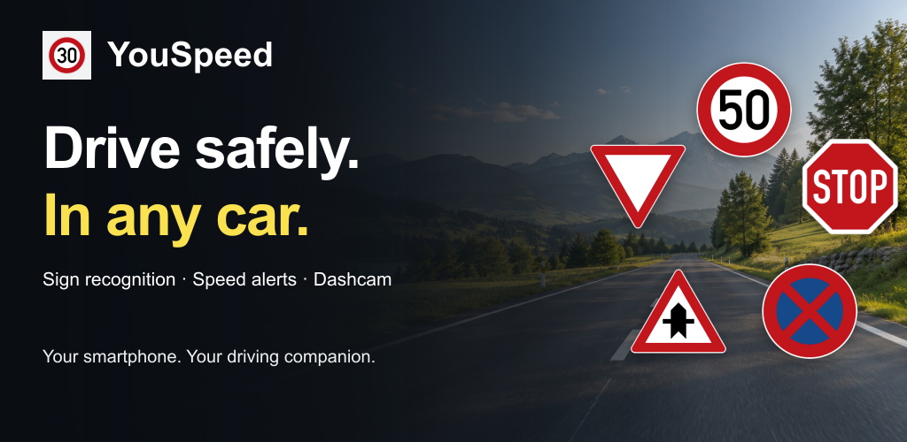
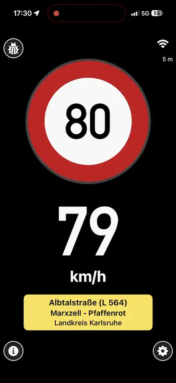
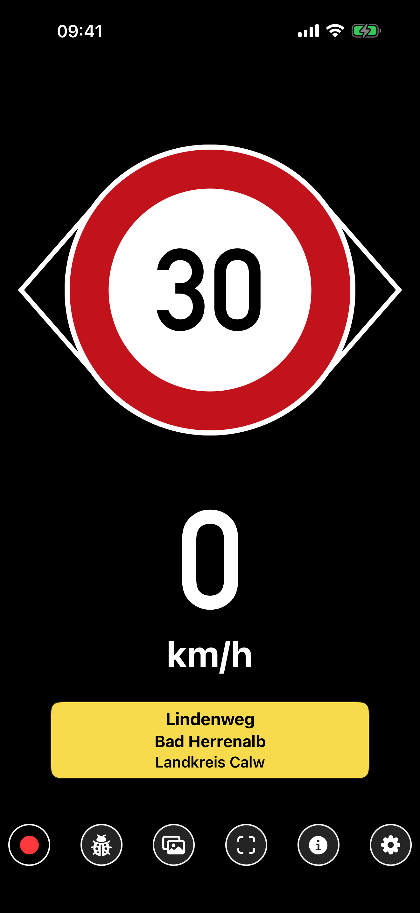
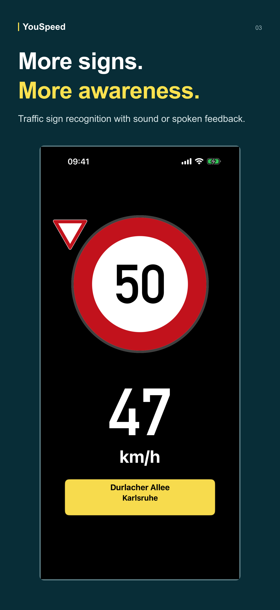
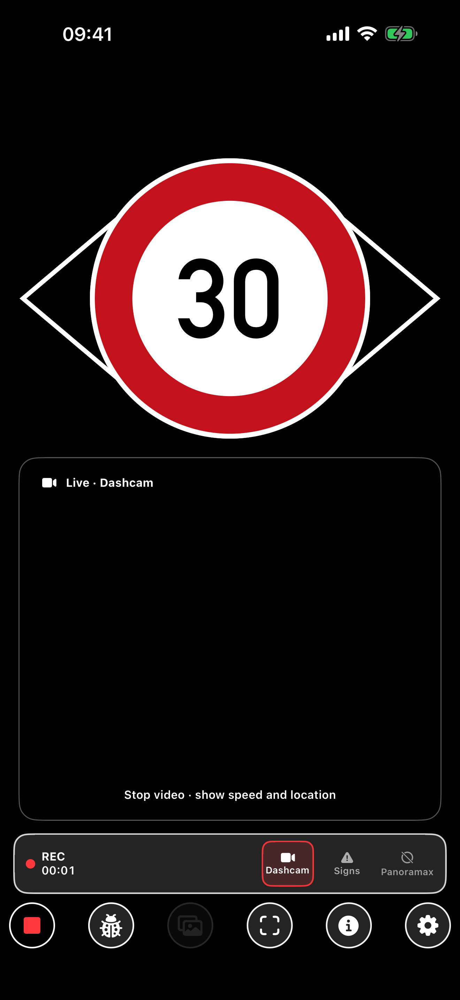
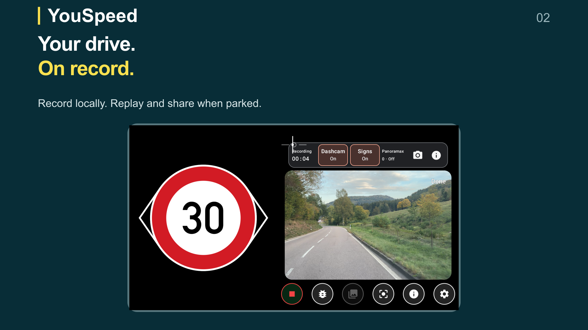
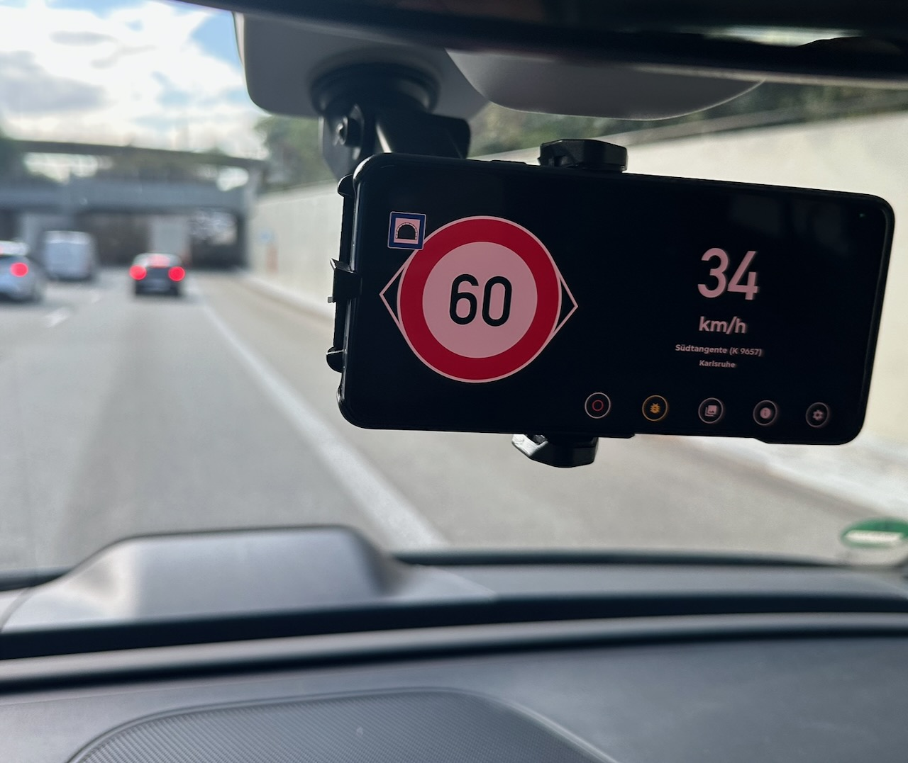
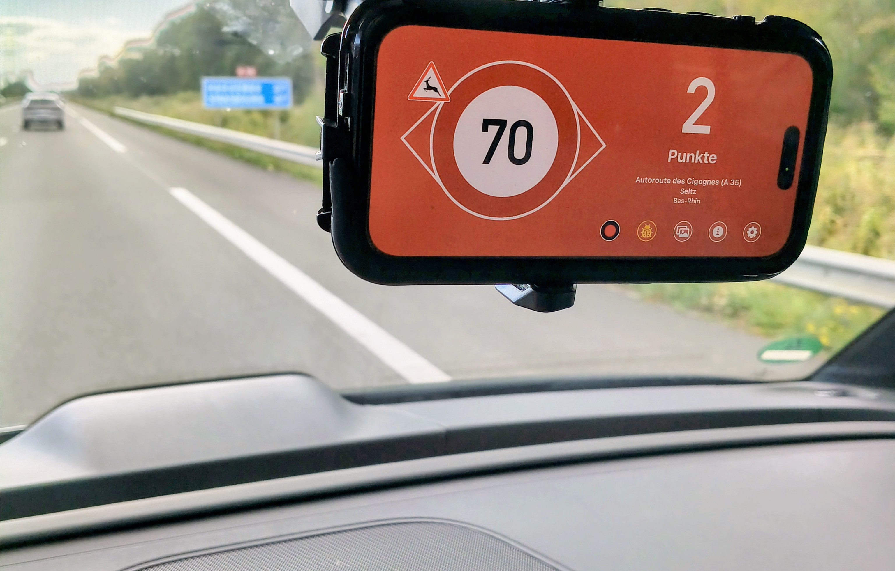
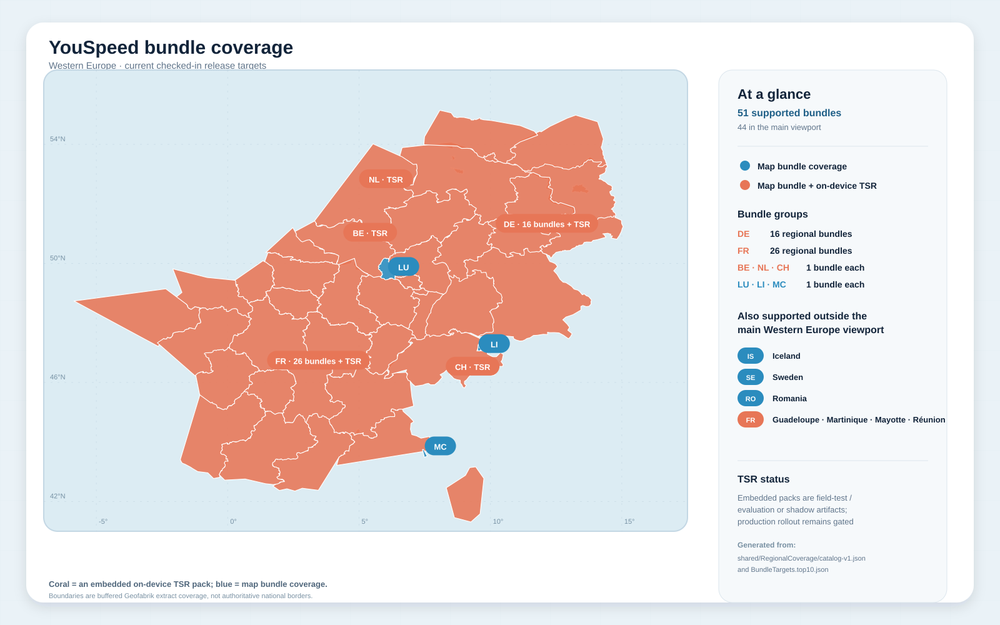
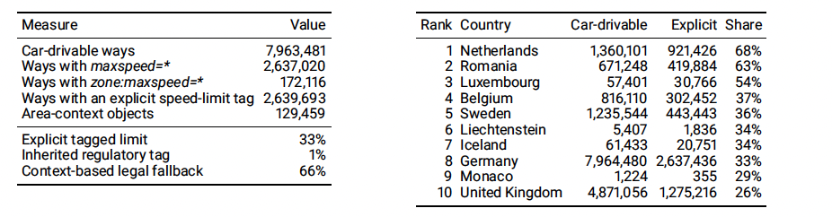

# YouSpeed

**Drive safely. Driver assistance for any car.**

YouSpeed is an open source app. Version 1.3 turns your iPhone or Android phone into a driving companion with on-device traffic-sign recognition, speed alerts, country-specific penalty estimates, local dashcam recordings and offline maps. No vehicle integration is needed, whatever your car’s age. Core driving features need no account; there are no advertising or tracking SDKs.

*YouSpeed is an advisory aid: road signs and traffic rules always take precedence. Recognition and penalty estimates can be incomplete or incorrect.*



Originally launched on 29 August 2026 at the State of the Map conference in Paris, France.

## New since 1.0

- **Automatic traffic-sign recognition:** recognize speed limits and additional road signs on the device, with sound or spoken feedback. Supported signs depend on the country and installed model.
- **Local dashcam:** record drives and play back, share or delete videos when parked.
- **Street-photo review and Panoramax uploads:** review geolocated photos before selecting an optional upload. Uploads require a connected account and internet and include GPS and capture metadata.
- **Offline references:** browse country-specific speeding fine tables and a traffic-sign catalogue with official pictograms and spoken names behind Info. These references provide guidance rather than legal advice.
- **Regional map management:** search countries and regions, inspect package dates and download sizes, and download or delete packages independently. Maps and country advisories include Germany, France, Switzerland, Belgium and the Netherlands.
- **Cross-border continuity:** improved map switching at borders, GPS fix handling and road matching. The app supports English, German, French and Dutch.

## Demo

[**Watch the YouSpeed 1.3 feature film on YouTube**](https://www.youtube.com/watch?v=89oEyuqHVMw) — sign recognition, dashcam recording, street photos and setup before driving, in English with captions.

Original speed-display and warning-level demonstration from the 1.0 release:



## Get YouSpeed 1.3

[**Download the signed Android 1.3 APK**](https://github.com/volzinnovation/youspeed.de/releases/download/android-v1.3/YouSpeed-1.3-100332.apk) — Android 14 or later, **arm64-v8a** (most current phones), approximately 348 MB.

For other devices, choose **armeabi-v7a**, **x86** or **x86_64** on the [Android 1.3 release page](https://github.com/volzinnovation/youspeed.de/releases/tag/android-v1.3). [SHA-256 checksums](https://github.com/volzinnovation/youspeed.de/releases/download/android-v1.3/SHA256SUMS) accompany the APKs. Download a map package before using offline road lookup.

The direct Android release is available. The 1.3 rollout on Google Play and the App Store is pending; the store links open the version currently available there.

- [Google Play](https://play.google.com/store/apps/details?id=de.youspeed.android)
- [iPhone on the App Store](https://apps.apple.com/de/app/youspeed-de/id6787469256)

Scan to download the app or open its source code:

<table>
  <tr>
    <th width="33%">Android (Google Play)</th>
    <th width="34%">Apple iPhone (App Store)</th>
    <th width="33%">this.repo</th>
  </tr>
  <tr>
    <td align="center"><a href="https://play.google.com/store/apps/details?id=de.youspeed.android"></a></td>
    <td align="center"><a href="https://apps.apple.com/de/app/youspeed-de/id6787469256"></a></td>
    <td align="center"><a href="https://github.com/volzinnovation/youspeed.de"></a></td>
  </tr>
</table>

All help welcome, contact [Raphael Volz on GitHub](https://github.com/volzinnovation). 

Just want to use it?  Learn more at [**Visit youspeed.de**](https://youspeed.de/)

User guides: [English](docs/USER_GUIDE.md) · [Deutsch](docs/USER_GUIDE_DE.md) · [Français](docs/USER_GUIDE_FR.md) · [Nederlands](docs/USER_GUIDE_NL.md)

Website references: [Traffic-sign catalogue](https://youspeed.de/en/traffic-signs.html) for five countries and [speeding fine tables](https://youspeed.de/en/speeding-fines.html) for twelve countries, available in English, German, French and Dutch. These pages reproduce the app’s reference data, with sources and review dates; penalty tables are indicative estimates.


The mobile apps perform matching and warning logic on the device. Map bundles are downloaded from public GitHub releases and checked against their published metadata. No account or client-side GitHub credential is required.

## Version 1.3 artwork

<table>
  <tr>
    <td></td>
    <td></td>
    <td></td>
  </tr>
</table>



These are native demonstration views from the 1.3 store artwork. The dashcam illustrations combine the app interface with a genuine recording frame; they are not live screenshots of that recording session. [Artwork provenance](store/README.md) and [dashcam composition details](docs/release/dashcam-composites-2026-10-03/README.md) are retained.

## Camera features and current limitations

Version 1.3 adds on-device recognition, dashcam recording and Panoramax photo capture on iPhone and Android. Recognition availability depends on the installed country model and device; field testing and country coverage continue to improve. Contributions and field testing in additional countries are welcome.

- **On-device traffic-sign recognition (TSR):** opt-in live recognition uses Core ML
  on iPhone and LiteRT with CameraX on Android. A detector/classifier pipeline
  combines candidate bursts over time and only a validated sign passage may
  affect the active speed context. Country models cover Belgium, Switzerland, Germany, France and the Netherlands.
  Display coverage and live speed interpretation differ; supplementary plates
  are displayed but are not interpreted in live inference. **The town-entry recognition is still under improvement.**

  *Ordinary recognition keeps no frame stream and sends no video or inference to the cloud.* See the [TSR contracts](shared/tsr/README.md) and
  [implementation specification](docs/VIDEO_TRAFFIC_SIGN_RECOGNITION_YOLO_SPEC.md).
- **Dashcam:** the same camera session can independently provide an explicit,
  local-only dashcam recording, live preview, TSR frames, and Panoramax stills.
  Recordings are playable, shareable, and deletable from the local library;
  storage is capped at 5 GB per movie and 10 GB for the library. Controls wait
  for successful video finalization before navigating or changing state.
- **Panoramax upload:** distance- or time-sampled JPEGs are kept in a durable
  local review queue with GPS metadata, optional altitude/course, and sign annotations. Users can
  favorite, include or exclude, and inspect originals before explicitly
  approving a batch for upload to the main  [Panoramax instance](https://panoramax.openstreetmap.fr/). For the time being access to our own  [Panoramax instance](https://panoramax.youspeed.de/) is limited to contributors.
  
  Uploads support progress, cancellation, resumption, and server-processing
  completion tracking. Upload **never starts during or automatically after a
  drive**, and local images are retained unless the user enables cleanup after
  successful remote completion. See the [Panoramax client contract](shared/PanoramaxUploadProtocol.md).

### Recognition examples

These historical field-test images show the camera-derived speed-limit display.
The eye-shaped marker identifies the camera source; additional signs appear as
secondary information. The French capture documents an exit-lane applicability
issue and is retained as test evidence rather than a claim of recognition accuracy.

<table>
  <tr>
    <td></td>
  </tr><tr>
    <td></td>
  </tr>
</table>


## Repository contents

- [`iphone/`](iphone/): iPhone app, tests, and Xcode project
- [`android/`](android/): Android app, tests, and Gradle project
- [`scripts/map/`](scripts/map/): OpenStreetMap bundle builders, validators, and release helpers
- [`mapdata/`](mapdata/): map-data formats, lightweight fixtures, and reproducibility metadata
- [`inspector/`](inspector/): local matcher and log-inspection tools
- [`Web/`](Web/): source for the public website
- [`sites/`](sites/): generated static website published by GitHub Pages
- [`docs/`](docs/): technical and release documentation

## Scientific paper 
Read the [youspeed.de paper](https://zenodo.org/records/21626565) for a high-level technical description (previous to our on-device recognition work).
## Citation

BibTeX:

```bibtex
@Conference{volz_2026_21626565,
  author    = {Raphael Volz},
  title     = {youspeed.de - A system for Intelligent Speed Assistance (ISA) based on OpenStreetMap data},
  month     = aug,
  year      = {2026},
  booktitle = {Proceedings of OSM Science 2026},
  pages = {26-29},
  publisher = {Zenodo},
  organization = "OpenStreetMap",
  doi       = {10.5281/zenodo.21626565},
  url       = {https://doi.org/10.5281/zenodo.21626565}
}
```
## Build and test

Common prerequisites are Python 3, SQLite, `jq`, Git, and optionally `osmium-tool`/`pyosmium` for map processing. The iPhone app requires Xcode 16 or newer. The Android app requires Java 17 and an Android SDK.

Android:

```bash
cd android
./gradlew :app:testDebugUnitTest :app:assembleDebug
```

iPhone simulator:

```bash
./scripts/iphone/build_consumer_app.sh
xcodebuild test \
  -project iphone/SpeedDBBench.xcodeproj \
  -scheme SpeedConsumer \
  -destination 'platform=iOS Simulator,name=iPhone 16'
```

See [`android/README.md`](android/README.md), [`iphone/SpeedConsumerApp/README.md`](iphone/SpeedConsumerApp/README.md), and [`docs/README.md`](docs/README.md) for details.

## Privacy and safety

YouSpeed keeps driving data, dashcam videos and captured photos on the device until the user chooses to share or upload them. Optional Panoramax uploads include location and capture metadata and require a connected account. Local diagnostic logging is enabled by default and can be switched off. Local recordings and build products are excluded from version control. The apps must not embed repository credentials or private release tokens.

The software is provided without warranty and does not replace attentive driving, posted signs, or applicable law. See [`LICENSE`](LICENSE), [`SECURITY.md`](SECURITY.md), and the in-app legal and privacy information.

## Traffic-sign model attribution

The current two-stage traffic-sign recognition field-test pack uses these
off-the-shelf Panoramax components:

- Detector: [`models/yolo11n_panoramax.pt`](https://github.com/cquest/sgblur/blob/169451970702aca0dde9ff3106dba0f67e0b88a8/models/yolo11n_panoramax.pt) from [`cquest/sgblur`](https://github.com/cquest/sgblur/tree/169451970702aca0dde9ff3106dba0f67e0b88a8), pinned to commit `169451970702aca0dde9ff3106dba0f67e0b88a8` and provided under the [MIT License](https://github.com/cquest/sgblur/blob/169451970702aca0dde9ff3106dba0f67e0b88a8/LICENSE).
- Classifier: [`Panoramax/classify_de_road_signs`](https://huggingface.co/Panoramax/classify_de_road_signs/tree/5360aa6f4ef6c7b1998044b18d00b4d0b1a5a790), pinned to commit `5360aa6f4ef6c7b1998044b18d00b4d0b1a5a790`; its [model card](https://huggingface.co/Panoramax/classify_de_road_signs/blob/5360aa6f4ef6c7b1998044b18d00b4d0b1a5a790/README.md) declares the Etalab Open License 2.0. It was trained from [`Panoramax/classified_de_road_signs`](https://huggingface.co/datasets/Panoramax/classified_de_road_signs/tree/b4856947ed7cb6312587258acc90e8cf88a4aa13), pinned to commit `b4856947ed7cb6312587258acc90e8cf88a4aa13` and published under CC BY-SA 4.0.
- Model architecture and conversion stack: [`ultralytics`](https://github.com/ultralytics/ultralytics/tree/v8.4.56) 8.4.56 under AGPL-3.0 supplies the YOLO architecture and export tooling; [`coremltools`](https://github.com/apple/coremltools/tree/9.0) 9.0 and [`PyTorch`](https://github.com/pytorch/pytorch/tree/v2.13.0) 2.13.0, both under BSD-3-Clause, were also used to create the bundled Core ML artifacts.
- Test frames: Panoramax pictures [`0906fc23-7175-430e-acc0-106e7d45eca7`](https://panoramax.openstreetmap.fr/?background=streets&focus=pic&map=17/48.779997/8.402469&pic=0906fc23-7175-430e-acc0-106e7d45eca7&seq=f2266cf8-eb84-4ff8-990e-133edb8b9e4c) and [`49e25e66-1614-44c0-96bb-d7fb6faa74b1`](https://panoramax.openstreetmap.fr/?s=fp;s2;p49e25e66-1614-44c0-96bb-d7fb6faa74b1;c184.00/0.00/30;m17/48.780303/8.402511;vd;bs;udefault) from sequence `f2266cf8-eb84-4ff8-990e-133edb8b9e4c`, published by “youspeed DOT de - mapping speed limits” under CC BY-SA 4.0.

Both mobile apps expose **Info → Sources and credits**, including each sign image's author, permanent source page, licence basis and changes. The [shared attribution catalog](shared/attributions/README.md) also covers map and rule sources, model provenance, fonts, runtime libraries and conversion tools. Full notices are readable offline, including the existing [model-pack licences](iphone/SpeedConsumerApp/TSRModelPacks/DE.panoramax-bootstrap.tsrmodelpack/THIRD_PARTY_NOTICES.txt) and the [shared notices](shared/attributions/THIRD_PARTY_NOTICES.txt).

The [2026-09-10 source audit](docs/license-audit-2026-09-10/README.md) records the verified artwork declarations, corrected mapping provenance and the remaining model-release licence review items.

## Contributing

Keep changes focused, add or update tests for behavioural changes, and do not commit generated builds, credentials, precise personal traces, or local machine configuration. Before opening a change, run the relevant platform tests and `git diff --check`.

## Map bundles

The following map bundles are available from their continuously updated [GitHub releases](https://github.com/volzinnovation/youspeed.de/releases). Each link opens the latest release for that bundle.

### Coverage map

The current target catalog contains 51 offline map bundles. The map below is
focused on Western Europe; blue marks map-bundle coverage and coral marks the
regions whose country also has an embedded on-device traffic-sign-recognition
pack (DE, FR, BE, NL, or CH). The shapes use the checked-in official
Eurostat/GISCO region and country boundaries and are rendered in Web Mercator.
Embedded TSR packs are currently field-test, evaluation, or shadow artifacts;
the coral color does not imply production rollout or calibrated confidence. The
graphic is generated with [`scripts/map/generate_bundle_coverage_map.py`](scripts/map/generate_bundle_coverage_map.py).



- [Belgium](https://github.com/volzinnovation/youspeed.de/releases/tag/belgium)
- France
  - [Alsace](https://github.com/volzinnovation/youspeed.de/releases/tag/alsace)
  - [Aquitaine](https://github.com/volzinnovation/youspeed.de/releases/tag/aquitaine)
  - [Auvergne](https://github.com/volzinnovation/youspeed.de/releases/tag/auvergne)
  - [Basse-Normandie](https://github.com/volzinnovation/youspeed.de/releases/tag/basse-normandie)
  - [Bourgogne](https://github.com/volzinnovation/youspeed.de/releases/tag/bourgogne)
  - [Bretagne](https://github.com/volzinnovation/youspeed.de/releases/tag/bretagne)
  - [Centre](https://github.com/volzinnovation/youspeed.de/releases/tag/centre)
  - [Champagne Ardenne](https://github.com/volzinnovation/youspeed.de/releases/tag/champagne-ardenne)
  - [Corse](https://github.com/volzinnovation/youspeed.de/releases/tag/corse)
  - [Franche Comte](https://github.com/volzinnovation/youspeed.de/releases/tag/franche-comte)
  - [Guadeloupe](https://github.com/volzinnovation/youspeed.de/releases/tag/guadeloupe)
  - [Haute-Normandie](https://github.com/volzinnovation/youspeed.de/releases/tag/haute-normandie)
  - [Ile-de-France](https://github.com/volzinnovation/youspeed.de/releases/tag/ile-de-france)
  - [Languedoc-Roussillon](https://github.com/volzinnovation/youspeed.de/releases/tag/languedoc-roussillon)
  - [Limousin](https://github.com/volzinnovation/youspeed.de/releases/tag/limousin)
  - [Lorraine](https://github.com/volzinnovation/youspeed.de/releases/tag/lorraine)
  - [Martinique](https://github.com/volzinnovation/youspeed.de/releases/tag/martinique)
  - [Mayotte](https://github.com/volzinnovation/youspeed.de/releases/tag/mayotte)
  - [Midi-Pyrenees](https://github.com/volzinnovation/youspeed.de/releases/tag/midi-pyrenees)
  - [Nord-Pas-de-Calais](https://github.com/volzinnovation/youspeed.de/releases/tag/nord-pas-de-calais)
  - [Pays de la Loire](https://github.com/volzinnovation/youspeed.de/releases/tag/pays-de-la-loire)
  - [Picardie](https://github.com/volzinnovation/youspeed.de/releases/tag/picardie)
  - [Poitou-Charentes](https://github.com/volzinnovation/youspeed.de/releases/tag/poitou-charentes)
  - [Provence Alpes-Cote-d'Azur](https://github.com/volzinnovation/youspeed.de/releases/tag/provence-alpes-cote-d-azur)
  - [Reunion](https://github.com/volzinnovation/youspeed.de/releases/tag/reunion)
  - [Rhone-Alpes](https://github.com/volzinnovation/youspeed.de/releases/tag/rhone-alpes)
- Germany
  - [Baden-Württemberg](https://github.com/volzinnovation/youspeed.de/releases/tag/baden-wuerttemberg)
  - [Bayern](https://github.com/volzinnovation/youspeed.de/releases/tag/bayern)
  - [Berlin](https://github.com/volzinnovation/youspeed.de/releases/tag/berlin)
  - [Brandenburg (including Berlin)](https://github.com/volzinnovation/youspeed.de/releases/tag/brandenburg)
  - [Bremen](https://github.com/volzinnovation/youspeed.de/releases/tag/bremen)
  - [Hamburg](https://github.com/volzinnovation/youspeed.de/releases/tag/hamburg)
  - [Hessen](https://github.com/volzinnovation/youspeed.de/releases/tag/hessen)
  - [Mecklenburg-Vorpommern](https://github.com/volzinnovation/youspeed.de/releases/tag/mecklenburg-vorpommern)
  - [Niedersachsen](https://github.com/volzinnovation/youspeed.de/releases/tag/niedersachsen)
  - [Nordrhein-Westfalen](https://github.com/volzinnovation/youspeed.de/releases/tag/nordrhein-westfalen)
  - [Rheinland-Pfalz](https://github.com/volzinnovation/youspeed.de/releases/tag/rheinland-pfalz)
  - [Saarland](https://github.com/volzinnovation/youspeed.de/releases/tag/saarland)
  - [Sachsen](https://github.com/volzinnovation/youspeed.de/releases/tag/sachsen)
  - [Sachsen-Anhalt](https://github.com/volzinnovation/youspeed.de/releases/tag/sachsen-anhalt)
  - [Schleswig-Holstein](https://github.com/volzinnovation/youspeed.de/releases/tag/schleswig-holstein)
  - [Thüringen](https://github.com/volzinnovation/youspeed.de/releases/tag/thueringen)
- [Iceland](https://github.com/volzinnovation/youspeed.de/releases/tag/iceland)
- [Liechtenstein](https://github.com/volzinnovation/youspeed.de/releases/tag/liechtenstein)
- [Luxembourg](https://github.com/volzinnovation/youspeed.de/releases/tag/luxembourg)
- [Monaco](https://github.com/volzinnovation/youspeed.de/releases/tag/monaco)
- [Netherlands](https://github.com/volzinnovation/youspeed.de/releases/tag/netherlands)
- [Romania](https://github.com/volzinnovation/youspeed.de/releases/tag/romania)
- [Sweden](https://github.com/volzinnovation/youspeed.de/releases/tag/sweden)
- [Switzerland](https://github.com/volzinnovation/youspeed.de/releases/tag/switzerland)

The bundle data is derived from [© OpenStreetMap contributors](https://www.openstreetmap.org/copyright) and is made available under the [Open Data Commons Open Database License (ODbL) 1.0](https://opendatacommons.org/licenses/odbl/1-0/).

### Max-speed provenance

The max-speed provenance tables from the paper shown below are a snapshot from 23 February 2026 for Germany (left) and the Top 10 countries by maxspeed tag use in OpenStreetMap.


