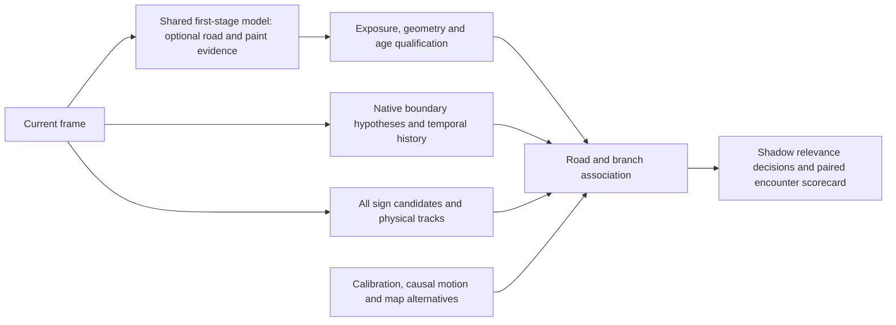

# Native lane evidence and driver-relevant traffic signs — 9 October 2026

## Decision

The current paint-head experiments do **not** justify activating additional sign
rejection. The useful product target is whether a physical sign governs the
vehicle's current road/branch or an explicitly designated lane. Adjacent lanes
on the same carriageway are not automatically unrelated roads, and a valid
roadside sign need not lie inside a lane polygon.

Continue one bounded **sign-to-branch association** experiment. Stop treating a
better lane overlay or paint IoU as its success criterion. If even reviewed
geometry cannot improve this decision on replayed sign encounters, stop that
lane-based rejection approach. If reviewed geometry helps but learned geometry
does not, the evidence supports improving perception rather than abandoning the
association task. No expected sign-error reduction can yet be estimated from
the available paint labels.

## What was compared

The comparison reuses exactly the prior 100 ZOD and 32 A2D2 test frames and all
nine epoch-10 heads: A2D2-only, ZOD-only and mixed, each with all three seeds.
These are already-exposed **development** frames, not fresh acceptance data.
Original RGB/label hashes and checkpoint identities were checked. Inference ran
detached on GPU 2 with an independent deadline; prior experiments stayed read-only.

The new harness compiles the actual Swift and Kotlin `RoadPathSession`, detector,
filter, tracker and presentation code. It uses the preview and separate TSR
session modes with the flags found at both live app callsites. Each still is a
fresh session with one observation. Repeating a still to manufacture temporal
confirmation is prohibited. Both platforms receive identical center-sampled
grayscale bytes at the established maximum 384×216 analysis size. This is a
host component comparison, not equivalence to each camera's live luminance
adapter, calibration, workload or latency. A fixed processing clock removes
wall-clock nondeterminism; the actual 250,000-operation limit remains active.

All native baseline output fields match exactly between Swift and Kotlin, with
deterministic repeated execution. Native results before presentation are:

| Dataset | Frames | Frames with a raw boundary | Raw boundaries | Geometric corridors |
|---|---:|---:|---:|---:|
| ZOD | 100 | 41 | 58 | 2 |
| A2D2 | 32 | 30 | 65 | 8 |

Both modes publish zero boundaries on their first observation. All 123 preview
candidate decisions are `not_mature`; no geometry operation cap was exceeded.
This expected cold-start behavior is **not** a zero-accuracy estimate for driving
video. The current default detector also emits no explicit observed paint
segments here. Its fitted lines must not be relabeled as observed paint spans.

Both baselines and all 22 preview variants passed exact Swift/Kotlin parity and
deterministic repeats: 12,672 frame executions. The variants comprise nine
learned heads, nine per-model spatial-mean controls, one reviewed-mask diagnostic
and missing/stale/wrong-generation controls. Every variant's native output was
byte-identical to that platform's preview baseline. This demonstrates fallback
and gate preservation on these inputs, not a ranking benefit hidden by averaging.
The test qualifies envelopes in the Python reference and injects source-bound
bonuses into the actual native selector; asynchronous phone inference and the
native typed-hint producer/cache are outside this test's scope.

For the geometric diagnostic, a one-pixel fitted centerline is compared with
known paint in image rows 0.58–0.95, at a fixed two-analysis-pixel tolerance;
zero-pixel sensitivity is retained. We report supported predicted length and
coverage of annotated paint separately. These are neither segmentation IoU nor
ego-lane/sign-relevance accuracy. All unknown annotation area is excluded;
learned guidance never receives annotation validity.

The fixed-threshold **offline filter** keeps a raw paint candidate only when its
mean row-wise two-pixel-band model support is at least 0.5. All nine models were
tested without threshold tuning. The table shows the mean and seed range;
"support" means predicted fitted-line pixels close to annotated paint, and
"coverage" means the fraction of annotated paint reached by those lines.
This filter is not wired into the native apps.

| Dataset / candidate source | Paint support % | Paint coverage % |
|---|---:|---:|
| ZOD / native | 58.16 | 19.94 |
| ZOD / native + A2D2 filter | 89.74 (88.71–91.28) | 10.14 (8.34–11.42) |
| ZOD / native + ZOD filter | 61.85 (61.48–62.03) | 19.94 (19.94–19.94) |
| ZOD / native + mixed filter | 77.41 (76.04–78.74) | 19.36 (19.19–19.70) |
| A2D2 / native | 76.08 | 34.46 |
| A2D2 / native + A2D2 filter | 91.43 (88.80–92.87) | 28.77 (25.23–32.04) |
| A2D2 / native + ZOD filter | 76.08 (76.08–76.08) | 34.46 (34.46–34.46) |
| A2D2 / native + mixed filter | 90.68 (87.60–92.82) | 29.69 (28.79–30.96) |

The mixed head provides the most useful ZOD coverage/precision tradeoff in this
probe: support rises from **58.16% to 76.04–78.74%**, while coverage changes from
**19.94% to 19.19–19.70%**. It removes 587–663 of 1,031 unsupported fitted-line
pixels, but also rejects 24–70 supported pixels. The A2D2-only filter reaches
88.71–91.28% support while reducing coverage to 8.34–11.42%; its higher precision
comes with a substantial loss of useful evidence. On A2D2 the mixed filter also
improves support, but lowers coverage from 34.46% to 28.79–30.96%.

This is evidence of complementary errors between geometry and appearance, not
proof of better ego-lane assignment or fewer wrong-road signs. The mixed model's
weaker standalone mask scores do not automatically make it the worst auxiliary
cue; conversely, these geometry results do not justify deploying that checkpoint.

All seeds are retained below (support / coverage, %, fixed two-pixel tolerance):

| Head / seed | ZOD | A2D2 |
|---|---:|---:|
| a2d2 / 20261009 | 91.28 / 11.42 | 88.80 / 32.04 |
| zod / 20261009 | 62.03 / 19.94 | 76.08 / 34.46 |
| a2d2_zod / 20261009 | 78.74 / 19.19 | 92.82 / 28.79 |
| a2d2 / 20262009 | 89.22 / 10.67 | 92.87 / 29.03 |
| zod / 20262009 | 62.03 / 19.94 | 76.08 / 34.46 |
| a2d2_zod / 20262009 | 76.04 / 19.70 | 87.60 / 30.96 |
| a2d2 / 20263009 | 88.71 / 8.34 | 92.62 / 25.23 |
| zod / 20263009 | 61.48 / 19.94 | 76.08 / 34.46 |
| a2d2_zod / 20263009 | 77.44 / 19.19 | 91.62 / 29.32 |

The scoring region has 67 ZOD frames containing annotated paint; this differs
from the previous whole-image 69/31 positive/no-paint split. Explicit observed
segments are empty, so their support precision is undefined and their coverage
is zero. The 114 paint candidates are scored; nine edge candidates are excluded
from paint metrics. Zero-pixel sensitivity and low-resolution full-image
and ROI mask counts are preserved in the evidence; they are not official
dataset metrics or substitutes for encounter-level outcomes.

At zero-pixel tolerance the same mixed-filter direction remains: ZOD support
is 71.02–73.89% versus native 54.22%, with coverage 3.61–3.72% versus 3.77%.
A2D2 support is 79.82–85.76% versus 68.86%, with coverage 5.65–6.18% versus
6.86%. A one-pixel centerline cannot cover the full width of a painted stripe;
the low absolute coverage at zero tolerance illustrates why these values are
not segmentation recall or whole-lane detection rates.

## What integration currently changes

The tested native integration adds at most 0.10 to an existing candidate's
selection score. It cannot create a missing boundary, add an independent
temporal confirmation, remove a sole wrong candidate or override eligibility
and maturity gates. It acts on the preview selector. The separate TSR session
does not consume this bonus.

An annotation-based bonus is an explicitly non-deployable diagnostic of this
hook, not an upper bound on every possible semantic integration. The separate
fixed-threshold candidate suppression probe is also an offline experiment,
not shipping application behavior. Its supported-length losses matter as much
as its removal of unsupported geometry.

The previous **400-frame real-video, 15-arm ablation** was independently
reverified against the current code: all 11 native/replay source files remain
byte-identical. It used an older A2D2-only head, kept separate from today's nine
heads. Qualified paint changed two unreviewed frame selections and **zero
reviewed selections**. The 16 approximately reviewed keyframes contain 21
boundaries: 5 were visible, 9 lacked maturity, 1 was held and 6 lacked a matching
post-temporal candidate. None was lost to score competition. Neither wrong
visible selection had a correct competing candidate. The separate existing
1,573-frame report recorded no selection changes across its 15 arms.

These historical labels are sparse assistant reviews, not independent
acceptance truth. They nevertheless explain why increasing a ranking bonus is
unlikely to address the observed bottleneck. Repeating identical native runs
would not add evidence; probability/source/output hashes and broad invalid-hint
fallback equality were checked again instead.

## Existing sign-relevance wiring

Both apps already maintain physical sign tracks. General applicability is
configured in **shadow mode**, while narrow motorway-exit and access-road
safeguards actively withhold certain candidates before fusion. The native
sign-to-corridor sidecar triangulates track bearings with causal motion and
calibration, but only logs its result. It does not feed lane evidence back into
actionable sign selection.

Two implementation findings precede any new model claim:

1. The live map-context producer supplies no horizontal field of view or camera
   yaw to the general bearing-based applicability policy on either platform.
   The separate road-path calibration does not fill these fields. Enabling a
   gate alone does not complete the calibrated pipeline.
2. iPhone filters all detections and sends the surviving list to fusion.
   Android's shadow-mode block retains the backend-selected detection only if
   it survives; that block does not select an alternative survivor. A
   higher-scored exit sign alongside a lower-scored valid mainline sign is an
   essential parity fixture. This is a source-level difference, not a measured
   field-error rate.

Relevant implementation references:
[Swift applicability](../iphone/SpeedConsumerApp/TrafficSignApplicability.swift),
[Kotlin applicability](../android/app/src/main/java/de/youspeed/android/alpha/TrafficSignApplicability.kt),
[Swift runtime](../iphone/SpeedConsumerApp/TrafficSignRuntime.swift),
[Android runtime](../android/app/src/main/java/de/youspeed/android/alpha/TrafficSignRecognitionOrchestrator.kt),
[Swift road-path session](../iphone/SpeedConsumerApp/RoadPathSession.swift),
[Kotlin road-path session](../android/app/src/main/java/de/youspeed/android/alpha/RoadPathSession.kt).

## Proposed integration and experiment

Preserve full-frame sign detection and physical tracks. Combine native boundary
hypotheses, observed mainline/exit connectivity, vehicle motion, map branch
uncertainty and calibrated sign bearings in a separate association component.
Qualified road/paint/separator probabilities can support or challenge geometric
hypotheses. They are additional same-frame evidence, not extra temporal votes.
Represent `current path / other branch / uncertain`, including possible sets of
governing lanes for overhead or lane-specific signs. An unqualified/missing hint
keeps the baseline behavior. The vehicle's eventual exit choice is not evidence
available to the causal runtime before that choice becomes observable.

Run the same sign candidates, tracks, context and decision logic through four
arms: current safeguards; native geometry plus association; the same association
plus segmentation; and reviewed geometry as a non-deployable diagnostic. Test
geometry recovery and false-candidate suppression separately from reranking.
Measure **wrong-road actionable acceptance** and **false exclusion of valid
signs** per physical encounter, along with uncertainty, assignment delay,
release when entering the exit and simultaneous-sign retention. A reduction in
false lane pixels is only a supporting diagnostic.

A2D2/ZOD paint masks do not label the sign's governing branch, relevance interval
or earliest causally decidable time. Prime that ledger from the existing HF
videos and sign tracks, using later frames to propose identity/branch labels.
Review ambiguous sign assemblies and branch changes; future motion alone does
not prove a sign's governing scope. Existing playback tools and a small
hash-bound encounter ledger suffice initially; a new pixel-labeling tool is not
the priority. Split by drive and physical exit/route, not adjacent frames.

## Revised priorities and effort estimates

These are engineering estimates, not promises of model accuracy or elapsed
unattended execution time.

| Priority | Deliverable | Estimated effort | Decision unlocked |
|---|---|---|---|
| P0 — #10 | A 30–50-encounter development ledger, including mainline/exit pairs, taken exits and valid isolated right-side reductions; record existing guard baseline | 1–3 working days, depending on footage coverage and ambiguity review | Can we measure the intended failure rather than paint pixels? |
| P0 — #21/#23 | Calibration/context audit and simultaneous-sign parity fixture; shared shadow association replay | 2–4 working days | Does useful native evidence reach a comparable relevance decision? |
| P1 — #22 | Separate native, hybrid and reviewed-geometry arms on that ledger; freeze thresholds before a fresh evaluation | 2–4 working days after the ledger | Is additional lane evidence worth further investment? |
| Conditional — #22 | Repair negative supervision/source loss weighting; add road/separator context and test candidate recovery | 2–5 working days for a bounded prototype after a positive diagnostic | Can a learned model realize the useful association evidence? |
| Conditional — #23/#24 | Causal video replay, fault fallback and sustained matched device qualification | 2–4 working days plus required driving/device access | Is any benefit feasible on both phones? |

The small development ledger is a feasibility gate, not a low-error production
qualification. Fresh independently reviewed encounters and more diverse exits
would still be required. Preserve valid single right-side mainline signs,
left/overhead signs and same-carriageway signs; do not obtain better rejection
by making most signs unknown or withholding every lower speed.

For the model work, the current ZOD-only recipe has 796 positive-only frames
versus 16 complete-coverage training frames. Unannotated pixels cannot simply
be made negative. Test loss normalization by source/coverage, separately
qualified background, sensible negative sampling and denser road/separator
targets before more scale. All nine heads share a frozen backbone and only
3,457 trainable parameters; their failure is not a test of every segmentation
architecture. Model changes remain conditional on evidence of sign-decision
benefit, and no protected speed-reference policy is changed by this report.

## Research basis

Combining signs, maps and visual lane changes for exit relevance is established;
it is not a novel claim for this proposal. An earlier joint speed-limit system
explicitly uses all three evidence sources
([Bargeton et al., 2010](https://arxiv.org/abs/1010.3867)).
OpenLane-V2 provides lane connectivity and lane-to-traffic-element relations,
which fit the missing association task better than painted-pixel labels, but
its documented attributes are not a European numeric-speed/exit applicability
benchmark ([official schema](https://github.com/OpenDriveLab/OpenLane-V2/blob/master/data/README.md)).
TopoMLP likewise separates geometry/element detection from relation prediction
([paper](https://arxiv.org/abs/2310.06753)). Future driven poses can propose
earlier ego-lane labels, with reconstruction and geometry review still needed
([Roberts et al., ECCV 2018](https://www.ecva.net/papers/eccv_2018/papers_ECCV/papers/Brook_Roberts_A_Dataset_for_ECCV_2018_paper.pdf)).

## Reproduction and limitations

The new tools are `prepare_native_comparison.py`,
`compare_still_lane_platforms.py`, `StillLaneReplay.swift/.kt` and the separate
`score_native_paint_support.py` scoring/variant builder. Source images,
probability maps, models and native
build artifacts stay outside Git. The evidence bundle preserves the frozen
protocol, source hashes, all per-frame results and preparation/audit receipts.
The 19 targeted harness/scoring tests passed. Independent recomputation passed
142,046 checks, including per-frame retained/rejected support, group totals,
mask counts, compatibility and variant output identities; the largest arithmetic
difference was 1.11×10⁻¹⁶. This audit does not replace sign-relevance truth.

Reinference at batch size one differs from the archived batch-eight evaluation
in two of 1,188 frame/model comparisons, each by one background pixel at the
fixed threshold. Those differences are retained explicitly; prior metrics are
not overwritten. Learned masks are inverse-letterboxed into native coordinates;
native targets preserve any-area paint occupancy and require all contributing
area to be valid. These transforms and tolerance are disclosed rather than
treated as official dataset metrics.

Further limits: assistant ZOD coverage QA; sparse supervision; reused test
images; correlated geographic/day groups; a single A2D2 test day; no verified
camera geometry, sign encounters or fresh multi-frame chronology in the still
test; no on-device timing claim. No weights were promoted, app behavior changed,
branch merged or protected speed-reference policy modified.
