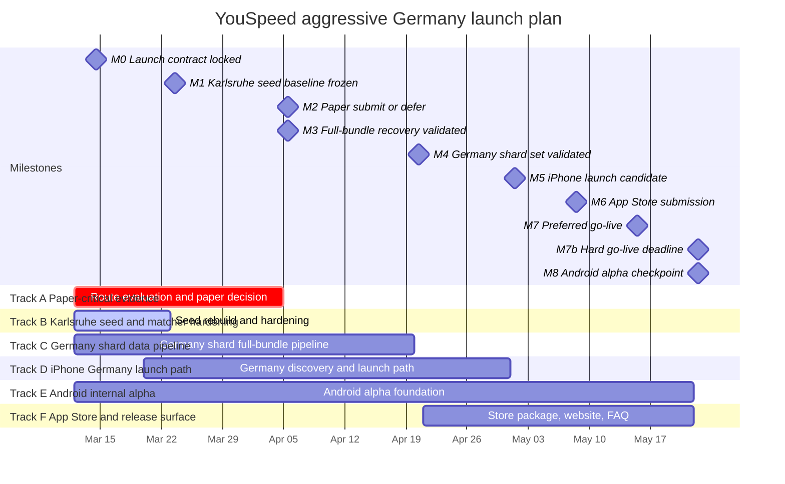

# YouSpeed Gantt Chart

Date: 2026-03-12

This chart visualizes the aggressive Germany launch plan defined in `PROJECT_PLAN_2026-03-12.md`.

## Notes

- Launch is public, Germany-only, and iPhone-only on `2026-05-22`.
- Germany launch is nationwide via shards, but launch-day update policy is full bundles only.
- Android starts immediately as a parallel internal-alpha track, but Android release parity is not a May 22 gate.
- Paper work keeps priority over noncritical launch polish if time conflicts emerge.
