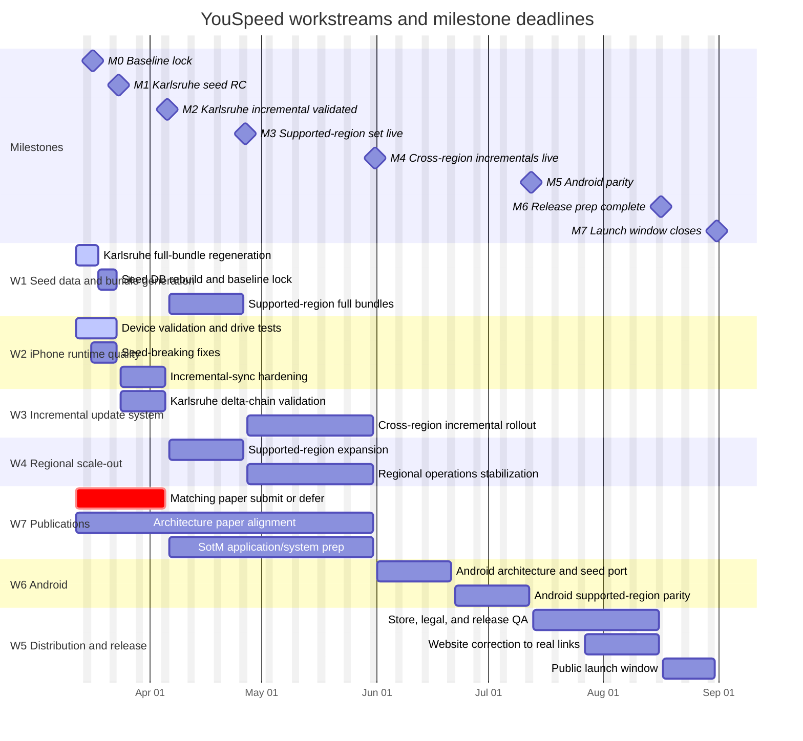

# YouSpeed Gantt Chart

Date: 2026-03-12

This chart visualizes the workstreams and milestone deadlines defined in `PROJECT_PLAN_2026-03-12.md`.

## Notes

- `W5` starts after Android parity because the public website and store CTAs should only follow real store deliverables.
- `W7` starts early because the matching paper depends on the Karlsruhe seed phase, not on the later multi-region product rollout.
- `W3` and `W4` overlap intentionally after Karlsruhe validation; by then the work shifts from proving one region to operating a supported set.
