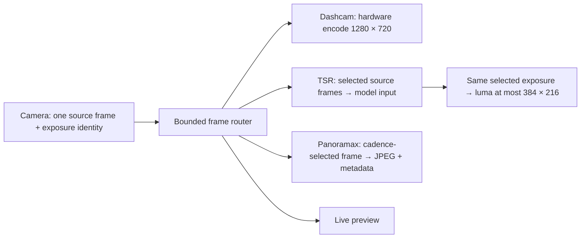

# Trajectory ingestion fix and shared-frame capture proposal

The 29 September Moto g86 recording exposed two independent problems: ordinary
re-delivery of location fixes cleared trajectory history, and analysis used a
different image shape from the dashcam. The timestamp correction is implemented
in this change. The camera redesign below is the next implementation proposal;
the current recording adapters have not yet been replaced.

The owner confirmed **1280 × 720**, and requires **one captured-frame feed as the
source of truth for all processing**, ideally including Panoramax stills. Here,
“frame” means a camera exposure, not a compressed-video keyframe. The protected
speed-reference policy remains unchanged; its input remains the visual TSR signal.

## Evidence and implemented correction

The first drive contained 1,262 path evaluations. Of the 1,254 full records, 543
had no causal trajectory sample, 704 had one, and only seven had two or more.
There were 609 changes of local origin. Android delivers both GPS and fused fixes
to the same session; equal or delayed timestamps must not imply a clock reset.

Both platforms now follow these ingestion rules:

- Accept a valid location fix only if its timestamp is strictly newer than the
  last accepted fix. Drop equal and older fixes without changing the origin,
  accepted poses, observation histories, or current overlay. A more accurate
  late fix must not retrospectively change poses already used for observations.
- Log lifetime counters in `locationIngestion`: `duplicateFixesDropped`,
  `outOfOrderFixesDropped`, and `resetCount`.
- Reset trajectory explicitly at drive start/stop. A reset invalidates work that
  was already evaluating, which reports `trajectory_reset`. A newly reset session
  can accept a new clock epoch; a timestamp comparison cannot establish one.
- Within the same frame scope, compare original camera timestamps (not a fresh
  callback-to-UTC estimate) and drop equal/older exposures with
  `duplicate_frame` / `out_of_order_frame` diagnostics instead of clearing
  observation history. Scope/calibration changes and explicit lifecycle resets
  remain legitimate history boundaries. Repeated exposures must not add support.

The short data lock and separate serial evaluation lock remain. A semaphore
alone would not correct this bug: duplicate provider callbacks can arrive
serially. The existing TSR mailbox already allows only one inference in flight
and replaces its single pending frame with the latest one.

The camera guard is preventive; the drive established the GNSS reset problem,
not a duplicate-camera-exposure failure. Regression tests need at least three
observations of one physical sign, delayed/duplicate fixes, duplicate exposures,
an explicit reset, and a reset or duplicate arriving during evaluation.

Validation for this correction: **481 Android unit tests passed**, including 13
session tests; **seven native Swift session tests passed** against the production
session, applicability, geometry and evidence sources. The iPhone simulator app
build passed. The protected policy check passed 39 scenarios / 171 steps with
unchanged policy hashes and client pins; all 12 country rule checks passed. These
checks validate the ingestion change, not the proposed new capture pipeline.

This fix does not establish useful sign-to-path accuracy. In that drive, none of
the 557 distinct retained fixes met both current position/course accuracy gates.
Detected paint was also intermittent, including on the marked middle section.
Do not loosen those gates to make the replay appear successful.

## One source, independent consumers

Use **1280 × 720 as the initial source format** for the low-end Android trial.
TSR receives that source image before its existing model preprocessing; lane
input is downsampled directly from its luminance. Dashcam encodes those source
frames independently of inference completion. Panoramax selects from this same
feed without requesting a separate photo exposure. Each consumer remains
independently enabled, including when video retention is disabled.

This is a fan-out, not a serial `TSR → record → lane` processing chain. TSR can
sample at its adaptive cadence while dashcam runs at camera cadence. Every
analyzed frame has a source identity that can be matched to a frame confirmed in
the muxed encoded output. Input submission alone is insufficient. Actual encoder
drops and segment finalization outcomes must be recorded explicitly;
matching frames does not mean inference runs on every recorded exposure.

A higher-resolution **single source** is the alternative if HD proves inadequate
for distant signs or Panoramax detail: TSR and JPEG extraction use the source,
with independent downsampling to 720p recording and small lane luminance. This
preserves exposure identity and common field of view. It needs a new Moto
performance qualification; do not silently negotiate a larger format or a
different crop as an undocumented fallback.
At higher source resolution, 720p dashcam replay cannot reproduce the extra
detail used by TSR or retained in the JPEG.

The owner also proposed a phone-capability-dependent quality option. Expose the
same source-quality choice on both clients, with actual supported dimensions:

| Choice | Shared source / Panoramax | Dashcam | Availability |
| --- | --- | --- | --- |
| Standard | 1280 × 720 | 1280 × 720 | Initial Moto trial and efficient default |
| Detailed | 1920 × 1080, or a specifically qualified larger size | 1280 × 720 | Supported format and sustained pipeline qualification |

This is a capture-quality option, not an independent still-camera switch.
Capability metadata establishes supported formats; measured encoder, readback,
inference, thermal and JPEG performance establishes whether a profile is usable.
Show the actual dimensions and estimated storage from measured local JPEG sizes.
Apply profile changes before opening the next camera session; do not rebuild the
capture graph during a recording. Log the requested/effective profile and any
fallback reason. Do not automatically select full sensor resolution just because
the phone advertises it. Keep current consumer controls, retention and consent
independent of this choice.

## Platform implementation

Today's Android `ImageAnalysis` requests 1920 × 1080 without an aspect-ratio
strategy and negotiated 1600 × 1200; the video is 1280 × 720. CameraX defaults to
4:3 for analysis. An explicit 16:9 selector, HD recording quality and shared
`ViewPort` would establish common field of view **only after every consumer
honors its crop and rotation**. They would not prove that TSR and the encoded
video use the same exposure. The current iPhone similarly uses separate video
data, movie-file and photo outputs in one capture session.

For the strict contract, the adapters must fan out the same owned source frame:

- **Android:** retain CameraX for camera lifecycle and controls, with a single
  `Preview.SurfaceProvider` supplying an OES texture. Latch each exposure once
  and transform it into a canonical upright 1280 × 720 GPU frame. Fan out to
  preview and a hardware MediaCodec/MediaMuxer writer, with bounded readbacks
  only for admitted TSR or Panoramax work. Set encoder presentation timestamps
  from the source and confirm actual encoded PTS using `BufferInfo`. A CameraX
  `SurfaceProcessor` feeding Recorder is a smaller intermediate option, but its
  aggregate duration callbacks do not establish encoded-frame correspondence.
  CameraEffect does not target ImageAnalysis; the independent analysis output
  cannot remain the authority for the strict shared-source implementation.
- **iPhone:** use `AVCaptureVideoDataOutput` sample buffers as the source for
  TSR, preview, JPEG selection and an `AVAssetWriter` encoder. Preserve source
  presentation timestamps through writing. This replaces the independent movie
  and photo exposures for the shared-feed mode while retaining the existing
  segment limits, finalization, orientation and consumer lifecycle behavior.

In both adapters, configure one field of view and keep a complete source-to-output
transform for every consumer. Crop offsets belong in luma sampling, sign boxes,
intrinsics, preview projection and replay. Normalize against the cropped image;
do not apply CameraX's sensor-to-view transform and the same rotation twice.
Keep raw buffers alive only until their bounded consumers release them. GPU
frames/readback slots need explicit ownership and completion fences: retaining
a SurfaceTexture reference does not preserve pixels across `updateTexImage`.
Skip optional consumer admission when slots are full. Never wait for TSR or JPEG
compression on the camera/encoder delivery thread. JPEG compression uses a
separate bounded worker; consumer-specific drops are logged. Drain the encoder
on its own worker and measure encoder-surface blocking; bounded analysis alone
does not prevent `eglSwapBuffers` from stalling delivery.

The Moto rear camera advertises 1280 × 720 YUV, PRIVATE and JPEG formats with
REALTIME hardware timestamps. This supports prototyping, but does not guarantee
simultaneous graph support, exact encoder mapping or sustained throughput.

## Panoramax from the feed

Select a source frame when the existing distance/time capture policy admits a
capture, independently of signs and video recording. Encode the unannotated
full scene once to JPEG on its worker. Never extract the original from a
compressed dashcam file, upscale it to imply more detail, or burn debug overlays
into the image.

Carry the source frame ID and exposure time into capture provenance. Associate
location at that exposure, preserving the fix timestamp and accuracy separately
from delivery/request time. Preserve orientation, dimensions, EXIF location and
heading where known, software provenance, hash, thumbnails, annotation mapping,
atomic queue writes and late-write rejection after a batch is sealed. Existing
consent, review, storage and post-drive upload rules still apply.

An HD-only source produces 0.92-megapixel stills, below today's separate photo
output (the inspected Moto graph exposes 4096 × 3072 JPEG). Review real road
detail before replacing that output in release behavior. The higher-resolution
shared-source option addresses this tradeoff without adding a second exposure.

### Measured storage comparison

Ten original Moto photos from the first drive were pulled read-only and verified
against queue hashes. The 4096 × 3072 originals total 43.33 MB. Native macOS
ImageIO produced 16:9 center-cropped 720p/1080p comparison JPEGs at quality 90,
preserving capture dates and GPS fields through metadata reserialization.
Decimal units below use the sample mean, scaled to
1,000 photos; they exclude thumbnails, queue files and server derivatives.

| Photo output | Approximate GB / 1,000 photos | Byte reduction vs originals |
| --- | ---: | ---: |
| Current 4096 × 3072 originals | 4.333 | — |
| 1920 × 1080, JPEG quality 90 | 0.853 | 80.31% |
| 1280 × 720, JPEG quality 90 | 0.396 | 90.85% |

These are measured comparisons of resized existing JPEGs, not predictions of
identical byte counts from Android's encoder or raw video buffers. Cropping,
scene detail and source processing affect the result. ImageIO also reduced
median APP/COM metadata from 47.544 KB to 0.956 KB; GPS reserialization differed
by at most 0.000001667 degrees per coordinate axis. Annotation retention was not
tested because these samples had no EXIF UserComment. Resized comparison files
are analysis specimens, not Panoramax upload originals.

A separate read-only backend API sample of 1,000 latest-updated public items
contained 997 Moto 4096 × 3072 uploads: original upload bytes totaled 2.097 GB,
with a 1.757 MB median. This differs from the ten current-drive photos and shows
why storage estimates should use observed files rather than only pixel counts.
The API's `original_file:size` records uploaded bytes, not current disk usage.
Served permanent HD images, SD derivatives and thumbnails must be counted
separately; server-wide disk/backup totals were not available through public APIs.
For one measured Moto item, those served assets total **3,631,246 bytes**:
4096 × 3072 HD at 3,297,221 bytes, 2048 × 1536 SD at 311,842 bytes, and a
500 × 375 thumbnail at 22,183 bytes. Its upload provenance records 3,351,734
bytes; do not count that as an additional retained original without disk evidence.

The [live API](https://panoramax.youspeed.de/api/configuration) reports GeoVisio
**2.15.1**. [Upstream code for that version](https://gitlab.com/panoramax/server/api/-/blob/2.15.1/geovisio/utils/pictures.py#L267) generates
the SD derivative at **2048 pixels wide unconditionally**, so a 720p or 1080p
upload would be enlarged to 2048 × 1152 under that behavior. The deployed source
hash was not available for verification. Confirm this on the backend, then cap
derivative dimensions at the source size before rolling out small uploads.
Upsampling adds storage without restoring detail; the app-side 80%/91% savings
must not be advertised as measured server-wide savings. Backend changes are a
separate follow-up; this investigation changed no service configuration or media.

## Logs and qualification before rollout

1. Give each captured frame an immutable `(cameraGeneration, sourceTimestamp)`
   key plus a sequence number. Log timestamp clock/domain, source dimensions,
   crop, rotation, sensor mapping and effective intrinsics. Capture a monotonic
   to UTC anchor; label uncertainty instead of treating callback time as exposure.
2. Log selected consumer deliveries, drops and reasons. Link TSR/lane results and
   Panoramax capture IDs to the source key. Link accepted encoded frames to video
   segment and presentation timestamp; use compact sidecar records where needed
   rather than large per-frame JSON. Record encoder drops/finalization failures.
3. Teach Inspector to use verified frame/PTS mapping and the logged geometry.
   Retain explicitly estimated alignment for older recordings. Measure overlay
   publication/render age as well as computation time.
4. Test nonzero asymmetric crops, padded planes, all mount rotations, changing
   generations, duplicate exposures, consumer toggles and bounded backpressure.
   Compare landmarks in source, TSR, lane, preview, JPEG and encoded frames.
5. On the Moto, validate the actual graph, negotiated formats and recording
   finalization. Compare HD sign recall and detection distance against the
   existing source, especially for small distant signs. Then compare sustained
   matched workloads with recording and
   Panoramax enabled: added work p50/p95/p99/max, capture age, encoder drops,
   TSR cadence, memory and thermal state. The extra processing target remains
   **no more than 200 ms**; a component benchmark cannot establish total camera
   pipeline overhead. Include marked and unmarked road segments separately.

Primary API references: [CameraX configuration and viewport](https://developer.android.com/media/camera/camerax/configuration),
[CameraEffect targets](https://developer.android.com/reference/androidx/camera/core/CameraEffect),
[SurfaceProcessor](https://developer.android.com/reference/androidx/camera/core/SurfaceProcessor),
[SurfaceProvider](https://developer.android.com/reference/androidx/camera/core/Preview.SurfaceProvider),
[MediaCodec.BufferInfo](https://developer.android.com/reference/android/media/MediaCodec.BufferInfo),
[AVCaptureVideoDataOutput](https://developer.apple.com/documentation/avfoundation/avcapturevideodataoutput),
[AVAssetWriter](https://developer.apple.com/documentation/avfoundation/avassetwriter).
