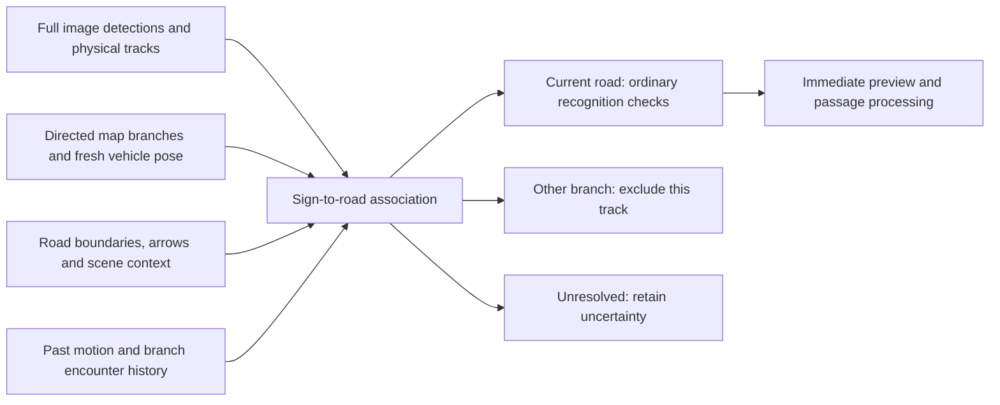

# Exit-sign attribution: simulation and implementation design

Status: offline investigation and executable regression fixtures, 28 September
2026. No new filter has been installed or enabled on either phone. The shared
speed-reference state-machine policy and applicability contract are unchanged.

## What the logs establish

The [drive review](FR_DE_DRIVE_REVIEW_2026-09-28.md) documents wrong-road signs in
daylight, including a service-area 30 on a motorway with map limit 130. Existing
guards often lacked fresh road context, a connected branch, or an image centre
to the right of x=0.60. These conditions overlap. Recognition confidence cannot
resolve which road a correctly recognized sign governs.

Four exact recorded candidate clips are now durable fixtures in
[`shared/tsr/applicability/fixtures/`](../shared/tsr/applicability/fixtures/README.md).
Their 263 frames contain 152 candidate observations. Actual Swift/Kotlin replay
agrees on all associations and decisions: 311 decisions are UNKNOWN, with no
explicit exit/access rejection. Of 263 road snapshots, 229 are stale. UNKNOWN
in this shadow evaluator is not live suppression; these numbers are not an
accuracy score or a count of displayed signs.

The separate manifest preserves source and per-batch hashes, original authority
events, dismissal times and nearby still metadata. It deliberately marks these
clips `unreviewed_real`: reviewing a nearby image is not complete ground truth
for every physical sign in every recognition frame. A dismissal is a review cue,
not an automatic negative label. The 90/70/50/30 observations include classifier
flicker; they do not prove four distinct physical signs.

## Proposed solution

Introduce an explicit **sign-to-road association before camera evidence is
admitted**. Keep full-frame detection. Each physical sign track has a road
assignment: current carriageway, another branch, or unresolved. Keep this separate
from the recognized sign class and its confidence.



This is a proposed integration diagram. The offline prototype accepts explicit
geometry hints; it does not yet estimate them from pixels. Its `hold` result is
an experiment label, not a change to the production UNKNOWN fallback. Changing
that fallback or reference-state semantics requires the repository's policy
versioning and approval process.

### Geometry and preprocessing

Represent directed mainline/branch encounters with bounded along-road intervals,
branch identity and side, divergence/merge geometry and available lane counts.
Include service-area access, and keep a branch relevant after the gore while its
parallel road and signs remain visible. Whole-way IDs alone are too coarse:
ways may be split before an exit or extend far beyond it. Geometric proximity
alone also admits overpasses and opposing carriageways.

The current `scripts/map/motorway_exit_context.py` stores a directed 350 m
approach across connected motorway segments to motorway-link branches. It does
not provide the full service-area/post-divergence corridor design above. The
French databases used in the drive lack even that newer approach context.
Rebuilding appropriate bundles is therefore part of the eventual fix. Source
vertices are already retained by the current extractor; disabling simplification
again will not supply absent branch semantics.

Separate cached static topology from fresh vehicle pose. A road graph does not
expire after 1.5 seconds; the vehicle's assignment, position and heading can.
Use genuine fix timestamps and bounded propagation with uncertainty. Relabelling
an old match as fresh is not a fix. The existing local Android change from 3 s to
1 s location requests addresses one source of age, but map-worker delay remains
to be measured.

Image position should be relative to the current carriageway and the branch,
accounting for camera yaw, road curvature and uncertainty. A fixed x threshold
does not express that relation. Phone GPS alone cannot reliably distinguish
adjacent lanes. Do not project an elevated sign centre onto the road plane as
though it were a point on the ground. An optional lane/road-boundary model is an
offline experiment first; its mobile cost and failure cases require measurement.

### Motion and sequences

Retain an encounter hypothesis tied to a directed branch across changes of OSM
way and physical sign track. A coherent reduction sequence can corroborate an
already supported branch assignment. Count separate physical signs, not repeated
classifications of one sign. Do not wait for all four numbers to decide the first
sign; the later numbers cannot justify a decision retrospectively.

Use past GPS speed/course history as supporting evidence. Continued mainline
motion and little deceleration are useful context, but neither establishes that
a sign is irrelevant. A driver can ignore a genuine reduction or brake late
when taking an exit. Genuine roadworks can also contain a rapid descending
sequence. The behavioural limitation is supported by the exit-speed field study
of [Ma et al. (2019)](https://journals.plos.org/plosone/article?id=10.1371/journal.pone.0225203),
which studied 480 vehicles at three Chinese ramps; it does not validate a French
motorway classifier.

Allow credible current-road signs, overhead/paired signs, and changed roadworks
geometry to contradict an exit hypothesis. A single genuine mainline sign must
remain eligible: paired signs are evidence, not a requirement. Release branch
exclusion as soon as the vehicle is credibly on that branch. Clear or expire
association history on scope changes, poor pose, long gaps and encounter end.

A manual dismissal may support a known branch encounter, but cannot create road
geometry by itself. Scope its effect to the rejected track/associated branch.
The observed new 50 after a dismissed 70 is a useful regression; so is the later
110, which shows why a blanket camera timeout would hide potentially valid data.

Military capture exclusions need a separate capture/privacy policy. Their spatial
indexing may share infrastructure with branch intervals; TSR applicability does
not determine which imagery may be recorded.

## Executable coverage

| Observed problem or counterexample | Coverage and interpretation |
| --- | --- |
| Right exit sign near image centre | Real clip `clip-141810`; valid candidate x<0.60 despite fresh connected exit context |
| Aire de Brouck 30 on separate service road | Real clip `clip-143435`; absent branch context plus stale snapshots; nearby still linked separately |
| Rapid reductions / semantic flicker | Same real clip; preserve original timing and class disagreement instead of inventing four physical signs |
| 70 with road snapshot 5.027 s old | Real clip `clip-154245`; documents freshness failure without changing timestamps |
| Dismissed exit 70 followed by new 50 | Real clip `clip-160920`; original controller events show reactivation 3.074869 s later |
| Later 110 after another dismissal | Same real clip; regression against suppressing all subsequent camera evidence |
| Driver does not slow for a genuine mainline sign | Synthetic association tests; steady speed cannot cause rejection |
| Roadworks 90→70→50→30 on the mainline | Synthetic association tests; descending values cannot cause rejection |
| Actual ramp entry, lost pose, duplicate/sparse frames | Synthetic association tests; release/reset/abstention, never fabricate confirmations |
| France→overlap→Germany; coloured speed without fine | Existing `CountryPenaltyTests.franceToGermanyRestoresFinePresentationAfterBufferedBorderOverlap` and controller instrumented test; original drive coordinates and rule-unavailable presentation |
| Grey-circle recovery / user dismissal | Existing `SpeedReferenceControllerInstrumentedTest.roadRecoveryAndUserDismissalReachTheControllerPresentation` and shared reference scenarios; exercises controller presentation |
| Old logs removed at startup | Existing Android `startupPreparationPreservesPreviousDriveAndCreatesOnlyMissingFiles` and iPhone startup-preservation/explicit-clear tests |

Recorded-failure tests are in
[`test_fr_exit_failure_replay.py`](../tests/tsr/test_fr_exit_failure_replay.py).
They preserve historical behaviour, not an acceptance requirement that future
implementations continue failing. Synthetic proposal tests are in
[`test_exit_hypothesis_simulation.py`](../tests/tsr/test_exit_hypothesis_simulation.py),
with the isolated prototype in
[`exit_hypothesis_simulation.py`](../scripts/tsr/applicability/exit_hypothesis_simulation.py).
Passing synthetic tests validates specified invariants; it does not demonstrate
that real images provide the assumed geometry.

The earlier [night-drive review](ANDROID_NIGHT_DRIVE_REVIEW_2026-09-27.md) identifies
candidate scarcity and blurred stills. Candidate logs can reproduce timing,
dropout and class flicker, but cannot prove why a detector missed an unretained
camera frame. Add reviewed night images to the image lane before tuning recognition
thresholds; do not label missing detections as road-attribution failures.

## Panoramax evaluation

Use two linked experiments:

1. **Recorded candidates:** replay original dense live timestamps through native
   tracking and applicability, then extend the harness through preview, passage,
   dismissal and final presentation. The current harness ends at applicability;
   it cannot measure displayed wrong-limit duration yet.
2. **Full images:** run the fixed production detector/classifier and experimental
   road geometry on original Panoramax assets. Record asset, model, preprocessing
   and bundle hashes. Score sign recognition and road association separately.

The 826 retained stills have a median capture gap of 11.998 s (minimum 6.006 s).
They are spatial review evidence, not replacement video. Even the existing public
fixture sequence contains a 1.737 s gap between its two 70-sign images, longer
than the nominal 1.5 s confirmation window. Duplicating/interpolating images must
never count as independent confirmations. Future trajectory may inform human
truth labels but must not enter the features available at a replay timestamp.

Panoramax provides STAC item/collection identity, capture time, geometry and
assets; optional headings and EXIF need availability checks. Preserve each item's
license and attribution in the corpus manifest. See the official
[STAC documentation](https://docs.panoramax.fr/backend/dev/STAC_compatibility/)
and [API](https://docs.panoramax.fr/backend/api/api/).

For the OSM France instance, use `/api/search` with bbox/intersects, capture-date
range and `sortby=-ts`, followed by collection items and pagination. Pin the item
JSON and asset hash for reproducibility. Check date, travel direction and actual
carriageway: the inspected Aire de Brouck query returned 27 old westbound images,
whereas our incident was eastbound. A matching location is insufficient.
Retain annotation-free frames; semantic tags are machine predictions, not truth.

Freeze location/physical-sign-separated holdout groups before tuning. Compare
baseline, fresh-pose/topology, branch association, lane geometry, and motion
corroboration separately. Include missed signs, false immediate activations,
false passages, wrong-limit duration, latency and actual ramp entry. Keep the
existing qualification gates; these four clips cannot meet their exposure or
reviewed-encounter requirements.

## Reproduce locally

No device access is needed. From the repository root, using Python with pytest
and jsonschema and the existing Swift/Kotlin toolchains:

```sh
python3 scripts/tsr/applicability/replay.py \
  --vectors shared/tsr/applicability/fixtures/fr-exit-failures-20260928-v1.json \
  --output /tmp/youspeed-fr-exit-replay
YOUSPEED_FR_EXIT_REPLAY_OUTPUT=/tmp/youspeed-fr-exit-replay \
  python3 -m pytest tests/tsr/test_applicability.py \
  tests/tsr/test_fr_exit_failure_replay.py \
  tests/tsr/test_exit_hypothesis_simulation.py -q
```

The recorded baseline is bound to the historical source hashes. If the native
implementation changes, keep the historical artifact and compare a new result;
do not overwrite it to conceal a regression. Full-image sequential native
inference, automated corridor extraction and replay through the displayed limit
remain implementation work, not completed validation.

For scientific methods, evidence, code availability and transfer limits, see
the [related-work review](TSR_ROAD_APPLICABILITY_RESEARCH_2026-09-28.md).

## Validation performed

On 28 September 2026 the actual Swift/Kotlin replay passed exact semantic/state
parity for all four recorded clips (263 frames). The combined Python suite above
passed **82 tests**, including the explicitly enabled comparison with that native
replay. Of these, 58 exercise the experimental association simulator; the other
24 cover the existing applicability contract and recorded-failure fixtures.
Both candidate orders are tested when a frame contains a valid mainline sign
and an unrelated branch sign. Tests also cover expiry, invalid pose, changing
scope, nonfinite/future timestamps and unchanged capture identity.

The simulator's corridor assignments are supplied synthetic/reviewed inputs.
No learned lane model, full-image sequential inference or field accuracy claim
is part of these results. `git diff --check` passes. No physical-device process,
upload or installed app was changed during this research/simulation follow-up.
