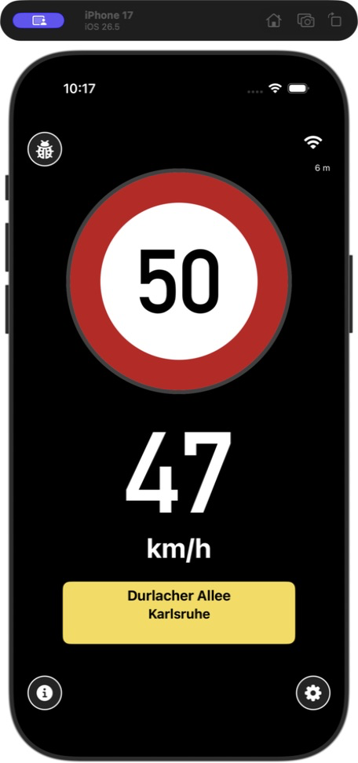
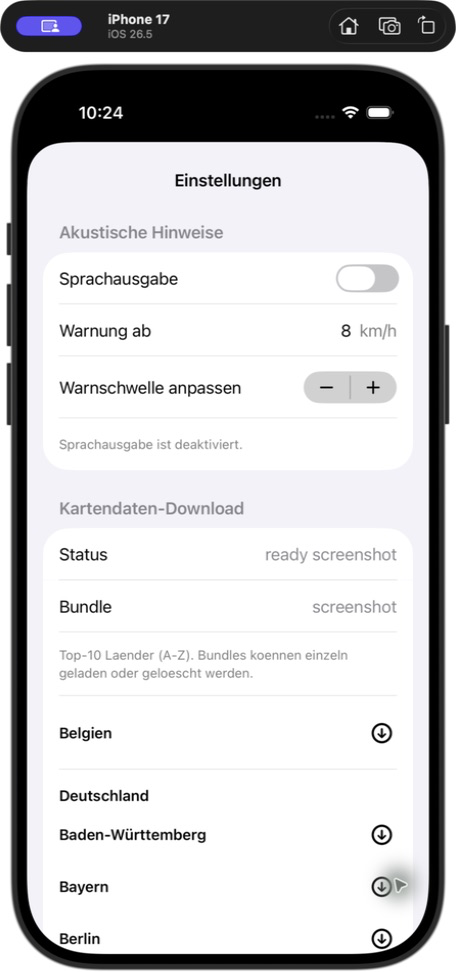
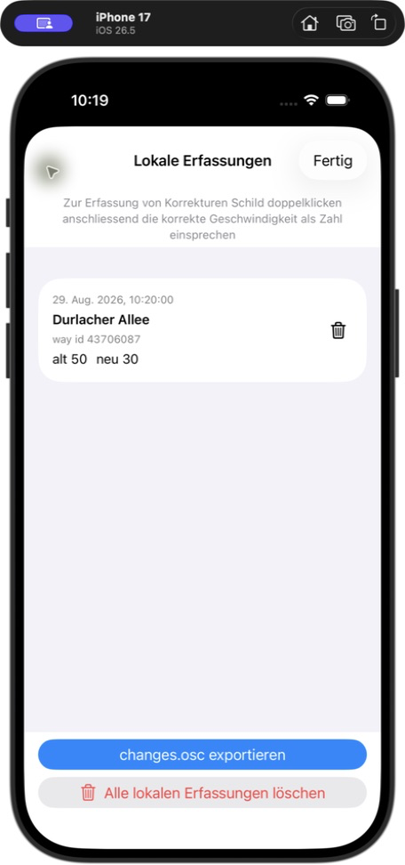
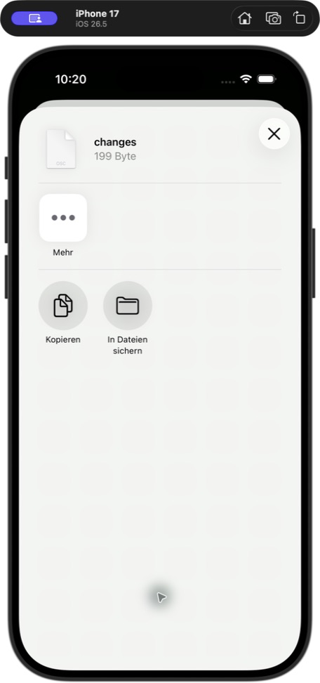
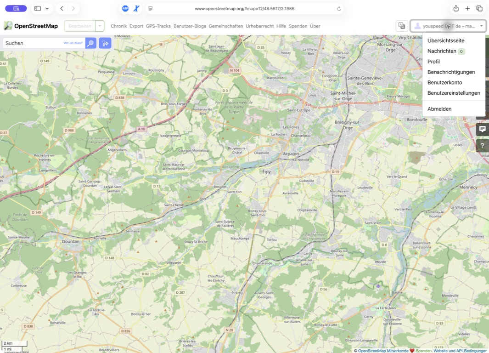

# YouSpeed-Benutzerhandbuch für iPhone

Dieses Handbuch zeigt, wie Offline-Kartendaten heruntergeladen, Tempolimit-Korrekturen erfasst, als OpenStreetMap-Änderungsdatei exportiert und vor dem Hochladen zu OpenStreetMap (OSM) geprüft werden.

Die Berechtigungen für Mikrofon und Spracherkennung sind notwendig, um Korrekturen durch Sprache zu erfassen, ebenso generell der Zugriff auf den detaillierten Standort.

> **Sicherheit:** Richte die App vor der Fahrt ein. Erfasse eine Korrektur nur im sicher abgestellten Fahrzeug oder als Beifahrer. YouSpeed ist lediglich ein Assistenzsystem; Verkehrszeichen und Verkehrsregeln haben immer Vorrang.

## 1. Fahrtansicht

Das große Schild zeigt das aktuell aus der lokalen Karte erkannte Tempolimit. Die Zahl darunter ist die aktuelle GPS-Geschwindigkeit. Über die Käfer-Schaltfläche oben links öffnest du **Lokale Erfassungen**, über das Zahnrad unten rechts die Einstellungen.

## 2. Regionale Karten herunterladen

Öffne über das Zahnrad die Einstellungen und scrolle zu **Kartendaten-Download**. Länder sind alphabetisch sortiert. Länder mit regionalen Paketen, etwa **Deutschland**, zeigen jede Region einzeln.

1. Stelle eine Internetverbindung her, öffne **Einstellungen → Kartendaten-Download** und suche das benötigte Land oder die Region.
2. Tippe auf den Abwärtspfeil neben der Region, zum Beispiel **Baden-Württemberg** oder **Bayern**.
3. Lass YouSpeed geöffnet, bis die Fortschrittsanzeige abgeschlossen ist. Das Paket steht anschließend für die Offline-Zuordnung zur Verfügung.
4. Wiederhole den Vorgang für weitere benötigte Regionen. Jedes Paket kann unabhängig verwaltet werden.
5. Um Speicherplatz freizugeben, verwende die Löschfunktion des jeweiligen Pakets oder **Heruntergeladene Datenbanken loeschen (Seed behalten)**, um alle Downloads zu entfernen und die eingebauten Startdaten zu behalten.

Der Screenshot verwendet die Simulator-Testdaten. Deshalb stehen dort die Statuswerte `ready screenshot` und `screenshot`; eine normale Installation zeigt stattdessen das aktive Paket und den tatsächlichen Download-Status.

## 3. Korrektur per Sprache erfassen

1. Warte, bis YouSpeed die richtige Straße und das zugehörige Tempolimit anzeigt, und achte auf einen guten GPS-Empfang.
2. **Tippe zweimal auf das große Tempolimit-Schild.**
3. Erlaube beim ersten Mal den Zugriff auf Mikrofon und Spracherkennung. In diesem Handbuch gelten beide Berechtigungen bereits als erteilt.
4. Wenn das Schild `?` und die App **Jetzt sprechen** anzeigt, sprich nur die neue Zahl, zum Beispiel **„30“**. Für Schrittgeschwindigkeit kannst du auch **„Fussgaengerzone“** sagen.
5. YouSpeed speichert das Ergebnis lokal. OpenStreetMap wird nicht automatisch geändert.

## 4. Lokale Erfassung prüfen und exportieren

Öffne über die Käfer-Schaltfläche **Lokale Erfassungen**. Prüfe Zeitpunkt, Straße, OSM-Weg-ID, alten Wert (**alt**) und neuen Wert (**neu**). Lösche den Eintrag, wenn die Straße falsch zugeordnet oder der Wert falsch erkannt wurde.

Tippe auf **changes.osc exportieren** und dann auf **In Dateien sichern**, um `changes.osc` in der Dateien-App abzulegen. Alternativ kannst du die Datei über AirDrop oder eine andere Teilen-Aktion auf den Mac übertragen.

Der Export ist ein Vorschlag mit OSM-Weg-IDs und vorgesehenen `maxspeed`-Werten. Er ist kein vollständig geprüfter OSM-Datensatz.

## 5. OSC-Vorschlag prüfen und zu OSM hochladen

Verwende das dafür vorgesehene OSM-Konto:

- Anmelde-E-Mail: `raphael.volz@pm.me`
- OSM-Benutzername: `youspeed DOT de - mapping speed limits`

Der Benutzername im Safari-Kontomenü bestätigt, welches Konto aktiv ist. Schreibe weder E-Mail-Adresse noch Passwort in den Änderungssatz-Kommentar.

### Sicherer Arbeitsablauf mit JOSM

Der aktuelle YouSpeed-Export `changes.osc` enthält nur die Weg-ID und den vorgeschlagenen `maxspeed`-Tag. Vollständige Geometrie, aktuelle Objektversion und andere Tags fehlen. **Lade die importierte OSC-Ebene nicht direkt hoch.** Verwende sie als Prüfliste und übertrage jede bestätigte Änderung auf frisch heruntergeladene OSM-Daten:

1. Installiere und öffne [JOSM](https://josm.openstreetmap.de/). Öffne `changes.osc` über **Datei → Öffnen…**, um den Vorschlag zu prüfen.
2. Verwende für jeden aufgeführten Weg **Datei → Objekt herunterladen…** (`Strg+Umschalt+O`), wähle **Weg**, gib die ID ein und lade das aktuelle Objekt von OSM. Lade auch die Umgebung und übergeordneten Objekte, wenn sie für die Straße relevant sind. Weitere Hinweise enthält die [JOSM-Anleitung „Download Object“](https://josm.openstreetmap.de/wiki/Help/Action/DownloadObject).
3. Vergleiche den Vorschlag mit einer tatsächlichen Vor-Ort-Beobachtung. Prüfe, ob der Weg den richtigen Straßenabschnitt abdeckt und das Tempolimit auf seiner gesamten Länge gilt.
4. Bearbeite den frisch heruntergeladenen Weg und erhalte Geometrie sowie alle nicht betroffenen Tags. Setze `maxspeed=30` nur, wenn 30 in beiden Richtungen gilt. Verwende bei richtungsabhängigen oder zeitlich bedingten Schildern die passenden OSM-Tags; beachte die [OSM-Dokumentation zu `maxspeed`](https://wiki.openstreetmap.org/wiki/Key%3Amaxspeed).
5. Starte in den JOSM-Verbindungseinstellungen die OAuth-Autorisierung. Safari sollte die OSM-Freigabeseite öffnen. Prüfe, dass **youspeed DOT de - mapping speed limits** angezeigt wird, und autorisiere anschließend JOSM.
6. Führe die JOSM-Prüfung aus und behebe Fehler oder Konflikte. Aktualisiere die Daten erneut, falls ein anderer Mapper sie während deiner Prüfung geändert hat.
7. Wähle **Datei → Daten hochladen** (`Strg+Umschalt+↑`). Prüfe die genaue Liste der geänderten Objekte. Verwende einen aussagekräftigen Kommentar, zum Beispiel `Ausgeschilderte Tempolimits nach Vor-Ort-Erhebung mit YouSpeed aktualisiert`, und gib `survey` nur dann als Quelle an, wenn tatsächlich vor Ort geprüft wurde. Die [JOSM-Upload-Anleitung](https://josm.openstreetmap.de/wiki/Help/Action/Upload) erklärt Prüfung und Upload-Dialog.
8. Klicke erst nach der Abschlussprüfung auf **Änderungen hochladen**. Dadurch wird die Änderung unter dem ausgewählten Konto öffentlich in OSM veröffentlicht; dies ist kein privater Test.

Das simulierte Beispiel 50 → 30 aus diesem Handbuch wurde bewusst **nicht hochgeladen**.

## Fehlerbehebung

- **„Jetzt sprechen“ erscheint nicht:** Prüfe unter iOS **Einstellungen → Datenschutz & Sicherheit → Mikrofon** und **Spracherkennung**, ob YouSpeed aktiviert ist. Die deutsche Spracherkennung auf dem Gerät muss verfügbar sein.
- **Falsche Zahl oder Straße erkannt:** Lösche den lokalen Eintrag und erfasse ihn erneut, wenn die richtige Straße zugeordnet ist.
- **Die Export-Schaltfläche erzeugt keine brauchbare Datei:** Prüfe, ob mindestens eine gültige lokale Erfassung aufgelistet ist.
- **JOSM meldet unvollständige oder widersprüchliche Daten:** Erzwinge den Upload nicht. Lade den aktuellen Weg und seine Umgebung erneut, übertrage den geprüften Tag auf dieses vollständige Objekt und führe die Prüfung nochmals aus.
- **Regionale Liste oder Download nicht verfügbar:** Prüfe die Internetverbindung, öffne die Einstellungen erneut und versuche es noch einmal. Bereits heruntergeladene Karten funktionieren weiterhin offline.
