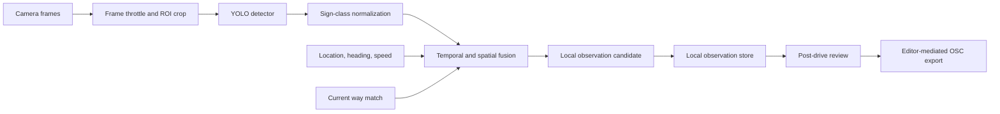

# Video Traffic Sign Recognition With YOLO

Date: `2026-07-06`

Status: draft implementation spec

Owner surface: iPhone `SpeedConsumerApp`, Android alpha, shared local-observation contract

## Summary

YouSpeed should add an on-device video recognition lane that detects traffic signs while the driving app is running. The feature complements the current database lookup and voice-based capture flow. It must produce candidate local observations through the same review/export pipeline instead of introducing a separate camera-specific truth source.

The first production slice is Germany-first and speed-sign focused:

- detect speed limit signs and speed-related special cases with a compact YOLO model,
- run inference locally on Android and iPhone,
- merge detections over time before creating an observation,
- map detections into the existing local-observation state machine,
- never upload raw video and never auto-publish map edits.

## Existing Fit

Current architecture already reserves a computer-vision module feeding the observation-normalization path in `youspeed.de-paper/share/TECHNICAL_ARCHITECTURE.md`. The local-corrections policy in `youspeed.de-paper/share/LOCAL_CORRECTIONS_STRATEGY.md` requires candidate observations, mandatory review, and editor-mediated OSM export.

Current implementation state:

- iPhone already has `LocalObservationModality.computer_vision` and `temporary_restriction` in `iphone/SpeedConsumerApp/ConsumerModels.swift`.
- Android currently has `voice_command` and `lock_current_speed` modalities in `android/app/src/main/java/de/youspeed/android/alpha/LocalObservationStore.kt`; Android needs a parity extension for `computer_vision` and `temporary_restriction`.
- Both apps persist local observations with lat/lon, road candidates, confidence, source version, state, old speed, and new speed.
- Both apps currently request location and microphone permissions only. Camera permissions, model runtime, and camera pipelines are not wired yet.

## Decision Answers

### Is there already a usable model?

Short answer: usable for a proof of concept, not usable as production evidence without YouSpeed validation and likely fine-tuning.

There are public YOLO traffic-sign checkpoints and datasets that can accelerate the first spike:

- Hugging Face has YOLOv8 traffic-sign models such as `nezahatkorkmaz/traffic-sign-detection`, which reports YOLOv8, MIT license, and 30,000+ labeled images.
- Other public YOLOv8 traffic-sign repositories exist, but many are academic/demo checkpoints, have incomplete label coverage for speed limits, or do not publish enough evaluation detail for safety-critical app behavior.
- German-oriented detection data exists through GTSDB conversions such as `keremberke/german-traffic-sign-detection`, but the dataset is small enough that it should be treated as a bootstrap/evaluation source, not sufficient production coverage.
- Larger real-world datasets such as TT100K are useful for technique and robustness lessons, but they are country-specific and may have non-commercial licensing constraints.
- Some deployment-focused checkpoints, such as Vietnamese VTSR, show useful artifact packaging patterns, but their classes, signs, and licenses are not a fit for Germany-first YouSpeed rollout.

Recommendation:

1. Use an existing public YOLO checkpoint only to prove camera, inference, post-processing, and observation plumbing.
2. Train or fine-tune a YouSpeed-owned compact model for the first real field trial, starting from a YOLO nano/small base and a Germany-first speed-sign ontology.
3. Treat any public model output as untrusted candidate evidence until it passes YouSpeed route validation and post-drive review metrics.

### Android first or iPhone first?

Implement Android first for the prototype, then port the stabilized contract to iPhone.

Android is the better first integration target in this repo because:

- Android is already an internal alpha track, so CV work is less likely to disturb the iPhone launch/reference path.
- CameraX `ImageAnalysis` maps cleanly to the desired latest-frame analyzer loop and stale-frame dropping strategy.
- LiteRT / TensorFlow Lite is a natural target for YOLO mobile inference and keeps the pipeline easy to inspect with Kotlin tests and instrumentation.
- Android already needs enum/schema parity work, so the CV contract can be introduced there before touching the iPhone reference app.

iPhone may be cleaner for final end-user performance once a Core ML export is stable, because Vision/Core ML is a strong native stack. The risk is product and release coupling: camera privacy copy, project configuration, and model integration should happen after labels, thresholds, and fusion behavior are less volatile.

### Separate app first or integrated into the current app?

Do not build a long-lived separate app. Build a short-lived Android camera/model spike first, then integrate into the current app behind a debug/internal flag.

Recommended sequence:

1. `android` debug-only spike: camera permission, CameraX analyzer, bundled sample model, local overlay/log output. This can be a hidden debug screen or isolated package inside the Android app tree.
2. Integrated fake-detector path: feed deterministic detections into `LocalObservationStore` without opening the camera.
3. Integrated real-detector path: enable CameraX + LiteRT only while driving mode is active and the internal CV flag is on.
4. iPhone parity: port the same labels, evidence JSON, fusion thresholds, and fixtures to Vision/Core ML once Android has proven the path.

A fully separate app is only useful if camera/model experimentation becomes blocked by current app build configuration. Otherwise it creates throwaway lifecycle, permission, location, and map-match code that must be rebuilt in the real app.

### Estimate

Assuming one senior mobile engineer, one validated candidate YOLO checkpoint, and no app-store/public-release work in the first pass:

| Milestone | Scope | Estimate |
| --- | --- | --- |
| Model triage and fixture contract | Pick candidate model, define labels, run desktop inference on sample/route images, write fixture JSON. | 2-4 days |
| Android camera spike | Camera permission, CameraX latest-frame analyzer, local debug detections, no observation writes. | 2-4 days |
| Android integrated fake detector | Schema migration, Android enum parity, evidence JSON, fake detector tests, review-list display. | 3-5 days |
| Android real YOLO prototype | LiteRT export/load, preprocessing, YOLO post-processing, throttling, latency metrics. | 5-8 days |
| Android fusion and local observations | Duplicate suppression, repeated-frame clustering, way-match gating, `local_only` / `needs_review` rules. | 5-8 days |
| iPhone parity prototype | Core ML export, AVCapture/Vision wrapper, same fixtures/evidence/fusion behavior. | 7-12 days |
| Controlled field validation | Route tests, threshold tuning, false-observation analysis, battery/thermal checks. | 2-4 weeks |

Practical expectations:

- First visible Android demo: 1-2 weeks.
- Integrated Android internal prototype that writes reviewable CV observations: 3-4 weeks.
- Cross-platform internal prototype: 5-7 weeks.
- Public opt-in quality: 8-12+ weeks, dominated by model quality, route validation, privacy review, and threshold tuning rather than camera plumbing.

## Goals

1. Detect traffic signs during active driving sessions on Android and iPhone.
2. Run all inference on device; no live video upload or cloud inference.
3. Generate auditable candidate observations that use the same local review/export flow as voice capture.
4. Keep database lookup as the primary runtime source. CV is additional evidence, not immediate shared ground truth.
5. Preserve battery, thermal, and latency budgets so speed-limit display and warning logic remain responsive.
6. Establish a shared model artifact contract so Android and iPhone can ship equivalent class labels and calibration thresholds even with different mobile inference backends.

## Non-Goals

- No direct app upload to OSM.
- No automatic shared backend correction from a single device.
- No raw video retention by default.
- No reliance on cloud OCR or cloud object detection.
- No global sign inventory in the first slice.
- No driver-facing camera preview during normal driving mode.

## Target Classes

The first model should recognize sign classes that can be normalized into existing maxspeed behavior.

| Detection class | Normalized value | Observation intent | Notes |
| --- | --- | --- | --- |
| `speed_limit_10` through `speed_limit_130` | numeric km/h | `set_maxspeed` | Germany-first class set; keep class names country-neutral where possible. |
| `speed_limit_zone_start_*` | numeric km/h | `set_maxspeed` | Store zone evidence in metadata; maxspeed value remains numeric. |
| `speed_limit_zone_end_*` | previous/baseline dependent | `map_inconsistency` | Do not infer a replacement limit without corroborating map/rule context. |
| `end_speed_limit` | `none` or baseline dependent | `map_inconsistency` initially | Treat as review-required until unlimited/end semantics are modeled per country. |
| `pedestrian_zone_start` | `walk` | `set_maxspeed` | Matches existing `Fussgaengerzone` / `walk` export support. |
| `pedestrian_zone_end` | baseline dependent | `map_inconsistency` | Candidate evidence only. |
| `city_entry` / `city_exit` | rule-context evidence | `map_inconsistency` | Do not overwrite maxspeed alone; use to improve city/rural confidence later. |
| `temporary_speed_limit_*` | numeric km/h | `temporary_restriction` | Keep separate from permanent maxspeed export until policy is defined. |

The class ontology must be versioned independently from the model binary. Adding country-specific sign types later should not change the meaning of existing labels.

## Architecture



### Runtime Responsibilities

`TrafficSignCameraSession`

- Owns camera permission state and active camera lifecycle.
- Starts only in driving mode after explicit user opt-in.
- Uses the rear camera and no visible preview by default.
- Pauses when the app is backgrounded, thermal state is high, battery saver is active, or location is unavailable.

`TrafficSignFrameAnalyzer`

- Receives frames with timestamp, orientation, camera intrinsics when available, and current location snapshot.
- Applies backpressure: always analyze the latest frame and drop stale frames.
- Crops a configurable road-facing region of interest before inference.
- Default throttle: 2 analyzed frames per second; allow 5 FPS only on devices that pass thermal and latency checks.

`TrafficSignDetector`

- Loads the platform-native YOLO export.
- Emits normalized detections with class id, class label, confidence, normalized bounding box, frame timestamp, and model id.
- Does not know about map matching or local observations.

`TrafficSignObservationNormalizer`

- Maps raw detections into sign candidates with semantic values such as `30`, `walk`, `none`, or `city_entry`.
- Rejects detections below per-class thresholds.
- Applies country and speed-value allowlists from the active region when available.

`TrafficSignFusionEngine`

- Clusters detections across frames and distance.
- Requires repeated evidence before creating a candidate observation.
- Combines detector confidence, temporal consistency, GPS speed, heading, map-match confidence, and current way stability.
- Produces one observation per sign event, not one observation per frame.

## Data Contract

Keep `observations` as the durable user-review record. Add a modality-specific evidence envelope instead of creating a separate CV store.

### Observation Extensions

Cross-platform enum parity:

- Add Android `LocalObservationModality.COMPUTER_VISION("computer_vision")`.
- Add Android `LocalObservationIntentType.TEMPORARY_RESTRICTION("temporary_restriction")`.
- Keep iPhone enum values as the source of current parity.

Schema extension:

- Add nullable `evidence_json TEXT` to `observations`.
- Add nullable `evidence_summary TEXT` if review UI needs a compact indexed string.
- Do not store raw image bytes in `observations`.

`evidence_json` shape:

```json
{
  "schema_version": 1,
  "modality": "computer_vision",
  "model": {
    "id": "youspeed-sign-yolo-de-v1",
    "family": "yolo",
    "artifact_sha256": "...",
    "labels_sha256": "...",
    "runtime": "coreml|litert"
  },
  "detection": {
    "class_id": 12,
    "class_label": "speed_limit_30",
    "confidence": 0.87,
    "bbox_normalized": [0.52, 0.18, 0.61, 0.31],
    "frame_timestamp_utc": "2026-07-06T12:34:56.789Z"
  },
  "fusion": {
    "cluster_id": "uuid",
    "frames_seen": 4,
    "distance_m": 18.4,
    "duration_ms": 1250,
    "calibrated_confidence": 0.79
  },
  "location": {
    "lat": 49.0069,
    "lon": 8.4037,
    "heading_deg": 82.0,
    "speed_kmh": 42.0,
    "way_id": "123456"
  },
  "privacy": {
    "raw_video_persisted": false,
    "thumbnail_persisted": false,
    "frame_hash": "..."
  }
}
```

### Observation Creation Rules

Create `local_only` observations when:

- a numeric or `walk` sign is detected with repeated evidence,
- the current way match is stable enough to assign a road candidate,
- calibrated confidence is above the local overlay threshold,
- the detected value differs from the current local/baseline value.

Create `needs_review` observations when:

- evidence is plausible but way association is weak,
- the sign is an end sign, city sign, or temporary restriction,
- the value conflicts with multiple nearby candidate ways,
- the detector confidence is high but temporal evidence is thin.

Discard silently when:

- the class is below threshold,
- the same sign has already produced an observation in the recent suppression window,
- the device is stationary or not in driving mode,
- the camera session lacks a synchronized location snapshot.

## Model Artifact Contract

Model artifacts should be generated from the same YOLO training run, then exported per platform.

Shared files:

- `TrafficSignLabels.json`: ordered class labels, semantic mapping, per-class thresholds.
- `TrafficSignModelManifest.json`: model id, training data id, export hashes, input size, quantization, calibration metrics, minimum app versions.
- `TrafficSignEvaluationReport.json`: validation metrics by class, country, lighting, weather, sign size, and route split.

iPhone artifact:

- Core ML export compiled into the app bundle or downloaded as a signed app-managed asset later.
- Runtime path: `AVCaptureSession` -> `Vision` / `Core ML` request -> normalized detector output.
- Prefer Neural Engine capable execution where available; fall back to CPU/GPU without blocking the main actor.

Android artifact:

- LiteRT / TensorFlow Lite export bundled under app assets for the first slice.
- Runtime path: CameraX `ImageAnalysis` -> frame conversion/ROI -> LiteRT interpreter -> YOLO post-processing.
- Use one analyzer executor and one in-flight inference at a time.

ONNX can remain useful for desktop evaluation and reproducible test tooling, but mobile runtime should use platform-native Core ML and LiteRT artifacts first.

## Platform Work

### iPhone

Add:

- `NSCameraUsageDescription` in `Info.plist` plus localized strings.
- Privacy manifest update for camera use.
- `TrafficSignCameraSession.swift` wrapping `AVCaptureSession`.
- `TrafficSignDetector.swift` wrapping Vision/Core ML inference.
- `TrafficSignFusionEngine.swift` for platform-independent fusion logic.
- `LocalObservationStore.recordComputerVisionDetection(...)`.
- Unit tests for class mapping, fusion thresholds, schema migration, and evidence JSON decoding.

Reuse:

- existing `LocalObservationModality.computer_vision`,
- existing local-observation store and review/export flow,
- existing active way and confidence context from `DriveSessionViewModel`.

### Android

Add:

- `android.permission.CAMERA` in `AndroidManifest.xml`.
- Camera permission handling in `ConsumerHost` and `MainActivity`.
- CameraX dependencies and a `TrafficSignCameraAnalyzer`.
- LiteRT dependency and detector wrapper.
- Android enum parity for `computer_vision` and `temporary_restriction`.
- `LocalObservationStore.recordComputerVisionDetection(...)`.
- Unit tests for mapping, fusion, schema migration, and JSON evidence.
- Instrumented tests with a fake detector and replayed image frames.

Reuse:

- existing driving-mode lifecycle,
- existing current way context in `ConsumerSessionController`,
- existing local observation review/export UI.

## Privacy and Safety

- Default mode stores no video, no full frames, and no sign thumbnails.
- Diagnostic image capture is a separate explicit opt-in and should expire automatically.
- Evidence JSON may store normalized bounding boxes and frame hashes, but not personally identifiable image content.
- The detector must run locally and must not send frames to a server.
- No camera preview should be shown while driving unless a debug build explicitly enables it.
- CV observations require post-drive review before export.
- Temporary restrictions should not be exported as permanent `maxspeed` edits until a dedicated policy exists.

## Runtime Budgets

Initial gates:

- Speed lookup and warning UI must not wait on CV inference.
- Analyze at most 2 FPS by default.
- Keep one inference in flight and drop stale frames.
- Target detector p95 under 250 ms on supported devices.
- Target local-observation creation within 2 seconds of the first qualifying detection cluster.
- Disable or downshift CV when thermal or battery conditions degrade.
- Model plus labels should fit comfortably in the app bundle; target under 25 MB for the first quantized mobile artifact.

These are release gates, not claims. They must be measured on actual Android and iPhone devices before enabling the feature by default.

## Training and Evaluation

Dataset requirements:

- Annotated sign images or frames split by route/date/device to prevent leakage.
- Minimum per-class coverage for daylight, dusk/night, rain, partial occlusion, small/far signs, and motion blur.
- Separate holdout routes for Germany field validation.
- Explicit negative frames from roads without visible signs.
- Labels for sign relevance where possible, because many visible signs apply to side roads, ramps, parking areas, or opposite directions.

Evaluation metrics:

- per-class precision/recall,
- false observation rate per driving hour,
- missed sign rate on curated routes,
- duplicate observation rate,
- wrong-way association rate,
- detector latency p50/p95,
- battery and thermal impact over a 30 minute drive,
- post-drive review acceptance rate.

Do not advance from capture-only testing to local overlay activation until false observations and wrong-way associations are low enough for safe review UX.

## Rollout Plan

### Phase 0: Offline Model and Contract

- Define labels and model manifest.
- Train/export YOLO artifacts.
- Build desktop evaluation and golden-image tests.
- Add shared evidence JSON fixtures.

Exit criteria:

- model manifest and labels are versioned,
- validation report exists,
- app code can parse fixture detections into local observations.

### Phase 1: App Integration With Fake Detector

- Add camera permission copy but keep camera disabled by default.
- Add fake detector injection on both platforms.
- Persist computer-vision observations through existing stores.
- Show CV observations in the same local review list.

Exit criteria:

- Android and iPhone parity tests pass with identical fixture detections,
- no raw image persistence,
- existing voice capture behavior unchanged.

### Phase 2: On-Device Prototype

- Wire CameraX + LiteRT on Android.
- Wire AVCapture + Vision/Core ML on iPhone.
- Run model behind an internal debug flag.
- Record only aggregate local metrics and evidence JSON.

Exit criteria:

- detector runs on actual devices,
- p95 inference stays within budget,
- driving UI remains responsive,
- field route logs can be replayed offline.

### Phase 3: Fusion and Local Overlay

- Enable temporal/spatial fusion.
- Create `local_only` observations only for high-confidence numeric/walk signs.
- Keep end signs, city signs, temporary restrictions, and weak way matches as `needs_review`.

Exit criteria:

- duplicate suppression works,
- wrong-way association rate is acceptable on controlled routes,
- review UX clearly distinguishes CV from voice.

### Phase 4: Limited Field Trial

- Enable for internal testers with explicit opt-in.
- Collect aggregate metrics and manually reviewed outcomes.
- Tune thresholds by class and device tier.

Exit criteria:

- review acceptance rate is high enough to justify broader opt-in,
- battery/thermal impact is understood,
- no privacy regressions.

### Phase 5: Public Opt-In

- Ship as an opt-in traffic-sign detection setting.
- Keep editor-mediated export policy.
- Defer backend corroboration until independent multi-device quality gates exist.

## Acceptance Criteria

The feature is ready for public opt-in when:

- both apps use the same label/manifest versions,
- Android and iPhone normalize the same fixture detections into equivalent observations,
- camera permissions and privacy copy are localized,
- no raw video leaves the device,
- detector runtime stays within measured latency and thermal budgets,
- CV observations never bypass post-drive review for export,
- voice capture and database lookup remain unchanged under regression tests,
- temporary restrictions and end signs are not exported as permanent maxspeed edits without explicit policy.

## Open Decisions

- Whether first-slice local overlay should apply immediately for high-confidence CV numeric signs, or always wait for review.
- Whether to persist opt-in cropped sign thumbnails for post-drive review, and how long they may live on device.
- How to model dynamic/electronic speed signs separately from permanent signs.
- Whether country-specific sign packs should ship in the app bundle or be downloaded with region assets.
- Minimum supported Android/iPhone hardware tier for default CV enablement.

## References

- Ultralytics YOLO export formats: https://docs.ultralytics.com/modes/export/
- Ultralytics Core ML integration: https://docs.ultralytics.com/integrations/coreml/
- Ultralytics TT100K dataset notes: https://docs.ultralytics.com/datasets/detect/tt100k/
- Hugging Face model `nezahatkorkmaz/traffic-sign-detection`: https://huggingface.co/nezahatkorkmaz/traffic-sign-detection
- Hugging Face model `Phearith/Traffic_Sign_Detection_Using_YOLOv8`: https://huggingface.co/Phearith/Traffic_Sign_Detection_Using_YOLOv8
- Hugging Face model `yahyagul/traffic-sign-yolov8`: https://huggingface.co/yahyagul/traffic-sign-yolov8
- Hugging Face dataset `keremberke/german-traffic-sign-detection`: https://huggingface.co/datasets/keremberke/german-traffic-sign-detection
- Hugging Face model `liamxdev/vtsr`: https://huggingface.co/liamxdev/vtsr
- Google LiteRT overview: https://developers.google.com/edge/litert/overview
- Android CameraX ImageAnalysis: https://developer.android.com/media/camera/camerax/analyze
- Apple Vision framework: https://developer.apple.com/documentation/vision
- Apple Core ML framework: https://developer.apple.com/documentation/coreml
