# Video Traffic Sign Recognition

Date: `2026-09-04`

Status: draft implementation spec

Owner surface: iPhone `SpeedConsumerApp`, Android alpha, shared local-observation contract

## Summary

YouSpeed should add an on-device video recognition lane that detects traffic
signs while the driving app is running. Traffic-sign recognition (TSR) is one
consumer of the feature-neutral Drive Recorder camera session, alongside
optional local Dashcam encoding, Panoramax still capture, and a fourth
display-only preview consumer. An actionable track committed after the sign
leaves view becomes an explicit session-scoped camera source above local
correction and bundled OSM for the current display and warnings. It remains
active while map matching
proves continuous travel along the same original road relation, survives a
temporary no-match gap, and is replaced by a newer committed sign or cleared on
the first definite unrelated way. Each committed export-safe recognition is
inserted once into the local corrections database for the passage-boundary
matched way (or first compatible rematch when the boundary has no match) when no
equivalent current correction exists and, after explicit review/approval, can
use the hardened OSC export flow. When TSR is disabled,
the camera lane admits/enqueues no new TSR input and makes any unavoidable
in-flight completion side-effect-free; continuous evaluation uses only the local
correction and bundle layers.

The first production slice is Germany-first and speed-sign focused:

- detect speed-relevant primary signs, including German city and distinct end
  signs, plus qualifying white supplementary plates with a compact proposal
  detector and mobile semantic classifier,
- run inference locally on Android and iPhone,
- merge detections over time before creating an observation,
- map detections into the existing local-observation state machine,
- never upload ordinary TSR frames or Dashcam video and never auto-publish map edits; a separate consented diagnostic mode may retain selected, inspectable training/evaluation frames,
- retain encoded video only when the independent Dashcam consumer is explicitly enabled, and
- keep Panoramax review, approval, and upload as an explicit post-drive “process later” workflow.

## Existing Fit

Current architecture already reserves a computer-vision module feeding the observation-normalization path in `youspeed.de-paper/share/TECHNICAL_ARCHITECTURE.md`. The local-corrections policy in `youspeed.de-paper/share/LOCAL_CORRECTIONS_STRATEGY.md` requires candidate observations, mandatory review, and editor-mediated OSM export.

Current implementation state:

- iPhone already has `LocalObservationModality.computer_vision` and `temporary_restriction` in `iphone/SpeedConsumerApp/ConsumerModels.swift`.
- Android local-observation enum/database parity for `computer_vision` and `temporary_restriction` remains a separate integration step.
- Both apps persist local observations with lat/lon, road candidates, confidence, source version, state, old speed, and new speed.
- iPhone now uses `DriveCaptureCoordinator` as the neutral Drive Recorder camera
  owner for Dashcam, TSR, Panoramax still capture, and the display-only preview;
  the earlier feature-owned Panoramax camera path has been folded into it.
- Shared v1 contracts, pure fusion/precedence policy, and the iPhone direct
  runtime adapter exist on this branch. The two-component pack/event v2 and
  trained artifacts are still missing. Android still needs camera permission
  and the shared CameraX/LiteRT lifecycle. Absence of a verified pack must
  remain visibly `unavailable` on either platform.
- The iPhone numeric override seam is intentionally dormant: its code-owned
  model-pack allowlist is empty, and the bundled pack is shadow-only. This spec
  does not authorize enabling that pack.
- Current iPhone/Android fusion confirms from a time window while a sign is still
  visible, and the current transient policy is exact-way/source-signature based.
  Neither behavior satisfies the passage-edge or relation-scope contract below.
- The v3 builder can create route-continuity tables, but the checked-in Karlsruhe
  bundles do not contain them yet. Runtime relation scope therefore requires
  regenerated bundles and an exact-way compatibility fallback.
- Current bulk OSC export accepts more than explicitly approved typed
  corrections and does not provide one-shot export semantics. It must be
  hardened before automatically recorded CV rows can use it.

## Decision Answers

### Is there already a usable model?

Short answer: no ready-made public checkpoint cleanly covers real German road scenes, numeric speed limits, and the white supplementary plates that qualify them on both mobile runtimes.

The first owned candidate architecture is therefore compositional:

1. Bootstrap full-scene proposal detection from Zenseact Open Dataset (ZOD) plus consented YouSpeed scenes and hard negatives. Before training, audit and freeze the ZOD label mapping to determine whether it supplies separate supplementary-plate boxes; otherwise add reviewed YouSpeed or synthetic full-scene plate annotations. Crop-only sources cannot prove proposal coverage.
2. Bootstrap German crop semantics from GTSIGN-220, use its pinned ViT only as a teacher/reference, and add Synset Signset Germany for rare primary/plate combinations and robustness augmentation.
3. Detect `primary_sign` and `supplementary_plate` separately, link them into a sign assembly, and classify/parse the white plate as a typed restriction. Do not create a flat class for every speed/restriction combination.
4. Use a two-role YOLOX-Nano-derived proposal detector at `640x640` and a
   MobileNetV3-Large `224x224` union-label crop classifier as the target.
   Compare MobileNetV3-Small as the latency challenger. A direct
   YOLOX-Nano semantic detector remains an iPhone-only shadow baseline while
   the current runtime supports direct detection only.
5. Keep RF-DETR Nano and D-FINE-N as detector conversion challengers until
   their exact checkpoints and Core ML/LiteRT parity are pinned. Use the
   Panoramax German classifier and the separately pinned GTSIGN-220 ViT only as
   external crop benchmarks/teachers; neither is a full-frame detector or the
   YouSpeed mobile model. GTSIGN taxonomy adaptation and leakage-safe
   evaluation are still required before quoting it as comparison evidence.
6. YOLOX repository code is Apache-2.0, but the COCO-pretrained release weight
   is not release-approved until its weight license and training lineage are
   documented. The MobileNetV3 initializations have the same fail-closed
   weight/data-lineage and NOTICE review.
7. Treat every public or transferred model output as untrusted until it passes
   leakage-safe real-route validation, calibration, export parity, and
   physical-device gates.

The exact source revisions, checksums, licenses, and training stages live in
`TSR_TRAINING_ROUND_TRIP.md` and `shared/tsr/training-sources-v1.json`. The
machine-readable decision and its still-blocked runtime state live in
`shared/tsr/model-selection-v1.json`; no candidate is selected yet.

### Android first or iPhone first?

Stabilize the shared contract first. Connect it to the existing iPhone Drive Recorder camera path for the current attached-device field work, while building the backend-neutral Android orchestration and parity tests in parallel. Add the Android CameraX/LiteRT backend only after a verified mobile artifact exists.

This order follows the implementation that now exists in this branch:

- the iPhone already owns the unified Dashcam/TSR/Panoramax camera session used by the attached test device,
- both platforms can share event, model-pack, context, fusion, and precedence fixtures before either receives a release model,
- CameraX `ImageAnalysis` still maps cleanly to the same latest-frame analyzer loop and stale-frame dropping strategy, and
- Core ML and LiteRT exports must both come from one frozen, evaluated training result.

Neither platform is the authority for labels, thresholds, or precedence. The shared signed pack and fixtures are. A runtime without a verified artifact must remain explicitly unavailable rather than substituting a demo model.

### Separate app first or integrated into the current app?

Do not build a separate camera app. Continue inside the existing iPhone app and
its neutral Drive Recorder session, behind development-only model-pack loading.
That is the shortest path to evidence from the attached field-test phone and
also proves that Dashcam recording remains unaffected.

Recommended sequence:

1. Train and export the direct YOLOX-Nano iPhone shadow baseline, then measure
   it through the existing Vision/Core ML consumer without activating camera
   overrides.
2. Evolve the shared pack/event contract so detector and classifier each carry
   their own preprocessing, calibration, and artifact identity; add the
   proposal-classification runtime to iPhone.
3. Train and compare the MobileNetV3 Large/Small two-stage candidates through
   the same consented replay and field fixtures.
4. Add the Android CameraX/LiteRT consumer after a verified sibling artifact
   exists, reusing the same normalized events, fusion policy, and golden
   fixtures.

A throwaway app would duplicate lifecycle, permission, location, map matching,
recording coexistence, and the diagnostic data flywheel that actually need to
be proven.

### Estimate

Assuming one senior mobile engineer, one validated candidate YOLO checkpoint, and no app-store/public-release work in the first pass:

| Milestone | Scope | Estimate |
| --- | --- | --- |
| Model triage and fixture contract | Pick candidate model, define labels, run desktop inference on sample/route images, write fixture JSON. | 2-4 days |
| iPhone direct-detector shadow | Fine-tuned Core ML export, replay fixtures, shared-camera shadow inference, no active override. | 3-6 days after a usable checkpoint exists |
| Two-stage contract + iPhone runtime | Component-specific preprocessing/artifact identity, proposal/classifier runtime, assembly fixtures. | 5-10 days |
| Android parity prototype | CameraX/LiteRT consumer, same fixtures/evidence/fusion behavior, recording coexistence. | 7-12 days |
| Controlled field validation | Route tests, threshold tuning, false-observation analysis, battery/thermal checks. | 2-4 weeks |

Practical expectations:

- First visible iPhone shadow result: within the initial model spike.
- Cross-platform internal prototype: after both mobile exports pass parity and
  the shared contract supports the two-stage result.
- Public opt-in quality: 8-12+ weeks, dominated by model quality, route validation, privacy review, and threshold tuning rather than camera plumbing.

## Goals

1. Detect traffic signs during active driving sessions on Android and iPhone.
2. Run all inference on device; no live video upload or cloud inference.
3. Generate auditable candidate observations that use the same local review/export flow as voice capture.
4. Resolve the active runtime value as `committed applicable TSR > local correction > bundled OSM`, while keeping the camera source visibly identified and scoped to the continuously matched road relation.
5. Preserve battery, thermal, and latency budgets so speed-limit display and warning logic remain responsive.
6. Establish a shared model artifact contract so Android and iPhone can ship equivalent class labels and calibration thresholds even with different mobile inference backends.
7. Use one camera owner and one explicit drive start/stop lifecycle while keeping Dashcam, TSR, Panoramax capture, and the display-only preview separately failure-isolated. Preview display may depend on Dashcam being active, but it must not control recording or another consumer.

## Non-Goals

- No direct app upload to OSM.
- No automatic shared backend correction from a single device.
- No retention of the shared raw frame stream during ordinary recognition. Optional Dashcam retention stores encoded local video only under its own explicit enablement and storage policy; diagnostic TSR capture stores only selected frames/crops under separate consent, retention, review, and export controls.
- No Panoramax upload during an active or finalizing drive, and no automatic upload after stop.
- No reliance on cloud OCR or cloud object detection.
- No global sign inventory in the first slice.
- No second camera session or persisted raw frames for the driver-facing confidence preview. While Dashcam is active, the user may temporarily replace the speed/location workspace with the shared session's live preview; the speed-limit sign remains visible.

## Target Classes

The first model should recognize sign classes that can be normalized into existing maxspeed behavior.

| Semantic/classifier label | Normalized value | Observation intent | Notes |
| --- | --- | --- | --- |
| `speed_limit_10` through `speed_limit_130` | numeric km/h | `set_maxspeed` | Germany-first class set; keep class names country-neutral where possible. |
| `speed_limit_zone_start_*` | numeric km/h | `set_maxspeed` | Store zone evidence in metadata; maxspeed value remains numeric. |
| `speed_limit_zone_end_*` | prior/baseline rule | `set_maxspeed` when resolved, otherwise `map_inconsistency` | End the active camera zone assertion. Persist/export only when policy resolves an unambiguous replacement value. |
| `maximum_speed_end_*` | prior/baseline rule | `set_maxspeed` when resolved, otherwise `map_inconsistency` | End the posted maximum-speed restriction, optionally retaining the crossed-out numeric value as evidence. |
| `all_restrictions_end` | prior/baseline rule | `set_maxspeed` when resolved, otherwise `map_inconsistency` | Keep distinct from maximum-speed-only end; its speed effect still needs a resolvable prior/baseline rule. |
| `pedestrian_zone_start` | `walk` | `set_maxspeed` | Matches existing `Fussgaengerzone` / `walk` export support. |
| `pedestrian_zone_end` | prior/baseline rule | `set_maxspeed` when resolved, otherwise `map_inconsistency` | End the camera pedestrian-zone assertion and resolve the surrounding rule conservatively. |
| `city_entry` | `50` in Germany | `set_maxspeed` | A committed German yellow place-name entry sign creates a camera-derived 50 km/h assertion. |
| `city_exit` | prior/baseline rule | `set_maxspeed` when resolved, otherwise `map_inconsistency` | End the urban assertion; German rural/motorway resolution still depends on the matched road context. |
| `motorway_exit` / `motorroad_exit` | prior/baseline rule | `set_maxspeed` when resolved, otherwise `map_inconsistency` | Re-evaluate the statutory/map baseline for the new road context. |
| non-speed restriction ends | no speed action | evidence only | Overtaking-, priority-, parking-, and other restriction-end signs must not be mistaken for a speed-limit end. |
| `temporary_speed_limit_*` | numeric km/h | `temporary_restriction` | Keep separate from permanent maxspeed export until policy is defined. |

The class ontology must be versioned independently from the model binary. Adding country-specific sign types later should not change the meaning of existing labels.

The bundled Panoramax bootstrap classifier is not sufficient for this target
class set. It has generic numeric/zone/end labels but no city-entry or city-exit
output, and its current model pack is explicitly uncalibrated and shadow-only.
Do not alias an unrelated label to a city sign or enable this pack for live
overrides. Introduce the missing city and distinct end classes in the next
versioned taxonomy/model pack, calibrate them, and keep deployment controlled
by the code-owned allowlist. A generic classifier output such as `no:end` is not
actionable until a speed-relevant subtype is proven. Use these reviewed
Panoramax cases as named model regressions:

- [yellow German city-limit sign](https://panoramax.openstreetmap.fr/?annot=d8dbe74f-315b-419b-81b9-a736ce373d27&background=streets&focus=pic&map=17/48.792708/8.425556&pic=e88450f8-b625-4b91-bc3c-2ab09e37cff0&seq=c532e405-c86b-417d-b5e8-1a448b5040b2&speed=250&theme=default&users=default&xyz=88.85/-0.68/65), picture `e88450f8-b625-4b91-bc3c-2ab09e37cff0`;
- [end of 70 km/h sign](https://panoramax.openstreetmap.fr/?annot=71bf3a65-23df-4847-acff-5032009a42af&background=streets&focus=pic&map=18.41/48.794189/8.418692&pic=9a5962cd-518c-4ae3-a027-4a53fbd72acd&seq=c532e405-c86b-417d-b5e8-1a448b5040b2&speed=250&theme=default&users=default&xyz=225.29/3.93/65), picture `9a5962cd-518c-4ae3-a027-4a53fbd72acd`.

The passage-edge behavior has a separate four-frame regression sequence:

1. [first distant 50 km/h sighting](https://explore.panoramax.fr/de/index?annot=08d9286f-71d0-4e0a-a0fe-fc9cac5acf0a&focus=pic&map=17/48.792964/8.427128&pic=722e390c-7ac8-4d1f-89d9-3f19d33c3c7e&seq=c532e405-c86b-417d-b5e8-1a448b5040b2&speed=250&theme=default&users=default&xyz=250.97/2.53/65), picture `722e390c-7ac8-4d1f-89d9-3f19d33c3c7e`;
2. [closer classified sighting](https://explore.panoramax.fr/de/index?annot=cddc33b2-a933-4c2d-b75e-98bd6ef60d67&focus=pic&map=17/48.792894/8.426672&pic=501e2fec-d5e1-400b-8701-52f26bbad0b1&seq=c532e405-c86b-417d-b5e8-1a448b5040b2&speed=250&theme=default&users=default&xyz=251.05/1.75/65), picture `501e2fec-d5e1-400b-8701-52f26bbad0b1`;
3. [last visible sighting](https://explore.panoramax.fr/de/index?focus=pic&map=17/48.792822/8.426214&pic=c8c29b58-9b45-42b2-a166-f9a2b6e4057e&seq=c532e405-c86b-417d-b5e8-1a448b5040b2&speed=250&theme=default&users=default&xyz=250.05/1.75/65), picture `c8c29b58-9b45-42b2-a166-f9a2b6e4057e`;
4. [first frame after the sign has left view](https://explore.panoramax.fr/de/index?focus=pic&map=17/48.792769/8.425878&pic=3340eefd-70df-403c-90b8-45729184fd3a&seq=c532e405-c86b-417d-b5e8-1a448b5040b2&speed=250&theme=default&users=default&xyz=250.05/1.75/65), picture `3340eefd-70df-403c-90b8-45729184fd3a`.

The first three frames may build and qualify one physical-sign track, but they
must not change the effective speed or write a correction. The fourth frame is
the logical passage boundary: after loss validation, activate and persist the
50 exactly once using the road context captured at that boundary. The track
reports each raw frame score and a separate accumulated support score; compatible
sightings make accumulated support non-decreasing up to a correlation cap even
though an individual frame score may fluctuate.

## Architecture

```mermaid
flowchart LR
  START["Explicit drive start"] --> CAM["Neutral shared camera session"]
  CAM --> STOP["Explicit drive stop and local finalization"]
  CAM --> ROUTER["Timestamped frame router"]
  ROUTER --> DASH["Dashcam encoder (optional)"]
  ROUTER --> THROTTLE["TSR latest-frame throttle and useful full frame"]
  ROUTER --> CADENCE["Panoramax distance/time sampler"]
  CAM --> PREVIEW["Display-only confidence preview"]
  DASH --> VIDEO["Protected local encoded video"]
  THROTTLE --> PROPOSALS["Two-role proposal detector"]
  PROPOSALS --> CROPS["Primary-sign and plate crops"]
  CROPS --> CLASSIFIER["Union-label crop classifier"]
  CLASSIFIER --> ASSEMBLY["Geometry and sign assembly"]
  ASSEMBLY --> NORMALIZE["Semantic normalization"]
  THROTTLE -. "current iPhone shadow lane" .-> SHADOW["Direct semantic detector"]
  SHADOW -.-> NORMALIZE
  NORMALIZE --> FUSION["Consecutive-frame track fusion"]
  FUSION --> PASS["Visible-to-missing passage finalizer"]
  GPS["Location, heading, speed"] --> ROUTER
  GPS --> FUSION
  MATCH["Current way match"] --> FUSION
  MATCH --> PASS
  PASS --> LIVE["Session camera-source assertion"]
  PASS --> OBS["Reviewable local observation candidate"]
  OSM["Bundled OSM result"] --> LIVE
  LOCAL["Local correction"] --> LIVE
  OBS --> STORE["Local observation store"]
  CADENCE --> PQUEUE["Local Panoramax still queue"]
  STOP --> REVIEW["Post-drive review"]
  STORE --> REVIEW
  PQUEUE --> REVIEW
  REVIEW --> EXPORT["Editor-mediated OSC export"]
  REVIEW --> APPROVE["Explicit Panoramax selection and approval"]
  APPROVE --> UPLOAD["Process-later Panoramax upload"]
```



### Runtime Responsibilities

`DriveCameraSession` (the conceptual owner; implemented on iPhone by
`DriveCaptureCoordinator`)

- Is the only owner of camera permission, rear-camera configuration, interruption handling, and the active camera lifecycle.
- Starts once for an explicit drive session and stops once when that drive ends; individual consumers may be toggled during recording but never open competing sessions or rebuild the live capture graph.
- Produces frames with a shared drive-session ID, timestamp, orientation, camera intrinsics when available, and synchronized location snapshot.
- For scored device runs, sustains at least 15 camera frames/s while TSR
  independently samples those frames at its adaptive inference cadence.
- Has no Panoramax account, upload, detection, or retention policy.

`DriveFrameRouter`

- Fans each shared frame out to the independently enabled Dashcam, TSR, and Panoramax consumers.
- Does not enqueue, copy, or preprocess a frame for TSR when the TSR setting is
  off or its current enable generation is inactive.
- Isolates backpressure: a slow consumer drops or skips its own work and cannot stall another consumer.
- Keeps common frame time/location association without making one consumer's output trigger another.

`DashcamEncoder`

- Is separately enabled and consented; enabling TSR or Panoramax does not enable video retention.
- Encodes local video segments without retaining the raw shared frame stream.
- Owns its protected storage, capacity, segment finalization, and retention policy.
- Never supplies files to Panoramax upload and never sends video to TSR or a server.

`DisplayOnlyPreviewConsumer`

- Is the fourth shared-camera consumer and presents the existing session through
  the platform preview layer; it does not pass sample buffers through the TSR
  frame router.
- While Dashcam is active, replaces the speed/location workspace only after an
  explicit user toggle; tapping the preview toggles back, and the speed-limit
  sign remains visible.
- Creates no retained media, second camera session, or inference input, and a
  preview failure cannot stop Dashcam, TSR, or Panoramax capture.

`TrafficSignFrameAnalyzer`

- Receives shared frames and their synchronized metadata from `DriveFrameRouter`; it does not own the camera.
- Applies backpressure: always analyze the latest frame and drop stale frames.
- Downscales the useful full frame for proposal/detection inference; it must not permanently discard roadside regions with a narrow center crop.
- Uses a measured adaptive 2–10 Hz inference envelope based on vehicle speed,
  active tracks, latency, power, and thermal pressure; this is independent of
  the higher shared-camera capture rate.
- Keeps one inference in flight, replaces the single pending frame with the newest frame, and retains only a bounded in-memory set of sharp/exposed full-resolution frames long enough to select primary-sign and supplementary-plate crops.
- Does not persist the input frame stream or trigger Dashcam/Panoramax capture.

`PanoramaxStillCaptureConsumer`

- Receives shared frames and location samples without owning the camera.
- Selects full-scene stills using its distance or time policy; TSR detections and Dashcam segment boundaries never trigger it.
- Writes only cadence-selected JPEGs, thumbnails, and metadata to the protected local Panoramax queue.
- Has no upload transport. During an active or finalizing drive it can only append local captures to the current `capturing` batch.

`TrafficSignProposalDetector`

- Loads the platform-native YOLOX-Nano-derived proposal export.
- Emits only `primary_sign` and `supplementary_plate` boxes with scores, frame
  timestamps, and detector lineage; it does not assign final road-sign meaning.
- Does not know about map matching or local observations.

`TrafficSignCropClassifier`

- Classifies the best retained primary and supplementary crops with the single
  MobileNetV3 union-label component, using the proposal role to constrain the
  permitted label subset.
- Applies independently calibrated primary and supplementary thresholds and
  preserves unsupported or unreadable white plates as `unresolved`.

`TrafficSignAssemblyNormalizer`

- Links compatible plates below/near a primary using deterministic geometry
  and temporal tracks, with one-parent ownership.
- Maps the assembled result into a structural action such as
  `posted_maximum(30)`, `pedestrian_zone_start`, `city_entry(DE)`, or a distinct
  end action, plus explicit condition state. Presentation and OSM values are
  resolved later and never used to reconstruct the structural action.
- Applies country and speed-value allowlists from the active region when
  available. The direct-detector iPhone shadow lane enters here through a
  legacy single-component adapter and is never treated as two-stage evidence.

`TrafficSignFusionEngine`

- Clusters detections into physical-sign tracks across consecutive eligible
  analyzed frames and distance.
- Arms a track after one or more consecutive consistent sightings. Repeated
  sightings are the normal path; a one-frame track must pass a separately
  calibrated higher threshold and require the stricter multi-negative loss path
  rather than the immediate geometric-exit shortcut. This is an explicit
  high-confidence exception that preserves the valid one-sighting case; it must
  not inherit the ordinary repeated-sighting threshold.
  A normal raw frame score may fluctuate; accumulated positive support is
  non-decreasing across compatible sightings, with a correlation/saturation cap.
  Contradictory evidence can reject or split the track. Preserve raw and fused
  scores separately.
- Combines detector/classifier confidence, temporal and box-motion consistency,
  GPS speed, heading, map-match confidence, and current way stability.
- Carries the frame-time way ID, coordinate, heading, travel direction,
  route-relation candidates, and source context through asynchronous inference.
- Keys the track by a stable drive/TSR generation, physical track ID, and road
  continuity epoch. Current way ID and the narrowing relation-group intersection
  are mutable track data, not key equality, so an OSM way split cannot reset a
  valid consecutive sequence.

`TrafficSignPassageFinalizer`

- Implements `idle -> tracking -> armed -> loss_pending -> committed|discarded`.
- While `tracking` or `armed`, it does not change the main speed, warnings, or
  local corrections. An already-active older camera assertion remains active.
- The first successfully analyzed frame without the armed physical sign records
  the logical passage timestamp/location/way. Strong pass geometry may commit
  that edge immediately; otherwise require a calibrated consecutive-negative
  debounce. A re-detection before debounce completes returns to `armed` without
  emitting an event.
- Counts only a successfully analyzed, usable image with no associated track as
  a negative frame. A throttled/dropped frame, blur/quality rejection, inference
  error, camera interruption, thermal pause, TSR disable, or drive stop is not
  evidence that the sign left view. Missing map context alone is not a visual
  miss; an otherwise valid negative image may record visual loss but must hold
  road activation/persistence pending coherent map context.
- Receives explicit per-frame `seen`/`not_seen` outcomes. Silent track eviction
  or a timeout may discard stale state, but can never synthesize a passage edge.
- On commit, emits exactly one passage event that may replace the runtime camera
  assertion and create at most one observation. The semantic boundary remains
  the first qualified missing frame even when a later negative frame confirms
  it.
- If the boundary has no coherent match, holds a bounded pending passage. It may
  commit on a stabilized same-scope rematch; a stabilized unrelated way or the
  time/distance bound discards it without assigning that way or writing a
  correction.

`TrafficSignRuntimeSourceResolver`

- Resolves `committed applicable TSR > local correction > bundled OSM` and
  publishes the selected provenance with the value.
- Keeps a camera assertion through repeated fixes on the same way and through a
  way-ID change when the matcher confirms continuous travel in at least one
  still-eligible `route_relation_connected` group captured at recognition.
- Holds the assertion through a temporary no-match gap. The first definite new
  way that is neither the original way nor a member of a still-eligible original
  route group clears it and immediately reveals the local correction or bundle
  value.
- Starts with the assertion's original relation-group set and narrows the
  eligible set by intersection on each continuous way transition. Never add a
  group learned only from a later way: that would allow transitive relation
  hopping. Do not treat broad same-street-name groups as route relations. If
  route membership is unavailable, fail closed to exact-way scope.
- Uses exact direction for repeated matches on the original way. Across
  different ways, use the matcher's continuous traversal decision rather than
  comparing `forward`/`reverse`, because adjacent OSM ways may use opposite
  digitization directions.
- Rejects a delayed result unless its TSR generation and frame-time context are
  still compatible with the current applicability scope. A newer actionable
  sign replaces the current camera assertion only when its track commits at the
  passage edge, never merely because it is visible or armed.
- Separates applicability from base-source revision. A different local or
  bundled speed value on another member way cannot outrank an applicable camera
  assertion, and persisting that camera assertion locally must not clear it.
  A bundle switch, drive/session stop, definite relation exit, matcher-detected
  reversal anywhere in the scope, or disabling TSR does clear it. A bundle
  switch also advances the context generation so a result admitted against the
  old bundle cannot publish or persist under the new one.
- Represents camera assertions as structural typed actions
  (`posted_maximum(value)`, `zone_start(value)`, `city_entry(country)`,
  `pedestrian_zone_start`, `temporary_maximum(value, condition)`, and the
  matching distinct end actions), rather than an optional integer. Keep the
  action separate from its resolved presentation value (`numeric`, `walk`,
  `statutory_default`, `unlimited`, or `unknown`) so an end reducer can remove
  exactly the layer that its sign ends. Country policy resolves German city
  entry to 50 km/h.
  An end action restores a captured prior rule or a corroborated statutory/map
  baseline using settlement, highway, motorroad, vehicle, and country context;
  it must not assume a blanket rural value. An ambiguous end remains visible
  review evidence but cannot fabricate a numeric limit.
- Exposes source and evidence context so UI, warnings, logs, replay, and review
  never mistake a camera estimate for a legally verified map value.

### Continuous evaluation integration

The continuous evaluator has one base layer and one optional camera layer:

```text
base = (value, source) from newest runtime-applicable local correction
       for matched way/direction, otherwise bundled OSM result for matched way

if TSR is disabled or the drive/session has ended:
    increment TSR generation; cancel queued work, tracks, and pending passages
    clear camera assertion
    publish (value = base.value, source = base.source,
             presentation_reason = base.reason)
    skip frame admission, inference-result handling, fusion, reconciliation,
         feedback, and computer-vision observation writes
else:
    camera = reconcile(active camera assertion, current matched scope)
    switch camera:
        case resolved(value, reason):
            publish (value = value, source = camera, presentation_reason = reason)
        case masks_stale_base(reason):
            publish (value = unknown, source = none, presentation_reason = reason)
        case absent:
            publish (value = base.value, source = base.source,
                     presentation_reason = base.reason)
```

Publish the value, provenance, and presentation reason as one reducer state so
clearing/disabling camera state cannot leave stale camera-source dark-red
styling attached to a local or bundled value.

Already-running model compute cannot always be cancelled, but its output can be
made inert. Every admitted frame, result, track, passage event, feedback event,
and store request carries a monotonic TSR session/context generation. Disabling,
re-enabling, ending the drive, or switching the bundle advances that generation.
Validate the generation and perform each reducer mutation, feedback publication,
UI/annotation publication, or write-permit handoff as one non-suspending action
on the same serialized actor/queue; there must be no await or interleaving
between the check and its side effect. Re-check inside the atomic database
transaction as described below. An old callback therefore cannot revive state
or write a correction. Ending the frame stream is never interpreted as the sign
leaving view.
Disabling TSR does not delete previously persisted CV corrections; any row that
passes the normal runtime predicate remains part of the black local-correction
base, not an active dark-red camera source.

A temporary analysis suspension caused by backpressure, thermal pressure,
camera interruption, or runtime unavailability admits no new work and cannot
finalize a pending track. It may cancel an uncommitted track after its normal
staleness bound, but it preserves an already-active camera assertion while road
scope remains valid. Only explicit TSR disable, drive/session end, bundle
change, or normal scope invalidation clears that assertion.

The camera assertion state transitions are:

| Input | Camera state | Effective source |
| --- | --- | --- |
| Matching sign remains visible | Accumulate/arm its track; do not apply or persist it | Existing camera assertion, otherwise local correction then bundle |
| First qualified missing frame after an armed track | Capture passage boundary and enter loss validation | Existing source until committed |
| Sign reappears during loss debounce | Return the same track to armed | Existing source |
| Loss is validated and boundary scope is coherent | Commit once and replace with the new typed assertion | Camera |
| Same way and same travel direction | Retain | Camera |
| Different way, continuous matcher transition, shared still-eligible original route group | Retain and intersect the eligible groups | Camera |
| Bounded temporary no-match | Retain the active assertion; hold a newly passed sign pending coherent context | Existing source |
| Stabilized unrelated way, relation-gap bound exceeded, or traversal reversal | Clear active assertion and discard any incompatible pending passage | Local correction, then bundle |
| Committed applicable end sign with resolved baseline | Replace/resolve the ended rule; do not treat it as `nil` camera evidence | Camera |
| Committed end sign with no safe baseline | Terminate the older camera restriction and mask a potentially stale base limit for this scope | None/unknown, with visible camera-end evidence |
| TSR switched off, drive stopped, or bundle changed | Invalidate the generation; cancel tracks/pending work; clear | Local correction, then bundle |

### End-action reduction

An end sign cannot be represented as `camera = nil`: that would expose the same
lower-priority value the sign may have just invalidated. Maintain a
`SpeedRuleContext` with the active camera rule layers and a snapshot of the
structural/statutory context that existed before each committed zone, city,
pedestrian-zone, or posted-limit transition. This is policy-aware history, not
a generic LIFO stack: a new posted maximum can replace an older posted maximum,
while a zone or city layer may enclose it.

The Germany policy reducer has distinct operations:

| Committed action | Reducer behavior |
| --- | --- |
| `maximum_speed_end(value?)` | If a camera-created posted-maximum layer is active and a crossed-out value is present, it must match that layer before removal; lower-priority road/database evidence cannot overrule the mismatch. Only when no camera posted-maximum layer exists may independent road evidence identify the ended rule. On mismatch, preserve the active rule and create unresolved review evidence. After a valid match, resolve the remaining structural/statutory rule; never restore the crossed-out value. |
| `all_restrictions_end` | End the camera-created route-specific posted-maximum layer and any separately modeled route-specific restriction covered by the German sign. Preserve enclosing zone, city, pedestrian-zone, motorway/motorroad, and other structural/statutory context unless its own explicit end action occurs, then resolve the surviving rule. |
| `zone_end(value?)` | End the matching zone layer and restore the enclosing city/road/statutory rule. |
| `city_exit` | End the German urban-50 layer and re-evaluate the matched highway/motorroad/vehicle context. |
| `pedestrian_zone_end` | End the `walk` layer and restore the enclosing rule. |
| `motorway_exit` / `motorroad_exit` | Remove that road-class context and resolve the new matched-road context. |
| non-speed restriction end | Leave the speed rule unchanged. |

Resolution may use a compatible rule-context snapshot, a country-tested
statutory result, or an explicit downstream map rule proven to begin beyond the
passage boundary. The unchanged current database value is not corroboration by
itself. In particular, the checked-in bundle around the supplied end-of-70
regression still resolves to 70, so falling straight back to that value would
ignore the observed sign. If no replacement is safe, commit an unresolved
camera-end marker, clear the older camera limit, show an unknown limit, and
suppress speed-limit warnings while continuing to evaluate the base in the
background. A later committed sign or a normal scope exit clears the marker.
The review record remains export-blocked until it can express a concrete, valid
OSM operation.

The match result must therefore expose the selected way's bundle-local
route-relation group IDs and their stable OSM source relation IDs (not only a
trace label). Copy them into the frame-time detection context and a new
`TrafficSignApplicabilityScope`. Give each continuous traversal a stable epoch
ID and use that epoch, not the mutable scope value, as the fusion road key so
consecutive tracking can survive a way split. The precise coordinate, way ID,
heading, direction, model identity, and timestamp remain immutable event
provenance even when applicability continues onto a later member way.

Define a temporary relation gap with measured time and traveled-distance bounds
plus a plausible heading/path envelope. A single provisional or noisy way
candidate is not a definite exit; use the matcher's stabilized accepted result.
The first stabilized nonmember way or an exceeded bound ends the scope so an
assertion cannot disappear and reappear much later on the same route relation.

The v3 bundle builder already creates `route_relation_connected` continuity
groups, but the matcher currently consumes them only internally and older
checked-in bundles may not contain the tables. Expose the groups on the match
result and regenerate release bundles. The runtime must retain the exact-way
fallback for shadow/development behavior on bundles without this capability,
but live camera override eligibility is gated on a continuity-capable bundle.
Public-opt-in acceptance requires that capability rather than silently shipping
the degraded exact-way behavior.

Publish an explicit effective-source enum (`camera`, `local_correction`,
`bundle`, `none`) beside the resolved value. The main traffic-sign number uses
dark-red text whenever the effective source is `camera`; ordinary local/bundle
numbers remain black. Define that dark red as the 50% encoded-sRGB component mix
between black and the platform's existing standard sign-border red token. With
the current colors this is iPhone `Color(red: 0.38, green: 0.035, blue: 0.055)`
(`~#61090E`) from border `(0.76, 0.07, 0.11)`, and Android `Color(0xFF690E12)`
from border `Color(0xFFD21B24)`. Derive it from the border token rather than an
unrelated generic red if those colors are later changed. Apply the same
provenance to camera-resolved city/default values and include it in the
accessibility label. Bind color to the value that is actually rendered, not
merely to the presence of a camera assertion, so a manual-capture `?` cannot
become dark red accidentally. Camera-derived `walk`,
`unlimited`, and unknown/end actions have no numeric glyph, so give them a
  visible non-color source marker or camera-accented sign border as well. The TSR
  badge distinguishes `tracking`, `armed/waiting to pass`, and `active`; it may
  show the current accumulated support while tracking and the final calibrated
  confidence after commit, labeling which metric is shown without implying that
  a visible sign is already in force.

### Shared lifecycle and module independence

Drive start creates one drive-session identity, opens the shared camera, and activates only the consumers the user has enabled. Drive stop first invalidates the TSR generation and stops new frame delivery, then gives each active consumer a bounded finalization step: Dashcam closes its local segment, any already-running TSR compute may finish but its result is dropped, and Panoramax closes its batch as `awaiting_review`. The camera is released after local finalization.

Feature state remains independent inside that shared lifecycle. A denied Panoramax queue write must not stop TSR or corrupt Dashcam output; a TSR thermal downshift must not change Panoramax cadence; Dashcam storage exhaustion must not start an upload or disable map lookup. Consumer errors are surfaced separately, while a fatal shared-camera error is reported once to all enabled consumers.

Panoramax upload preparation begins only after the shared drive is fully inactive. The user must later review, select, and approve stills before an uploader may create an upload set. Stop, account connection, network restoration, and app relaunch never start Panoramax upload automatically.

## Data Contract

Keep `observations` as the durable user-review record. Add a modality-specific evidence envelope instead of creating a separate CV store.

### Observation Extensions

Cross-platform enum parity:

- Add Android `LocalObservationModality.COMPUTER_VISION("computer_vision")`.
- Add Android `LocalObservationIntentType.TEMPORARY_RESTRICTION("temporary_restriction")`.
- Keep iPhone enum values as the source of current parity.

Schema extension:

- Add nullable `evidence_json TEXT` to `observations`.
- Add nullable `evidence_summary TEXT` if review UI needs a compact indexed string.
- Add an indexed `primary_way_id` so computer-vision deduplication does not
  depend on querying the JSON `road_candidate_ids` column.
- Add `effective_at_utc` plus a deterministic sequence/tie-breaker. Runtime and
  export ordering use the passage edge, not delayed insertion time.
- Add a typed normalized operation/direction scope and explicit
  `runtime_applicable` flag so runtime and export do not have to infer semantics
  from a free-form `value` string or review state.
- Bind export approval to the normalized correction revision that the user
  reviewed, and store an export disposition such as
  `eligible|superseded|exported`. A newer conflicting correction for the same
  typed target supersedes the old approval without changing that row's separate
  runtime-correction history; it must be reviewed again if it later becomes the
  intended export value.
- Add a nullable, CV-scoped `finalized_event_id` with a partial unique index.
  This idempotency key identifies one committed physical-sign passage; it is not
  a lifetime uniqueness constraint on `(way, semantic, value)`.
- Add a minimal `computer_vision_event_receipts` idempotency ledger keyed by
  `finalized_event_id`, with decision, optional observation ID, and consumed
  timestamp. It records equivalent/no-insert outcomes without duplicating a
  manual correction; sign evidence still belongs in `observations`.
- Add durable `local_observation_export_batches` and
  `local_observation_export_members` records. A batch stores its deterministic
  export ID, frozen serialized payload, payload hash/path, and
  `pending|stale|finalized|rolled_back` status. Denormalize the reservation
  status and typed target key into membership rows so SQLite partial unique
  indexes can permit at most one pending reservation per observation and per
  typed target.
  Keep this reservation separate from the observation lifecycle so a pending
  file operation cannot accidentally change runtime-correction eligibility;
  reject or defer deletion and export-relevant state mutation while membership
  is pending.
- Do not store raw image bytes in `observations`.

Migrate these columns without changing valid existing voice/manual correction
behavior: backfill `effective_at_utc = captured_at_utc`, use observation ID as a
stable legacy tie-breaker, derive a typed `set_maxspeed` operation only from a
canonical legacy intent/value, mark those existing local corrections runtime
applicable with their legacy way-wide direction scope, and backfill
`primary_way_id` from the first valid road candidate. Route every post-migration
voice, manual, `walk`, and CV insert through the same canonical normalization
adapter so newly written rows populate those fields too. In the same serialized
store transaction, a newer conflicting target revision marks any pending export
batch for that target `stale`; a package from that batch can no longer finalize.
Unconvertible rows remain review evidence and cannot silently become
runtime/export operations.
Define one canonical source of truth when columns and legacy JSON disagree, and
run a before/after lookup-equivalence migration fixture. Both iPhone and Android
decoders must preserve or skip unknown future enum values per row without
failing the complete fetch; an unknown modality, intent, operation, direction,
or state is always runtime-inapplicable and non-exportable, never defaulted to a
permissive value. Resolve any pre-existing duplicate CV event IDs before adding
the partial unique index.

Keep the existing `recognition-event-v1` and two-stage
`recognition-event-v2` contracts as immutable per-frame/shadow evidence. They do
not model passage. Add a versioned `traffic-sign-passage-event-v1` emitted only
by the finalizer; only that event may reach the runtime resolver or observation
store. The following is the persisted `evidence_json` v2 sketch for that event:

```json
{
  "schema_version": 2,
  "modality": "computer_vision",
  "model": {
    "id": "youspeed-sign-de-v2",
    "pipeline": "proposal_classification",
    "components": [
      {
        "role": "proposal_detector",
        "family": "YOLOX-Nano",
        "artifact_sha256": "...",
        "preprocessing_version": "detector-pre-v1",
        "calibration_version": "detector-cal-v1"
      },
      {
        "role": "classifier",
        "family": "MobileNetV3-Large",
        "artifact_sha256": "...",
        "preprocessing_version": "classifier-pre-v1",
        "calibration_version": "classifier-cal-v1"
      }
    ],
    "labels_sha256": "...",
    "runtime": "coreml|litert"
  },
  "assembly": {
    "assembly_id": "uuid",
    "primary": {
      "class_id": "speed_limit_30",
      "proposal_raw_score": 0.91,
      "proposal_calibrated_confidence": 0.88,
      "classifier_raw_score": 0.87,
      "classifier_calibrated_confidence": 0.82,
      "bbox_normalized": {
        "x": 0.52,
        "y": 0.18,
        "width": 0.09,
        "height": 0.13
      }
    },
    "condition_state": "none",
    "supplementary_plates": [],
    "frame_timestamp_utc": "2026-07-06T12:34:56.789Z"
  },
  "normalized_action": {
    "kind": "posted_maximum",
    "value": "30",
    "condition_state": "none"
  },
  "resolution": {
    "runtime_status": "resolved",
    "runtime_value": "30",
    "rule_context": {
      "id": "uuid",
      "country": "DE"
    },
    "osm_status": "resolved",
    "osm_operation": {
      "intent": "set_maxspeed",
      "tag_key": "maxspeed",
      "tag_value": "30",
      "direction_scope": "way_wide",
      "direction_proof": "matched_oneway"
    }
  },
  "fusion": {
    "track_id": "uuid",
    "finalized_event_id": "uuid",
    "tsr_generation": 7,
    "state": "committed_after_loss",
    "first_seen_timestamp_utc": "2026-07-06T12:34:54.980Z",
    "last_seen_timestamp_utc": "2026-07-06T12:34:56.789Z",
    "passage_boundary_timestamp_utc": "2026-07-06T12:34:57.050Z",
    "committed_timestamp_utc": "2026-07-06T12:34:57.310Z",
    "frames_seen": 4,
    "consecutive_frames_seen": 4,
    "negative_frames_to_commit": 2,
    "loss_reason": "consecutive_analyzed_misses",
    "frame_evidence": [
      {
        "timestamp_utc": "2026-07-06T12:34:54.980Z",
        "proposal_raw_score": 0.74,
        "proposal_calibrated_confidence": 0.70,
        "classifier_raw_score": 0.72,
        "classifier_calibrated_confidence": 0.69,
        "assembly_confidence": 0.68,
        "accumulated_support": 0.68
      },
      {
        "timestamp_utc": "2026-07-06T12:34:55.590Z",
        "proposal_raw_score": 0.81,
        "proposal_calibrated_confidence": 0.78,
        "classifier_raw_score": 0.78,
        "classifier_calibrated_confidence": 0.75,
        "assembly_confidence": 0.74,
        "accumulated_support": 0.76
      },
      {
        "timestamp_utc": "2026-07-06T12:34:56.180Z",
        "proposal_raw_score": 0.88,
        "proposal_calibrated_confidence": 0.85,
        "classifier_raw_score": 0.83,
        "classifier_calibrated_confidence": 0.79,
        "assembly_confidence": 0.78,
        "accumulated_support": 0.81
      },
      {
        "timestamp_utc": "2026-07-06T12:34:56.789Z",
        "proposal_raw_score": 0.91,
        "proposal_calibrated_confidence": 0.88,
        "classifier_raw_score": 0.87,
        "classifier_calibrated_confidence": 0.82,
        "assembly_confidence": 0.81,
        "accumulated_support": 0.84
      }
    ],
    "distance_m": 18.4,
    "duration_ms": 2330,
    "final_calibrated_confidence": 0.79
  },
  "location": {
    "last_seen_lat": 49.0069,
    "last_seen_lon": 8.4037,
    "last_seen_way_id": "123456",
    "passage_boundary_lat": 49.00685,
    "passage_boundary_lon": 8.4039,
    "passage_boundary_heading_deg": 81.5,
    "passage_boundary_speed_kmh": 42.0,
    "passage_boundary_way_id": null,
    "activation_timestamp_utc": "2026-07-06T12:34:57.310Z",
    "activation_lat": 49.0068,
    "activation_lon": 8.4041,
    "activation_heading_deg": 82.0,
    "activation_reason": "first_stabilized_same_scope_rematch",
    "travel_direction": "forward",
    "activation_speed_kmh": 42.0,
    "activation_way_id": "123457",
    "bundle_id": "de-karlsruhe-v3-2026-09-04",
    "bundle_sha256": "...",
    "internal_route_relation_group_ids": [481],
    "source_relation_ids": [12345],
    "source_signature": {
      "osm_revision": "bundle-2026-07-06|way:123456|maxspeed:50",
      "local_correction_revision": null
    }
  },
  "privacy": {
    "raw_video_persisted": false,
    "thumbnail_persisted": false,
    "frame_hash": "..."
  }
}
```

The action and resolution objects are canonical, rather than reconstructed from
the display value. Frame evidence keeps proposal and classifier raw/calibrated
scores separate and records the non-decreasing accumulated-support history.
Boundary and activation/rematch location snapshots remain separate so delayed
map recovery cannot rewrite where the sign first disappeared from view.

### Observation Creation Rules

A passage may affect the live source or runtime correction layer only after the
finalizer commits an armed visible-to-missing track. At that boundary:

- the TSR generation must still equal the enabled drive generation,
- the activation scope must contain either the boundary-time stabilized way or
  the explicitly captured first stabilized same-scope rematch after a bounded
  no-match boundary (including a same-relation way-ID split),
- the semantic assembly must meet the calibrated activation threshold, and
- an unconditional, supported action may replace the live camera assertion.

Nothing is applied or stored merely because a track is visible or armed. A newer
track therefore does not replace the active sign until its passage commits. A
committed conditional, vehicle-specific, or otherwise unresolved non-end speed
action must not become an unconditional number and is evidence-only in the first
slice: it does not mutate the current runtime rule. Unresolved end actions alone
use the explicit stale-base masking branch defined above.

The finalizer freezes and validates the activation scope in an immutable passage
event, then calls one serialized
`recordComputerVisionPassageIfNeeded(event:writePermit:)` operation. The store
must not re-read whichever way/relation happens to be current later. A
session-owned `TrafficSignWriteGate` serializes generation permits with
disable, stop, and bundle replacement: invalidation is an awaited barrier, and
the store consumes a permit only while it is still the authoritative active
generation. Permit validation and receipt/insert happen in one database
transaction with no suspension point between them. The transaction records the
finalized-event receipt and either inserts one observation or returns the
already-consumed result. Associate the row with the matched way
captured at the first qualified missing-frame boundary. If that boundary has no
match, preserve its timestamp/coordinate but use the first stabilized same-scope
rematch explicitly as `activation_way_id`; never read an arbitrary later current
way. Preserve the last-seen way separately as evidence.

Deduplicate delivery by stable `finalized_event_id`, plus a short
spatial/temporal physical-sign suppression window for accidental track splits.
Do not impose lifetime uniqueness on `(way, semantic, value)`: after
`50 -> 70 -> 50`, the final 50 must become the newest event. Before inserting a
new runtime correction, compare with the latest applicable normalized operation
for that way/direction. If it is already equivalent, store only an idempotent
event receipt (an equivalent current voice/manual correction also counts). If a
historical equivalent row is hidden by a newer different value, append a new
observation. A rejected/discarded location may be reconsidered only after a
cooldown or a model/version change, not on every drive.

The insert stores no image bytes. Preserve model pack/artifacts, raw per-frame
scores, fused confidence, first/last-seen counts and timestamps, loss-debounce
evidence, finalized reason and boundary time, track/assembly/finalized-event IDs,
last-seen and activation coordinates/ways/direction, bundle ID/checksum, stable
OSM source relation IDs, bundle-local group IDs, and source context in
`evidence_json`. Storage failure does not undo an already committed live
assertion. Refreshing the local correction cache after this self-originated
write must not invalidate the higher-priority camera source.

Create a `local_only` observation when a committed numeric, `walk`, German
city-entry `50`, or safely resolved end action has a concrete permanent value,
a stable activation way, sufficient calibrated confidence, and is not already
the latest equivalent correction. Create exactly one `needs_review` observation
at the same passage edge for a plausible but unresolved end/city/zone action,
temporary or conditional restriction, unsafe direction scope, or conflicting
way association. Both paths use the same finalized-event idempotency and TSR
generation check; new CV `needs_review` rows set `runtime_applicable = false`,
while safe `local_only` rows and their later lifecycle states remain applicable.

A German city-entry assertion is stored with resolved value `50`. Store an end
assertion as an exportable correction only when country/road policy produces a
concrete OSM operation. Raw labels such as `restriction_end` must never be
emitted as a tag value. Unresolved, conditional, temporary, tag-removal, and
unsupported direction operations remain `needs_review` until the operation and
OSC contracts can represent them safely.

Discard without applying or writing a correction when a track never arms, the
class is below threshold, passage is caused only by dropped/invalid input, the
device is stationary or outside driving mode, the TSR generation is stale, or
no compatible road association is recovered within the passage bound.
One generation-safe `needs_review` evidence row without a primary way may still
record a strong visual passage with conflicting road candidates, but it is not a
local correction and cannot drive or enter OSC.

### Runtime correction and OSC safety

The base layer must not mean every non-discarded observation. Define a common
structural validator for typed operation, canonical value, way, and direction,
then two separate state gates:

- `isRuntimeApplicableCorrection` requires the structural validator,
  `runtime_applicable = true`, a non-discarded local lifecycle state, permanent
  applicability, and compatibility with the current travel direction. New CV
  `needs_review`, `map_inconsistency`, `temporary_restriction`, lock snapshots,
  unresolved values, and unsupported direction operations set the flag false.
  Safely backfilled legacy voice/manual `set_maxspeed` rows retain their existing
  runtime behavior even if their historical review state is `needs_review`.
- `isExportableCorrection` independently requires the structural validator,
  state `approved_for_export`, a supported OSM tag operation, and permanent,
  unconditional, export-safe applicability. Runtime eligibility never implies
  export eligibility.

Lookup the indexed latest applicable correction directly for the current
`(primary_way_id, direction scope)` or maintain an equivalent materialized
current table. Do not populate runtime state from the newest 500 observations
globally; automatic CV history must not evict a still-current older-way
correction.

The current bulk OSC path is not yet an approval boundary, so it must be
hardened before CV rows use it. Both single and bulk export must require
`approved_for_export`, a positive numeric way ID, `set_maxspeed`, a canonical
supported value, and permanent unconditional applicability. Validate these
again inside the exporter rather than trusting the producer. The approval
revision must still identify the current effective winner for its typed target,
and no newer conflicting unresolved evidence may be awaiting review. Whenever a
newer correction wins, mark every older approval for that target
`superseded` for export so a later run cannot emit it after exporting the winner;
superseding export approval does not erase local correction history. A sign
observed in one travel direction may become a generic `maxspeed` only for a
proven one-way way or after bidirectional corroboration; otherwise generate a
correctly mapped `maxspeed:forward`/`maxspeed:backward` operation when supported,
or leave it review-only.

Reduce approved corrections by typed export target
`(way_id, tag key, direction/condition scope)`, not way ID alone, so opposite
direction tags survive together. Page or query all approved targets without the
present global row caps.

File creation and database state are not one atomic transaction. Reserve rows
in a durable batch whose status is `pending`, using a deterministic export ID
and the export tables above. In one transaction, revalidate freshness, reserve
each observation and typed target, and freeze the exact serialized payload and
hash. Write and validate that payload in a temporary directory. Immediately
before the non-suspending directory rename, reacquire the same serialized store
gate and revalidate both the approved revision and pending target reservation;
hold the gate through the rename and database finalize. Only then atomically
mark the batch `finalized` and its rows `exported_osc`, and expose only finalized
batches in the UI. Recovery repeats the freshness and payload-hash checks before
resuming. It quarantines or rolls back a stale reservation/package and rolls
back a reservation whose package was never finalized; it never creates a second
package for the same membership or target. Include review metadata with bulk
packages. OSC remains an editor/checklist artifact, not an automatic OSM upload.

The local-recordings UI identifies `computer_vision` rows as camera-derived and
offers the same explicit review, approval, delete, and OSC-export controls as
manual corrections; recognition never uploads directly to OSM.

## Model Artifact Contract

Detector and classifier mobile artifacts must be sibling exports of the same
pinned, evaluated component checkpoints. ONNX is the reference artifact, not a
mandatory conversion parent:

```text
frozen detector checkpoint   -> reference ONNX
                            \ -> Core ML detector
                             \-> LiteRT detector

frozen classifier checkpoint -> reference ONNX
                            \ -> Core ML classifier
                             \-> LiteRT classifier
```

All three runtimes replay the same normalized fixtures and must pass the
declared semantic, assembly, box, and calibrated-confidence tolerances.

Shared files:

- `TrafficSignLabels.json`: ordered class labels, semantic mapping, per-class thresholds.
- `TrafficSignPassageEvent.schema.json`: stable finalized event ID, TSR
  generation, physical track evidence, first/last seen and passage timestamps,
  loss reason/debounce, activation road scope, and normalized typed operation.
- `TrafficSignModelManifest.json`: model id, training data id, per-component
  export hashes, input/preprocessing contract, quantization, calibration,
  output schema, track-arm thresholds, loss-debounce parameters, and minimum
  app/runtime versions. Code-owned safety minima cap how permissive a pack may
  make single-frame arming or passage finalization.
- `TrafficSignEvaluationReport.json`: validation metrics by class, country, lighting, weather, sign size, and route split.

iPhone artifact:

- Sibling Core ML detector and classifier exports compiled into the app bundle
  or downloaded as signed app-managed assets later.
- Target runtime path: `DriveCaptureCoordinator` frame -> TSR latest-frame
  consumer -> Core ML proposals -> retained primary/plate crops -> Core ML crop
  semantics -> assembly normalization.
- Until pack/event v2 exists, a trained direct semantic Core ML artifact may be
  attached to the existing direct-detection runtime only as a clearly identified
  shadow baseline through the legacy v1 adapter.
- Prefer Neural Engine capable execution where available; fall back to CPU/GPU without blocking the main actor.

Android artifact:

- Sibling LiteRT detector and classifier exports bundled under app assets for
  the first slice.
- Target runtime path: shared CameraX lifecycle -> TSR `ImageAnalysis`
  consumer -> frame conversion -> proposal interpreter -> retained crops ->
  classifier interpreter -> assembly normalization.
- Use one analyzer executor and one in-flight inference at a time.

ONNX can remain useful for desktop evaluation and reproducible test tooling, but mobile runtime should use platform-native Core ML and LiteRT artifacts first.

The current pack/event v1 contracts are insufficient for the selected
two-stage target: they expose one global preprocessing/calibration record and
one event artifact hash. A v2 revision must identify detector and classifier
preprocessing, calibration, and artifact lineage independently before the
proposal-classification candidate can become runtime-ready.

## Platform Work

### iPhone

Already implemented on this branch:

- `DriveCaptureCoordinator` is the single rear-camera owner and fans one
  configured `AVCaptureSession` out to four independent consumers: Dashcam
  encoding, latest-frame TSR analysis, cadence-driven Panoramax still capture,
  and the display-only confidence preview.
- Panoramax review/upload remains outside the coordinator and cannot run while
  its capture session is active.
- The Drive Recorder UI and explicit start/stop state already select consumers
  without opening competing feature-owned camera sessions.

Remaining iPhone TSR work:

- Implement the versioned two-component pack/event v2 contract with separate
  detector/classifier preprocessing, calibration, and artifact hashes.
- Attach the proposal, crop-classification, and assembly pipeline through the
  existing `DriveVideoFrameConsumer` hook, preserving latest-frame backpressure
  and the measured adaptive cadence.
- Export and parity-test the sibling Core ML artifacts; keep the direct semantic
  detector explicitly shadow-only while the v1 adapter is in use.
- Expose route-relation groups from `V3SpeedLimitService`, regenerate capable
  bundles, and replace the exact-way/source-signature override with the typed,
  relation-scoped resolver described above.
- Replace the current time-window confirmation behavior with consecutive track
  state and the visible-to-missing passage finalizer.
- Connect committed passage events to the runtime source and an atomic
  `LocalObservationStore.recordComputerVisionPassageIfNeeded(...)` operation.
- Publish effective provenance to the display/warning path and render the main
  sign's camera-derived number in the specified border-derived dark red.
- Add a resumable pause plus monotonic TSR generation around frame admission,
  queued/in-flight result handling, fusion, passage commit, feedback, annotation,
  and local writes; explicit disable also clears the active camera assertion.
- Harden runtime-correction selection and both OSC exporters with the typed
  state/value/direction/approval rules above.
- Extend tests for component lineage, consumer independence, post-drive upload
  gating, relation continuity, source precedence, class/assembly mapping,
  fusion thresholds, idempotent persistence, OSC output, schema migration, and
  evidence decoding.

Reuse:

- the explicit Drive Recorder start/stop state machine,
- existing `LocalObservationModality.computer_vision`,
- existing local-observation store and review/export flow,
- existing active way and confidence context from `DriveSessionViewModel`.

### Android

Add:

- `android.permission.CAMERA` in `AndroidManifest.xml`.
- Camera permission handling in `ConsumerHost` and `MainActivity`.
- CameraX dependencies and one feature-neutral camera lifecycle binding the enabled Dashcam, TSR `ImageAnalysis`, and Panoramax still-capture use cases together.
- A `TrafficSignCameraAnalyzer` that consumes the shared `ImageAnalysis` output and never binds a second camera lifecycle.
- LiteRT dependency, proposal/classifier wrappers, and assembly normalizer.
- Android enum parity for `computer_vision` and `temporary_restriction`.
- Route-relation scope parity, typed camera assertions, explicit effective
  provenance, and the specified border-derived dark-red camera number.
- Consecutive track/passage-finalization parity,
  `LocalObservationStore.recordComputerVisionPassageIfNeeded(...)`, and the same
  generation-based setting gate/export safeguards as iPhone.
- Unit tests for shared lifecycle, consumer independence, post-drive upload gating, mapping, fusion, schema migration, and JSON evidence.
- Instrumented tests with a fake detector and replayed image frames.

Reuse:

- the explicit Drive Recorder start/stop state machine,
- existing current way context in `ConsumerSessionController`,
- existing local observation review/export UI.

## Privacy and Safety

- The shared raw frame stream is never persisted. With Dashcam disabled, no encoded video is retained.
- TSR does not persist its analysis frames. Panoramax does not retain the general frame stream; it stores only cadence-selected full-scene JPEGs and thumbnails in its protected local review queue.
- The separately enabled Dashcam consumer may retain encoded local video under its own explicit consent, capacity, and retention controls. Dashcam video is never a Panoramax upload input.
- Diagnostic image capture is a separate explicit opt-in and should expire automatically.
- Evidence JSON may store normalized bounding boxes and frame hashes, but not personally identifiable image content.
- The detector must run locally and must not send frames to a server.
- The optional confidence preview is the fourth display-only camera consumer,
  is available only while Dashcam is active, and replaces the current
  speed/location workspace on explicit user interaction. It never hides the
  speed-limit sign and never creates retained media, a second session, or an
  inference artifact.
- CV observations require post-drive review before export.
- Panoramax review, selection, approval, and upload occur only after drive finalization. Upload never starts automatically.
- Temporary restrictions should not be exported as permanent `maxspeed` edits until a dedicated policy exists.

## Runtime Budgets

Initial budgets:

- Speed lookup and warning UI must not wait on CV inference.
- Keep the shared camera feed at or above 15 FPS during scored device runs.
- Start TSR inference at the low end of a measured adaptive 2-10 Hz envelope, increase only
  while a plausible sign track needs sharper crops, and downshift again after
  the encounter.
- Keep one inference in flight and drop stale frames.
- Keep TSR backpressure isolated so it cannot stall Dashcam encoding or Panoramax still selection.
- Target detector and end-to-end pipeline p95 under 250 ms on supported devices.
- Target local-observation creation within 2 seconds of the validated passage
  boundary, never before the sign leaves view.
- Disable or downshift CV when thermal or battery conditions degrade.
- Finalize all enabled local consumers and release the shared camera within a measured, bounded stop interval.
- The combined two-component pack plus labels should fit comfortably in the app
  bundle; target under 25 MB for the first quantized mobile pack.

These are engineering targets and later product-release prerequisites, not
claims and not a release decision. They must be measured on actual Android and
iPhone devices before enabling the feature by default.

## Training and Evaluation

Dataset requirements:

- Annotated sign images or frames split by route/date/device to prevent leakage.
- Minimum per-class coverage for daylight, dusk/night, rain, partial occlusion, small/far signs, and motion blur.
- Separate holdout routes for Germany field validation.
- Explicit negative frames from roads without visible signs.
- Labels for sign relevance where possible, because many visible signs apply to side roads, ramps, parking areas, or opposite directions.

Evaluation metrics:

- per-class precision/recall,
- false observation rate per driving hour,
- missed sign rate on curated routes,
- duplicate observation rate,
- premature activation rate before a sign is passed,
- passage-boundary latency and false-finalization rate after detector dropouts,
- wrong-way association rate,
- detector latency p50/p95,
- dropped-frame and backpressure impact per camera consumer,
- shared-camera start/stop and local-finalization latency,
- battery and thermal impact over a 30 minute drive,
- post-drive review acceptance rate.

Do not advance from capture-only testing to local overlay activation until false observations and wrong-way associations are low enough for safe review UX.

Required deterministic reducer/store/export fixtures include:

- `seen -> seen -> missing`: confidence/track support rises, no value or row is
  produced while visible, and one commit occurs only after the configured loss
  validation;
- `seen -> missing -> same sign reappears`: the first miss is treated as a
  dropout, the track resumes, and nothing is applied or written early;
- a single sighting above its dedicated high-confidence threshold plus the
  stricter negative debounce may commit once, while the same sequence below
  that threshold is discarded as a false-positive guard;
- skipped/throttled/invalid/error frames, thermal suspension, disable, and stop
  never count as a missing-sign frame;
- the last sighting and passage boundary may have different way IDs inside one
  continuously traversed route relation;
- a no-match boundary commits after a bounded same-scope rematch, while an
  unrelated rematch or bound expiry never receives the sign or correction;
- disable/re-enable with queued and in-flight results cannot cross the TSR
  generation boundary, and a temporary thermal pause preserves an already-active
  assertion;
- a bundle replacement invalidates queued UI/store work from the prior context
  generation just like disable/stop;
- traversal reversal on any member way clears the direction-bound assertion;
- an older active camera value remains while a newer sign is visible, then the
  newer value replaces it exactly once at passage;
- a resolved end restores the tested rule context, while an unresolved end masks
  a stale base and cannot enter OSC;
- a crossed-out maximum that conflicts with the active posted layer preserves
  that layer and creates review-only evidence;
- `all_restrictions_end` removes the route-specific posted maximum but preserves
  enclosing German city/zone/road-class context;
- golden classifier/reducer fixtures cover zone end, all-restrictions end, city
  exit, pedestrian-zone end, motorway/motorroad exit, and their resolved and
  unresolved outcomes; overtaking-, priority-, parking-, and minimum-speed-end
  hard negatives never alter the speed rule;
- a committed conditional or vehicle-specific non-end action remains evidence
  only and cannot replace the runtime value;
- finalized-event retry is idempotent, current-equivalent manual/CV values do not
  duplicate, and `50 -> 70 -> 50` leaves the final 50 newest;
- self-originated cache refresh cannot clear the camera assertion;
- migrated legacy voice/manual corrections retain before/after lookup results,
  including a still-current correction older than 500 newer observations;
- voice, manual numeric, and `walk` corrections created after migration pass the
  same normalization/runtime lookup as equivalent migrated rows; mixed
  known/unknown enum rows still return the known corrections while unknown rows
  fail closed;
- review-only, temporary, invalid, and unsafe-direction rows neither drive the
  base nor enter OSC; paired approved forward/backward tags survive reduction;
- an approved 50 followed by a newer current 70 cannot export the stale 50; if
  both were approved, exporting 70 gives the older 50 a terminal superseded
  export disposition so a later run cannot emit it; and
- approved typed rows export once even beyond existing row-count caps, with
  failure injection after reservation, temporary write, directory rename, and
  before final database commit proving that recovery reuses the same frozen,
  deterministic pending batch and package; inserting a newer target value after
  reservation makes the old batch stale and proves that its package is never
  exposed or finalized.

## Rollout Plan

### Phase 0: Offline Model and Contract

- Freeze the union-label ontology, source manifest, and two-component pack/event
  v2 contract, then add the distinct finalized passage-event contract rather
  than overloading per-frame `confirmed`.
- Train the two-role YOLOX-Nano-derived proposal detector and the single
  MobileNetV3 union-label crop classifier.
- Export sibling reference ONNX, Core ML, and LiteRT artifacts for each frozen
  component and bind every hash to one training run.
- Build leakage-safe desktop evaluation, cross-runtime parity, and golden-image
  assembly tests; keep the direct YOLOX iPhone path as a shadow baseline only.
- Add shared proposal-classification evidence fixtures.

Exit criteria:

- pack/event v2 and labels are versioned with per-component lineage,
- an internal model-scorecard report exists and remains distinct from product
  release approval,
- app code can parse fixture assemblies into local observations.

### Phase 1: App Integration With Fake Detector

- Add camera permission copy but keep camera disabled by default.
- Reuse and test the existing iPhone Drive Recorder coordinator; define the
  equivalent Android owner and shared pure consumer-routing contracts.
- Add fake detector injection on both platforms.
- Persist computer-vision observations through existing stores.
- Show CV observations in the same local review list.
- Prove with a fake Panoramax upload transport that preparing, recording, interrupted, and finalizing states make zero upload calls.

Exit criteria:

- Android and iPhone parity tests pass with identical fixture detections,
- TSR input frames are not persisted,
- shared start/stop and post-drive upload-gate tests pass,
- existing voice capture behavior unchanged.

### Phase 2: On-Device Prototype

- Wire one CameraX lifecycle to Dashcam, Panoramax, and LiteRT TSR consumers on Android.
- Attach the Core ML TSR consumer to the existing iPhone
  `DriveCaptureCoordinator`; do not create another AVFoundation session.
- Run model behind an internal debug flag.
- Record only aggregate local metrics and evidence JSON.

Exit criteria:

- the direct shadow or proposal-classification pipeline runs with explicit model
  identity on actual devices,
- all enabled consumers run from one camera owner without resource contention,
- stopping finalizes local outputs without starting Panoramax upload,
- p95 inference stays within budget,
- driving UI remains responsive,
- field route logs can be replayed offline.

### Phase 3: Fusion and Local Overlay

- Enable consecutive temporal/spatial track fusion, visible-to-missing passage
  finalization, and the typed relation-scoped camera resolver.
- Resolve the session display/warning source as
  `committed applicable TSR > local correction > bundled OSM`; retain camera
  state across qualifying way splits and clear it on the first definite
  relation exit.
- Hard-gate all TSR work and camera state behind the TSR setting/generation.
- Atomically create event-idempotent `local_only` observations only at committed
  passage edges for high-confidence, runtime-safe values, including German city
  entry as 50 km/h and unambiguous resolved end actions.
- Keep unresolved end actions, temporary/conditional restrictions, and weak way
  matches as `needs_review`.
- Render camera-derived speed-limit numbers in the specified border-derived dark
  red and identify their provenance in accessibility output.

Exit criteria:

- no visible/armed track affects the main limit, every qualified passage applies
  at most once, and dropout/disable races cannot finalize it,
- duplicate suppression and `50 -> 70 -> 50` ordering work,
- wrong-way association rate is acceptable on controlled routes,
- review UX clearly distinguishes CV from voice, and only approved typed
  corrections enter OSC.

### Phase 4: Limited Field Trial

- Enable for internal testers with explicit opt-in.
- Collect aggregate metrics and manually reviewed outcomes.
- Tune thresholds by class and device tier.

Exit criteria:

- review acceptance rate is high enough to justify broader opt-in,
- battery/thermal impact is understood,
- no privacy regressions.

### Phase 5: Public Opt-In

- Ship as an opt-in traffic-sign detection setting.
- Keep editor-mediated export policy.
- Defer backend corroboration until independent multi-device quality gates exist.

## Acceptance Criteria

The feature is ready for public opt-in when:

- both apps use the same label/manifest versions,
- Android and iPhone normalize the same fixture detections into equivalent observations,
- camera permissions and privacy copy are localized,
- each platform has one neutral camera owner and one tested drive start/stop lifecycle,
- Dashcam, TSR, Panoramax capture, and the display-only preview are separately
  failure-isolated without one consumer triggering another; the preview's UI
  availability may depend on Dashcam being active but never controls recording,
- the shared raw frame stream is never persisted; optional Dashcam retention is encoded, local, explicit, and governed by its own storage policy,
- ordinary TSR frames and Dashcam video never leave the device; consented diagnostic bundles require an explicit, separate export action,
- Panoramax retains only cadence-selected local stills during a drive,
- Panoramax upload is impossible while a drive is preparing, active, interrupted, stopping, or finalizing,
- drive stop performs no network upload; only later explicit review, selection,
  and approval can start Panoramax upload preparation and upload,
- detector runtime stays within measured latency and thermal budgets,
- CV observations never bypass post-drive review for export,
- one or more eligible visible sightings only build/arm a track and its fused
  confidence (with the separate one-frame safety gate); repeated sightings grow
  accumulated support, while the main limit, warnings, and database remain
  unchanged until validated loss,
- the first qualified missing frame defines the passage boundary, reappearance
  cancels pending loss, and one physical-sign passage can apply/write at most
  once,
- a committed actionable TSR value overrides both local correction and bundle
  values, and a newer sign replaces it only after that track leaves view and
  commits,
- an active camera assertion survives repeated fixes, temporary no-match gaps,
  and continuous way-ID changes along one original route relation, but the first
  definite unrelated way clears it and restores `local correction > bundle`,
- every override-capable bundle exposes stable route-relation continuity; legacy
  exact-way fallback remains shadow/development-only,
- persisting a passage once for its atomically captured boundary-time matched way
  (or explicitly recorded first stabilized same-scope rematch after a no-match
  boundary) does not invalidate that live higher-priority assertion, and the
  resulting correction can enter the same explicit OSC export as other local
  corrections,
- a camera-derived number uses the 50% black-to-sign-border dark red while
  local/bundle numbers remain black,
- every reducer branch publishes value, source, and presentation reason
  atomically, so clearing camera state cannot leave a base value colored dark
  red,
- switching TSR off admits/enqueues no new TSR frames, cancels queued work and
  tracks, makes any unavoidable in-flight completion side-effect-free, creates
  no computer-vision observation, clears any camera assertion, and leaves the
  base evaluator unchanged,
- queued/in-flight work carries a generation token, so rapid disable/re-enable
  cannot publish, annotate, announce, or write an old result; thermal/camera
  suspension never impersonates passage and does not clear an already-active
  in-scope assertion,
- German city-entry fixtures resolve to a camera-derived 50 km/h value, and the
  taxonomy and golden fixtures distinguish every supported speed-relevant end
  action from non-speed restriction-end hard negatives,
- end actions restore a verified prior/statutory/map baseline rather than merely
  exposing a stale lower-priority value; unresolved actions cannot be serialized
  as permanent `maxspeed` edits,
- review-only, temporary, unresolved, and unsafe-direction observations cannot
  drive the local base, and only explicitly approved typed corrections can enter
  a defensive, current-revision, one-shot OSC export; superseded approvals can
  never leak into a later package,
- voice capture and database lookup remain unchanged under regression tests,
- temporary restrictions and end signs are not exported as permanent maxspeed edits without explicit policy.

## Open Decisions

- Calibrated per-device/pack values for minimum consecutive sightings,
  single-frame arming, loss-negative debounce, dropout tolerance, and pending
  passage time/distance bounds.
- The reviewed country/vehicle rule tables and downstream-map proof needed to
  resolve every supported end action instead of showing unknown.
- Exact retention duration and storage budget for separately consented diagnostic crops/full frames.
- How to model dynamic/electronic speed signs separately from permanent signs.
- Whether country-specific sign packs should ship in the app bundle or be downloaded with region assets.
- Minimum supported Android/iPhone hardware tier for default CV enablement.

## References

- Official German StVO § 3 statutory speeds: https://www.gesetze-im-internet.de/stvo_2013/__3.html
- Official German StVO Annex 2, including signs 274, 274.1/274.2, and 278-282: https://www.gesetze-im-internet.de/stvo_2013/anlage_2.html
- Official German StVO Annex 3, including town-limit signs 310/311: https://www.gesetze-im-internet.de/stvo_2013/anlage_3.html
- Zenseact Open Dataset Frames and traffic-sign annotations: https://zod.zenseact.com/frames/ and https://zod.zenseact.com/annotations/
- Zenseact Open Dataset license: https://zod.zenseact.com/license/
- Pinned GTSIGN-220 snapshot: https://huggingface.co/datasets/miriamcarnot/GTSIGN-220/tree/e235536c26486a42858602b146df40520a75be59
- Synset Signset Germany: https://synset.de/datasets/synset-signset-ger/
- YOLOX source and release: https://github.com/Megvii-BaseDetection/YOLOX and https://github.com/Megvii-BaseDetection/YOLOX/releases/tag/0.1.1rc0
- Ultralytics YOLO26 and licensing: https://docs.ultralytics.com/models/yolo26/ and https://www.ultralytics.com/license
- Google LiteRT overview: https://developers.google.com/edge/litert/overview
- Android CameraX ImageAnalysis: https://developer.android.com/media/camera/camerax/analyze
- Apple Vision framework: https://developer.apple.com/documentation/vision
- Apple Core ML framework: https://developer.apple.com/documentation/coreml
