# Video Traffic Sign Recognition

Date: `2026-09-01`

Status: draft implementation spec

Owner surface: iPhone `SpeedConsumerApp`, Android alpha, shared local-observation contract

## Summary

YouSpeed should add an on-device video recognition lane that detects traffic signs while the driving app is running. Traffic-sign recognition (TSR) is one consumer of the feature-neutral Drive Recorder camera session, alongside optional local Dashcam encoding, Panoramax still capture, and a fourth display-only preview consumer. A confirmed numeric detection becomes an explicit, session-only camera source above local correction and bundled OSM for the current display and warnings. It never mutates either durable source. The camera value remains active across repeated fixes with the same map/local source signature, and is replaced by a newer confirmed detection or cleared when genuinely new OSM/local information arrives.

The first production slice is Germany-first and speed-sign focused:

- detect primary speed signs and qualifying white supplementary plates with a
  compact proposal detector plus a mobile semantic classifier,
- run inference locally on Android and iPhone,
- merge detections over time before creating an observation,
- map detections into the existing local-observation state machine,
- never upload ordinary TSR frames or Dashcam video and never auto-publish map edits; a separate consented diagnostic mode may retain selected, inspectable training/evaluation frames,
- retain encoded video only when the independent Dashcam consumer is explicitly enabled, and
- keep Panoramax review, approval, and upload as an explicit post-drive “process later” workflow.

## Existing Fit

Current architecture already reserves a computer-vision module feeding the observation-normalization path in `youspeed.de-paper/share/TECHNICAL_ARCHITECTURE.md`. The local-corrections policy in `youspeed.de-paper/share/LOCAL_CORRECTIONS_STRATEGY.md` requires candidate observations, mandatory review, and editor-mediated OSM export.

Current implementation state:

- iPhone already has `LocalObservationModality.computer_vision` and `temporary_restriction` in `iphone/SpeedConsumerApp/ConsumerModels.swift`.
- Android local-observation enum/database parity for `computer_vision` and `temporary_restriction` remains a separate integration step.
- Both apps persist local observations with lat/lon, road candidates, confidence, source version, state, old speed, and new speed.
- iPhone now uses `DriveCaptureCoordinator` as the neutral Drive Recorder camera
  owner for Dashcam, TSR, Panoramax still capture, and the display-only preview;
  the earlier feature-owned Panoramax camera path has been folded into it.
- Shared v1 contracts, pure fusion/precedence policy, and the iPhone direct
  runtime adapter exist on this branch. The two-component pack/event v2 and
  trained artifacts are still missing. Android still needs camera permission
  and the shared CameraX/LiteRT lifecycle. Absence of a verified pack must
  remain visibly `unavailable` on either platform.

## Decision Answers

### Is there already a usable model?

Short answer: no ready-made public checkpoint cleanly covers real German road scenes, numeric speed limits, and the white supplementary plates that qualify them on both mobile runtimes.

The first owned candidate architecture is therefore compositional:

1. Bootstrap full-scene proposal detection from Zenseact Open Dataset (ZOD) plus consented YouSpeed scenes and hard negatives. Before training, audit and freeze the ZOD label mapping to determine whether it supplies separate supplementary-plate boxes; otherwise add reviewed YouSpeed or synthetic full-scene plate annotations. Crop-only sources cannot prove proposal coverage.
2. Bootstrap German crop semantics from GTSIGN-220, use its pinned ViT only as a teacher/reference, and add Synset Signset Germany for rare primary/plate combinations and robustness augmentation.
3. Detect `primary_sign` and `supplementary_plate` separately, link them into a sign assembly, and classify/parse the white plate as a typed restriction. Do not create a flat class for every speed/restriction combination.
4. Use a two-role YOLOX-Nano-derived proposal detector at `640x640` and a
   MobileNetV3-Large `224x224` union-label crop classifier as the target.
   Compare MobileNetV3-Small as the latency challenger. A direct
   YOLOX-Nano semantic detector remains an iPhone-only shadow baseline while
   the current runtime supports direct detection only.
5. Keep RF-DETR Nano and D-FINE-N as detector conversion challengers until
   their exact checkpoints and Core ML/LiteRT parity are pinned. Use the
   Panoramax German classifier and the separately pinned GTSIGN-220 ViT only as
   external crop benchmarks/teachers; neither is a full-frame detector or the
   YouSpeed mobile model. GTSIGN taxonomy adaptation and leakage-safe
   evaluation are still required before quoting it as comparison evidence.
6. YOLOX repository code is Apache-2.0, but the COCO-pretrained release weight
   is not release-approved until its weight license and training lineage are
   documented. The MobileNetV3 initializations have the same fail-closed
   weight/data-lineage and NOTICE review.
7. Treat every public or transferred model output as untrusted until it passes
   leakage-safe real-route validation, calibration, export parity, and
   physical-device gates.

The exact source revisions, checksums, licenses, and training stages live in
`TSR_TRAINING_ROUND_TRIP.md` and `shared/tsr/training-sources-v1.json`. The
machine-readable decision and its still-blocked runtime state live in
`shared/tsr/model-selection-v1.json`; no candidate is selected yet.

### Android first or iPhone first?

Stabilize the shared contract first. Connect it to the existing iPhone Drive Recorder camera path for the current attached-device field work, while building the backend-neutral Android orchestration and parity tests in parallel. Add the Android CameraX/LiteRT backend only after a verified mobile artifact exists.

This order follows the implementation that now exists in this branch:

- the iPhone already owns the unified Dashcam/TSR/Panoramax camera session used by the attached test device,
- both platforms can share event, model-pack, context, fusion, and precedence fixtures before either receives a release model,
- CameraX `ImageAnalysis` still maps cleanly to the same latest-frame analyzer loop and stale-frame dropping strategy, and
- Core ML and LiteRT exports must both come from one frozen, evaluated training result.

Neither platform is the authority for labels, thresholds, or precedence. The shared signed pack and fixtures are. A runtime without a verified artifact must remain explicitly unavailable rather than substituting a demo model.

### Separate app first or integrated into the current app?

Do not build a separate camera app. Continue inside the existing iPhone app and
its neutral Drive Recorder session, behind development-only model-pack loading.
That is the shortest path to evidence from the attached field-test phone and
also proves that Dashcam recording remains unaffected.

Recommended sequence:

1. Train and export the direct YOLOX-Nano iPhone shadow baseline, then measure
   it through the existing Vision/Core ML consumer without activating camera
   overrides.
2. Evolve the shared pack/event contract so detector and classifier each carry
   their own preprocessing, calibration, and artifact identity; add the
   proposal-classification runtime to iPhone.
3. Train and compare the MobileNetV3 Large/Small two-stage candidates through
   the same consented replay and field fixtures.
4. Add the Android CameraX/LiteRT consumer after a verified sibling artifact
   exists, reusing the same normalized events, fusion policy, and golden
   fixtures.

A throwaway app would duplicate lifecycle, permission, location, map matching,
recording coexistence, and the diagnostic data flywheel that actually need to
be proven.

### Estimate

Assuming one senior mobile engineer, one validated candidate YOLO checkpoint, and no app-store/public-release work in the first pass:

| Milestone | Scope | Estimate |
| --- | --- | --- |
| Model triage and fixture contract | Pick candidate model, define labels, run desktop inference on sample/route images, write fixture JSON. | 2-4 days |
| iPhone direct-detector shadow | Fine-tuned Core ML export, replay fixtures, shared-camera shadow inference, no active override. | 3-6 days after a usable checkpoint exists |
| Two-stage contract + iPhone runtime | Component-specific preprocessing/artifact identity, proposal/classifier runtime, assembly fixtures. | 5-10 days |
| Android parity prototype | CameraX/LiteRT consumer, same fixtures/evidence/fusion behavior, recording coexistence. | 7-12 days |
| Controlled field validation | Route tests, threshold tuning, false-observation analysis, battery/thermal checks. | 2-4 weeks |

Practical expectations:

- First visible iPhone shadow result: within the initial model spike.
- Cross-platform internal prototype: after both mobile exports pass parity and
  the shared contract supports the two-stage result.
- Public opt-in quality: 8-12+ weeks, dominated by model quality, route validation, privacy review, and threshold tuning rather than camera plumbing.

## Goals

1. Detect traffic signs during active driving sessions on Android and iPhone.
2. Run all inference on device; no live video upload or cloud inference.
3. Generate auditable candidate observations that use the same local review/export flow as voice capture.
4. Resolve the active runtime value as `confirmed TSR > local correction > bundled OSM`, while keeping the camera source visibly identified, transient, and completely separate from durable map edits.
5. Preserve battery, thermal, and latency budgets so speed-limit display and warning logic remain responsive.
6. Establish a shared model artifact contract so Android and iPhone can ship equivalent class labels and calibration thresholds even with different mobile inference backends.
7. Use one camera owner and one explicit drive start/stop lifecycle while keeping Dashcam, TSR, Panoramax capture, and the display-only preview separately failure-isolated. Preview display may depend on Dashcam being active, but it must not control recording or another consumer.

## Non-Goals

- No direct app upload to OSM.
- No automatic shared backend correction from a single device.
- No retention of the shared raw frame stream during ordinary recognition. Optional Dashcam retention stores encoded local video only under its own explicit enablement and storage policy; diagnostic TSR capture stores only selected frames/crops under separate consent, retention, review, and export controls.
- No Panoramax upload during an active or finalizing drive, and no automatic upload after stop.
- No reliance on cloud OCR or cloud object detection.
- No global sign inventory in the first slice.
- No second camera session or persisted raw frames for the driver-facing confidence preview. While Dashcam is active, the user may temporarily replace the speed/location workspace with the shared session's live preview; the speed-limit sign remains visible.

## Target Classes

The first model should recognize sign classes that can be normalized into existing maxspeed behavior.

| Semantic/classifier label | Normalized value | Observation intent | Notes |
| --- | --- | --- | --- |
| `speed_limit_10` through `speed_limit_130` | numeric km/h | `set_maxspeed` | Germany-first class set; keep class names country-neutral where possible. |
| `speed_limit_zone_start_*` | numeric km/h | `set_maxspeed` | Store zone evidence in metadata; maxspeed value remains numeric. |
| `speed_limit_zone_end_*` | previous/baseline dependent | `map_inconsistency` | Do not infer a replacement limit without corroborating map/rule context. |
| `end_speed_limit` | `none` or baseline dependent | `map_inconsistency` initially | Treat as review-required until unlimited/end semantics are modeled per country. |
| `pedestrian_zone_start` | `walk` | `set_maxspeed` | Matches existing `Fussgaengerzone` / `walk` export support. |
| `pedestrian_zone_end` | baseline dependent | `map_inconsistency` | Candidate evidence only. |
| `city_entry` / `city_exit` | rule-context evidence | `map_inconsistency` | Do not overwrite maxspeed alone; use to improve city/rural confidence later. |
| `temporary_speed_limit_*` | numeric km/h | `temporary_restriction` | Keep separate from permanent maxspeed export until policy is defined. |

The class ontology must be versioned independently from the model binary. Adding country-specific sign types later should not change the meaning of existing labels.

## Architecture

```mermaid
flowchart LR
  START["Explicit drive start"] --> CAM["Neutral shared camera session"]
  CAM --> STOP["Explicit drive stop and local finalization"]
  CAM --> ROUTER["Timestamped frame router"]
  ROUTER --> DASH["Dashcam encoder (optional)"]
  ROUTER --> THROTTLE["TSR latest-frame throttle and useful full frame"]
  ROUTER --> CADENCE["Panoramax distance/time sampler"]
  CAM --> PREVIEW["Display-only confidence preview"]
  DASH --> VIDEO["Protected local encoded video"]
  THROTTLE --> PROPOSALS["Two-role proposal detector"]
  PROPOSALS --> CROPS["Primary-sign and plate crops"]
  CROPS --> CLASSIFIER["Union-label crop classifier"]
  CLASSIFIER --> ASSEMBLY["Geometry and sign assembly"]
  ASSEMBLY --> NORMALIZE["Semantic normalization"]
  THROTTLE -. "current iPhone shadow lane" .-> SHADOW["Direct semantic detector"]
  SHADOW -.-> NORMALIZE
  NORMALIZE --> FUSION["Temporal and spatial fusion"]
  GPS["Location, heading, speed"] --> ROUTER
  GPS --> FUSION
  MATCH["Current way match"] --> FUSION
  FUSION --> LIVE["Transient camera-source override"]
  FUSION --> OBS["Reviewable local observation candidate"]
  OSM["Bundled OSM result"] --> LIVE
  LOCAL["Local correction"] --> LIVE
  OBS --> STORE["Local observation store"]
  CADENCE --> PQUEUE["Local Panoramax still queue"]
  STOP --> REVIEW["Post-drive review"]
  STORE --> REVIEW
  PQUEUE --> REVIEW
  REVIEW --> EXPORT["Editor-mediated OSC export"]
  REVIEW --> APPROVE["Explicit Panoramax selection and approval"]
  APPROVE --> UPLOAD["Process-later Panoramax upload"]
```



### Runtime Responsibilities

`DriveCameraSession` (the conceptual owner; implemented on iPhone by
`DriveCaptureCoordinator`)

- Is the only owner of camera permission, rear-camera configuration, interruption handling, and the active camera lifecycle.
- Starts once for an explicit drive session and stops once when that drive ends; individual consumers may be toggled during recording but never open competing sessions or rebuild the live capture graph.
- Produces frames with a shared drive-session ID, timestamp, orientation, camera intrinsics when available, and synchronized location snapshot.
- For scored device runs, sustains at least 15 camera frames/s while TSR
  independently samples those frames at its adaptive inference cadence.
- Has no Panoramax account, upload, detection, or retention policy.

`DriveFrameRouter`

- Fans each shared frame out to the independently enabled Dashcam, TSR, and Panoramax consumers.
- Isolates backpressure: a slow consumer drops or skips its own work and cannot stall another consumer.
- Keeps common frame time/location association without making one consumer's output trigger another.

`DashcamEncoder`

- Is separately enabled and consented; enabling TSR or Panoramax does not enable video retention.
- Encodes local video segments without retaining the raw shared frame stream.
- Owns its protected storage, capacity, segment finalization, and retention policy.
- Never supplies files to Panoramax upload and never sends video to TSR or a server.

`DisplayOnlyPreviewConsumer`

- Is the fourth shared-camera consumer and presents the existing session through
  the platform preview layer; it does not pass sample buffers through the TSR
  frame router.
- While Dashcam is active, replaces the speed/location workspace only after an
  explicit user toggle; tapping the preview toggles back, and the speed-limit
  sign remains visible.
- Creates no retained media, second camera session, or inference input, and a
  preview failure cannot stop Dashcam, TSR, or Panoramax capture.

`TrafficSignFrameAnalyzer`

- Receives shared frames and their synchronized metadata from `DriveFrameRouter`; it does not own the camera.
- Applies backpressure: always analyze the latest frame and drop stale frames.
- Downscales the useful full frame for proposal/detection inference; it must not permanently discard roadside regions with a narrow center crop.
- Uses a measured adaptive 2–10 Hz inference envelope based on vehicle speed,
  active tracks, latency, power, and thermal pressure; this is independent of
  the higher shared-camera capture rate.
- Keeps one inference in flight, replaces the single pending frame with the newest frame, and retains only a bounded in-memory set of sharp/exposed full-resolution frames long enough to select primary-sign and supplementary-plate crops.
- Does not persist the input frame stream or trigger Dashcam/Panoramax capture.

`PanoramaxStillCaptureConsumer`

- Receives shared frames and location samples without owning the camera.
- Selects full-scene stills using its distance or time policy; TSR detections and Dashcam segment boundaries never trigger it.
- Writes only cadence-selected JPEGs, thumbnails, and metadata to the protected local Panoramax queue.
- Has no upload transport. During an active or finalizing drive it can only append local captures to the current `capturing` batch.

`TrafficSignProposalDetector`

- Loads the platform-native YOLOX-Nano-derived proposal export.
- Emits only `primary_sign` and `supplementary_plate` boxes with scores, frame
  timestamps, and detector lineage; it does not assign final road-sign meaning.
- Does not know about map matching or local observations.

`TrafficSignCropClassifier`

- Classifies the best retained primary and supplementary crops with the single
  MobileNetV3 union-label component, using the proposal role to constrain the
  permitted label subset.
- Applies independently calibrated primary and supplementary thresholds and
  preserves unsupported or unreadable white plates as `unresolved`.

`TrafficSignAssemblyNormalizer`

- Links compatible plates below/near a primary using deterministic geometry
  and temporal tracks, with one-parent ownership.
- Maps the assembled result into semantic values such as `30`, `walk`, `none`,
  or `city_entry`, plus typed restrictions and explicit condition state.
- Applies country and speed-value allowlists from the active region when
  available. The direct-detector iPhone shadow lane enters here through a
  legacy single-component adapter and is never treated as two-stage evidence.

`TrafficSignFusionEngine`

- Clusters detections across frames and distance.
- Requires repeated evidence before creating a candidate observation.
- Combines detector confidence, temporal consistency, GPS speed, heading, map-match confidence, and current way stability.
- Produces one observation per sign event, not one observation per frame.
- Carries the way ID, coordinate, heading, travel direction, and stable OSM/local source signature captured with the analyzed frame through asynchronous inference.

`TrafficSignRuntimeSourceResolver`

- Resolves `confirmed numeric TSR > local correction > bundled OSM` without writing back to either durable source.
- Keeps a TSR value through repeated GPS fixes when the effective way/OSM/local source signature is unchanged.
- Rejects a delayed detection whose frame-time signature no longer matches the current source, replaces the value on a newer confirmed detection, and clears it as soon as the way, bundled OSM value/revision, or local correction revision changes.
- Exposes source and evidence context so UI, warnings, logs, replay, and review never mistake a camera estimate for a legally verified or persisted map value.

### Shared lifecycle and module independence

Drive start creates one drive-session identity, opens the shared camera, and activates only the consumers the user has enabled. Drive stop first stops new frame delivery, then gives each active consumer a bounded finalization step: Dashcam closes its local segment, TSR drops or finishes its last allowed inference, and Panoramax closes its batch as `awaiting_review`. The camera is released after local finalization.

Feature state remains independent inside that shared lifecycle. A denied Panoramax queue write must not stop TSR or corrupt Dashcam output; a TSR thermal downshift must not change Panoramax cadence; Dashcam storage exhaustion must not start an upload or disable map lookup. Consumer errors are surfaced separately, while a fatal shared-camera error is reported once to all enabled consumers.

Panoramax upload preparation begins only after the shared drive is fully inactive. The user must later review, select, and approve stills before an uploader may create an upload set. Stop, account connection, network restoration, and app relaunch never start Panoramax upload automatically.

## Data Contract

Keep `observations` as the durable user-review record. Add a modality-specific evidence envelope instead of creating a separate CV store.

### Observation Extensions

Cross-platform enum parity:

- Add Android `LocalObservationModality.COMPUTER_VISION("computer_vision")`.
- Add Android `LocalObservationIntentType.TEMPORARY_RESTRICTION("temporary_restriction")`.
- Keep iPhone enum values as the source of current parity.

Schema extension:

- Add nullable `evidence_json TEXT` to `observations`.
- Add nullable `evidence_summary TEXT` if review UI needs a compact indexed string.
- Do not store raw image bytes in `observations`.

Target `evidence_json` v2 sketch for the proposal-classification path (the
committed recognition-event v1 schema remains valid only for the direct
single-component shadow lane until this revision is implemented and tested):

```json
{
  "schema_version": 2,
  "modality": "computer_vision",
  "model": {
    "id": "youspeed-sign-de-v2",
    "pipeline": "proposal_classification",
    "components": [
      {
        "role": "proposal_detector",
        "family": "YOLOX-Nano",
        "artifact_sha256": "...",
        "preprocessing_version": "detector-pre-v1",
        "calibration_version": "detector-cal-v1"
      },
      {
        "role": "classifier",
        "family": "MobileNetV3-Large",
        "artifact_sha256": "...",
        "preprocessing_version": "classifier-pre-v1",
        "calibration_version": "classifier-cal-v1"
      }
    ],
    "labels_sha256": "...",
    "runtime": "coreml|litert"
  },
  "assembly": {
    "assembly_id": "uuid",
    "primary": {
      "class_id": "speed_limit_30",
      "raw_score": 0.87,
      "calibrated_confidence": 0.82,
      "bbox_normalized": {
        "x": 0.52,
        "y": 0.18,
        "width": 0.09,
        "height": 0.13
      }
    },
    "condition_state": "none",
    "supplementary_plates": [],
    "frame_timestamp_utc": "2026-07-06T12:34:56.789Z"
  },
  "fusion": {
    "cluster_id": "uuid",
    "frames_seen": 4,
    "distance_m": 18.4,
    "duration_ms": 1250,
    "calibrated_confidence": 0.79
  },
  "location": {
    "lat": 49.0069,
    "lon": 8.4037,
    "heading_deg": 82.0,
    "travel_direction": "forward",
    "speed_kmh": 42.0,
    "way_id": "123456",
    "source_signature": {
      "osm_revision": "bundle-2026-07-06|way:123456|maxspeed:50",
      "local_correction_revision": null
    }
  },
  "privacy": {
    "raw_video_persisted": false,
    "thumbnail_persisted": false,
    "frame_hash": "..."
  }
}
```

### Observation Creation Rules

Apply a transient live override when:

- temporal fusion confirms a numeric maximum-speed sign,
- the frame carries a complete way ID, coordinate, heading/direction, and source signature,
- that source signature is still current when inference completes, and
- the current first-slice assembly is explicitly unconditional (`condition_state = none`, with no supplementary restriction).

A newer confirmed conditional or unresolved assembly clears any older camera
override and falls back to the current local/OSM source. It remains visible as
review/training evidence, but cannot drive the active limit until a separately
tested applicability evaluator can resolve weather, time, vehicle, direction,
distance, and other restrictions. No camera result becomes a durable
correction automatically.

Create `local_only` observations for later review when:

- a numeric or `walk` sign is detected with repeated evidence,
- the current way match is stable enough to assign a road candidate,
- calibrated confidence is above the local overlay threshold,
- the detected value differs from the current local/baseline value.

Create `needs_review` observations when:

- evidence is plausible but way association is weak,
- the sign is an end sign, city sign, or temporary restriction,
- the value conflicts with multiple nearby candidate ways,
- the detector confidence is high but temporal evidence is thin.

Discard silently when:

- the class is below threshold,
- the same sign has already produced an observation in the recent suppression window,
- the device is stationary or not in driving mode,
- the camera session lacks a synchronized location snapshot.

## Model Artifact Contract

Detector and classifier mobile artifacts must be sibling exports of the same
pinned, evaluated component checkpoints. ONNX is the reference artifact, not a
mandatory conversion parent:

```text
frozen detector checkpoint   -> reference ONNX
                            \ -> Core ML detector
                             \-> LiteRT detector

frozen classifier checkpoint -> reference ONNX
                            \ -> Core ML classifier
                             \-> LiteRT classifier
```

All three runtimes replay the same normalized fixtures and must pass the
declared semantic, assembly, box, and calibrated-confidence tolerances.

Shared files:

- `TrafficSignLabels.json`: ordered class labels, semantic mapping, per-class thresholds.
- `TrafficSignModelManifest.json`: model id, training data id, per-component
  export hashes, input/preprocessing contract, quantization, calibration,
  output schema, and minimum app/runtime versions.
- `TrafficSignEvaluationReport.json`: validation metrics by class, country, lighting, weather, sign size, and route split.

iPhone artifact:

- Sibling Core ML detector and classifier exports compiled into the app bundle
  or downloaded as signed app-managed assets later.
- Target runtime path: `DriveCaptureCoordinator` frame -> TSR latest-frame
  consumer -> Core ML proposals -> retained primary/plate crops -> Core ML crop
  semantics -> assembly normalization.
- Until pack/event v2 exists, a trained direct semantic Core ML artifact may be
  attached to the existing direct-detection runtime only as a clearly identified
  shadow baseline through the legacy v1 adapter.
- Prefer Neural Engine capable execution where available; fall back to CPU/GPU without blocking the main actor.

Android artifact:

- Sibling LiteRT detector and classifier exports bundled under app assets for
  the first slice.
- Target runtime path: shared CameraX lifecycle -> TSR `ImageAnalysis`
  consumer -> frame conversion -> proposal interpreter -> retained crops ->
  classifier interpreter -> assembly normalization.
- Use one analyzer executor and one in-flight inference at a time.

ONNX can remain useful for desktop evaluation and reproducible test tooling, but mobile runtime should use platform-native Core ML and LiteRT artifacts first.

The current pack/event v1 contracts are insufficient for the selected
two-stage target: they expose one global preprocessing/calibration record and
one event artifact hash. A v2 revision must identify detector and classifier
preprocessing, calibration, and artifact lineage independently before the
proposal-classification candidate can become runtime-ready.

## Platform Work

### iPhone

Already implemented on this branch:

- `DriveCaptureCoordinator` is the single rear-camera owner and fans one
  configured `AVCaptureSession` out to four independent consumers: Dashcam
  encoding, latest-frame TSR analysis, cadence-driven Panoramax still capture,
  and the display-only confidence preview.
- Panoramax review/upload remains outside the coordinator and cannot run while
  its capture session is active.
- The Drive Recorder UI and explicit start/stop state already select consumers
  without opening competing feature-owned camera sessions.

Remaining iPhone TSR work:

- Implement the versioned two-component pack/event v2 contract with separate
  detector/classifier preprocessing, calibration, and artifact hashes.
- Attach the proposal, crop-classification, and assembly pipeline through the
  existing `DriveVideoFrameConsumer` hook, preserving latest-frame backpressure
  and the measured adaptive cadence.
- Export and parity-test the sibling Core ML artifacts; keep the direct semantic
  detector explicitly shadow-only while the v1 adapter is in use.
- Connect confirmed assemblies to fusion, the transient runtime source, and
  `LocalObservationStore.recordComputerVisionDetection(...)`.
- Extend tests for component lineage, consumer independence, post-drive upload
  gating, class/assembly mapping, fusion thresholds, schema migration, and
  evidence decoding.

Reuse:

- the explicit Drive Recorder start/stop state machine,
- existing `LocalObservationModality.computer_vision`,
- existing local-observation store and review/export flow,
- existing active way and confidence context from `DriveSessionViewModel`.

### Android

Add:

- `android.permission.CAMERA` in `AndroidManifest.xml`.
- Camera permission handling in `ConsumerHost` and `MainActivity`.
- CameraX dependencies and one feature-neutral camera lifecycle binding the enabled Dashcam, TSR `ImageAnalysis`, and Panoramax still-capture use cases together.
- A `TrafficSignCameraAnalyzer` that consumes the shared `ImageAnalysis` output and never binds a second camera lifecycle.
- LiteRT dependency, proposal/classifier wrappers, and assembly normalizer.
- Android enum parity for `computer_vision` and `temporary_restriction`.
- `LocalObservationStore.recordComputerVisionDetection(...)`.
- Unit tests for shared lifecycle, consumer independence, post-drive upload gating, mapping, fusion, schema migration, and JSON evidence.
- Instrumented tests with a fake detector and replayed image frames.

Reuse:

- the explicit Drive Recorder start/stop state machine,
- existing current way context in `ConsumerSessionController`,
- existing local observation review/export UI.

## Privacy and Safety

- The shared raw frame stream is never persisted. With Dashcam disabled, no encoded video is retained.
- TSR does not persist its analysis frames. Panoramax does not retain the general frame stream; it stores only cadence-selected full-scene JPEGs and thumbnails in its protected local review queue.
- The separately enabled Dashcam consumer may retain encoded local video under its own explicit consent, capacity, and retention controls. Dashcam video is never a Panoramax upload input.
- Diagnostic image capture is a separate explicit opt-in and should expire automatically.
- Evidence JSON may store normalized bounding boxes and frame hashes, but not personally identifiable image content.
- The detector must run locally and must not send frames to a server.
- The optional confidence preview is the fourth display-only camera consumer,
  is available only while Dashcam is active, and replaces the current
  speed/location workspace on explicit user interaction. It never hides the
  speed-limit sign and never creates retained media, a second session, or an
  inference artifact.
- CV observations require post-drive review before export.
- Panoramax review, selection, approval, and upload occur only after drive finalization. Upload never starts automatically.
- Temporary restrictions should not be exported as permanent `maxspeed` edits until a dedicated policy exists.

## Runtime Budgets

Initial budgets:

- Speed lookup and warning UI must not wait on CV inference.
- Keep the shared camera feed at or above 15 FPS during scored device runs.
- Start TSR inference at the low end of a measured adaptive 2-10 Hz envelope, increase only
  while a plausible sign track needs sharper crops, and downshift again after
  the encounter.
- Keep one inference in flight and drop stale frames.
- Keep TSR backpressure isolated so it cannot stall Dashcam encoding or Panoramax still selection.
- Target detector and end-to-end pipeline p95 under 250 ms on supported devices.
- Target local-observation creation within 2 seconds of the first qualifying detection cluster.
- Disable or downshift CV when thermal or battery conditions degrade.
- Finalize all enabled local consumers and release the shared camera within a measured, bounded stop interval.
- The combined two-component pack plus labels should fit comfortably in the app
  bundle; target under 25 MB for the first quantized mobile pack.

These are engineering targets and later product-release prerequisites, not
claims and not a release decision. They must be measured on actual Android and
iPhone devices before enabling the feature by default.

## Training and Evaluation

Dataset requirements:

- Annotated sign images or frames split by route/date/device to prevent leakage.
- Minimum per-class coverage for daylight, dusk/night, rain, partial occlusion, small/far signs, and motion blur.
- Separate holdout routes for Germany field validation.
- Explicit negative frames from roads without visible signs.
- Labels for sign relevance where possible, because many visible signs apply to side roads, ramps, parking areas, or opposite directions.

Evaluation metrics:

- per-class precision/recall,
- false observation rate per driving hour,
- missed sign rate on curated routes,
- duplicate observation rate,
- wrong-way association rate,
- detector latency p50/p95,
- dropped-frame and backpressure impact per camera consumer,
- shared-camera start/stop and local-finalization latency,
- battery and thermal impact over a 30 minute drive,
- post-drive review acceptance rate.

Do not advance from capture-only testing to local overlay activation until false observations and wrong-way associations are low enough for safe review UX.

## Rollout Plan

### Phase 0: Offline Model and Contract

- Freeze the union-label ontology, source manifest, and two-component pack/event
  v2 contract.
- Train the two-role YOLOX-Nano-derived proposal detector and the single
  MobileNetV3 union-label crop classifier.
- Export sibling reference ONNX, Core ML, and LiteRT artifacts for each frozen
  component and bind every hash to one training run.
- Build leakage-safe desktop evaluation, cross-runtime parity, and golden-image
  assembly tests; keep the direct YOLOX iPhone path as a shadow baseline only.
- Add shared proposal-classification evidence fixtures.

Exit criteria:

- pack/event v2 and labels are versioned with per-component lineage,
- an internal model-scorecard report exists and remains distinct from product
  release approval,
- app code can parse fixture assemblies into local observations.

### Phase 1: App Integration With Fake Detector

- Add camera permission copy but keep camera disabled by default.
- Reuse and test the existing iPhone Drive Recorder coordinator; define the
  equivalent Android owner and shared pure consumer-routing contracts.
- Add fake detector injection on both platforms.
- Persist computer-vision observations through existing stores.
- Show CV observations in the same local review list.
- Prove with a fake Panoramax upload transport that preparing, recording, interrupted, and finalizing states make zero upload calls.

Exit criteria:

- Android and iPhone parity tests pass with identical fixture detections,
- TSR input frames are not persisted,
- shared start/stop and post-drive upload-gate tests pass,
- existing voice capture behavior unchanged.

### Phase 2: On-Device Prototype

- Wire one CameraX lifecycle to Dashcam, Panoramax, and LiteRT TSR consumers on Android.
- Attach the Core ML TSR consumer to the existing iPhone
  `DriveCaptureCoordinator`; do not create another AVFoundation session.
- Run model behind an internal debug flag.
- Record only aggregate local metrics and evidence JSON.

Exit criteria:

- the direct shadow or proposal-classification pipeline runs with explicit model
  identity on actual devices,
- all enabled consumers run from one camera owner without resource contention,
- stopping finalizes local outputs without starting Panoramax upload,
- p95 inference stays within budget,
- driving UI remains responsive,
- field route logs can be replayed offline.

### Phase 3: Fusion and Local Overlay

- Enable temporal/spatial fusion.
- Resolve the session display/warning source as `confirmed TSR > local correction > bundled OSM`, with explicit camera-source labeling and source-signature invalidation.
- Create `local_only` observations only for high-confidence numeric/walk signs.
- Keep end signs, city signs, temporary restrictions, and weak way matches as `needs_review`.

Exit criteria:

- duplicate suppression works,
- wrong-way association rate is acceptable on controlled routes,
- review UX clearly distinguishes CV from voice.

### Phase 4: Limited Field Trial

- Enable for internal testers with explicit opt-in.
- Collect aggregate metrics and manually reviewed outcomes.
- Tune thresholds by class and device tier.

Exit criteria:

- review acceptance rate is high enough to justify broader opt-in,
- battery/thermal impact is understood,
- no privacy regressions.

### Phase 5: Public Opt-In

- Ship as an opt-in traffic-sign detection setting.
- Keep editor-mediated export policy.
- Defer backend corroboration until independent multi-device quality gates exist.

## Acceptance Criteria

The feature is ready for public opt-in when:

- both apps use the same label/manifest versions,
- Android and iPhone normalize the same fixture detections into equivalent observations,
- camera permissions and privacy copy are localized,
- each platform has one neutral camera owner and one tested drive start/stop lifecycle,
- Dashcam, TSR, Panoramax capture, and the display-only preview are separately
  failure-isolated without one consumer triggering another; the preview's UI
  availability may depend on Dashcam being active but never controls recording,
- the shared raw frame stream is never persisted; optional Dashcam retention is encoded, local, explicit, and governed by its own storage policy,
- ordinary TSR frames and Dashcam video never leave the device; consented diagnostic bundles require an explicit, separate export action,
- Panoramax retains only cadence-selected local stills during a drive,
- Panoramax upload is impossible while a drive is preparing, active, interrupted, stopping, or finalizing,
- drive stop performs no network upload; only later explicit review, selection,
  and approval can start Panoramax upload preparation and upload,
- detector runtime stays within measured latency and thermal budgets,
- CV observations never bypass post-drive review for export,
- a confirmed numeric TSR value can transiently override the display/warning value without changing OSM or local corrections, survives repeated fixes with an unchanged source signature, and is rejected/cleared when its frame-time source is stale,
- voice capture and database lookup remain unchanged under regression tests,
- temporary restrictions and end signs are not exported as permanent maxspeed edits without explicit policy.

## Open Decisions

- Exact retention duration and storage budget for separately consented diagnostic crops/full frames.
- How to model dynamic/electronic speed signs separately from permanent signs.
- Whether country-specific sign packs should ship in the app bundle or be downloaded with region assets.
- Minimum supported Android/iPhone hardware tier for default CV enablement.

## References

- Zenseact Open Dataset Frames and traffic-sign annotations: https://zod.zenseact.com/frames/ and https://zod.zenseact.com/annotations/
- Zenseact Open Dataset license: https://zod.zenseact.com/license/
- Pinned GTSIGN-220 snapshot: https://huggingface.co/datasets/miriamcarnot/GTSIGN-220/tree/e235536c26486a42858602b146df40520a75be59
- Synset Signset Germany: https://synset.de/datasets/synset-signset-ger/
- YOLOX source and release: https://github.com/Megvii-BaseDetection/YOLOX and https://github.com/Megvii-BaseDetection/YOLOX/releases/tag/0.1.1rc0
- Ultralytics YOLO26 and licensing: https://docs.ultralytics.com/models/yolo26/ and https://www.ultralytics.com/license
- Google LiteRT overview: https://developers.google.com/edge/litert/overview
- Android CameraX ImageAnalysis: https://developer.android.com/media/camera/camerax/analyze
- Apple Vision framework: https://developer.apple.com/documentation/vision
- Apple Core ML framework: https://developer.apple.com/documentation/coreml
