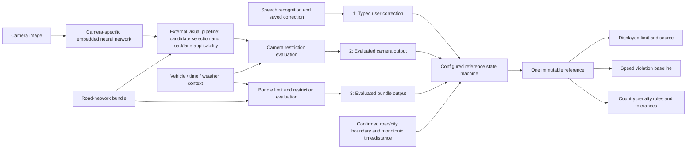

# Applicable speed-limit reference — runtime policy 1.0.0

The [versioned JSON](../../shared/speed-limit-reference/policy-v1.0.0.json) is a
**deterministic extended finite-state machine (EFSM)**. Both apps load its exact
packaged bytes, interpret its transition table, selection order and limits, and
use its selected reference for the displayed limit and overspeed/penalty baseline.
There is no in-app state-machine viewer or editor. This document and the diagrams
are development/configuration artifacts.

The [implementation snapshot](../../shared/speed-limit-reference/current-v0.1.0.json)
records behavior **before this change**, at source `99d62f2`, including the gaps
established in the 26 September iPhone/Android investigation. It is descriptive,
not a second selectable runtime policy.

The owner explicitly selected **5 km or five minutes, whichever occurs first**,
required explicit owner commands for policy changes, and clarified that camera
candidate selection/applicability belong to an external visual pipeline.

## System boundary and extensible inputs



The state machine does **not** select neural-network candidates, interpret image
position/confidence, construct exit topology, or decide which lane a sign serves.
Those decisions belong to the visual pipeline. A highly confident sign for an
exit lane must be removed there before it becomes an applicable camera input.
Pipeline repairs from finding F1 remain separate from this arbitration change.

Camera and bundle inputs carry an applicability envelope:

```json
{
  "status": "applicable",
  "context_revision": 3,
  "conditions": {
    "operator": "and",
    "operands": [
      {"kind": "vehicle_class", "parameters": ["passenger_car"], "result": "satisfied"},
      {"kind": "time_window", "parameters": {"start": "06:00", "end": "22:00"}, "result": "satisfied"}
    ]
  }
}
```

`conditions` is an opaque, extensible restriction expression, with room for
vehicle classes, schedules, rain/wet-road conditions and future types. The
producer evaluates AND/OR structure and reports **applicable, inapplicable or
unresolved**. The machine only admits `applicable` for its current evaluation
revision. Unsupported restrictions or missing vehicle/time/weather information
must result in `unresolved`, never an unconditional limit. Missing detections are
not proof that no restriction exists.

Currently the adapters forward the existing pipeline's accepted, interpreted
outputs and the bundle resolver's values with an unconditional envelope. The
runtime APIs also accept an evaluated envelope. Future condition-aware producers
must supply that envelope rather than use the unconditional adapter default.
This change does not add vehicle-class recognition, rain sensing or scheduling.

Before changing evaluated applicability of retained evidence, issue
`applicability_context_changed(next_revision)`. It invalidates camera/enclosing
camera/bundle authority while preserving an ordinary explicit voice correction.
Producers re-evaluate and emit outputs with the new revision. Ordinary camera
observations retain their original time/distance, so a weather change or a new
interpretation cannot renew an old sign's lifetime. Old-revision results are
withheld, even if their asynchronous computation finishes later.

## Formal state and output

Let `S = (V,C,E,B,L,g,a,p,h,seen,origins,t,d,session,seq)`.

| Register | Meaning |
|---|---|
| `V` | Saved, active user correction |
| `C` | Ordinary applicable camera assertion |
| `E` | Independently verified enclosing camera zone/town rule |
| `B` | Current applicable bundle/context value |
| `L` | Last selected current value, retained only for stale display |
| `g` | Road/city scope generation |
| `a` | Applicability context revision, independent of `g` |
| `p` | Possible, unconfirmed scope change |
| `h` | Start of missing/unusable road-context gap |
| `seen` | Processed evidence IDs; camera IDs include applicability revision |
| `origins` | Immutable original time/distance for ordinary physical camera evidence |
| `t,d` | Monotonic drive seconds and cumulative validated path metres |
| `session,seq` | Drive identity and strictly increasing event order |

A claim is `(id,value,source,generation,t₀,d₀)`. Values are typed `numeric(kmh)`,
`walk` or `unlimited`; absence is `null`, never zero/unlimited.

```text
expired(x,t,d) ≡ (t − x.t₀ ≥ 300) ∨ (d − x.d₀ ≥ 5000), for x ∈ {V,C}
selected(S)    = first present(V,C,E,B,L,unknown)
current(S)     ≡ selected register ∈ {V,C,E,B}
baseline(S)    = selected kmh if current(S) and value is numeric, otherwise null
```

The persistent observable states are `VOICE`, `CAMERA`, `BUNDLE`, `LAST_KNOWN`
and `UNKNOWN`. `E` shares CAMERA priority/provenance with `C`, but is not an
ordinary claim with a distance timer. Selecting a current value updates `L`.
Reading `L` never makes it current.

The display, violation and penalty consumers use the same selected value and
source in one publication. `penalty_reference_kmh = violation_reference_kmh`;
existing country/context/tolerance rules apply afterwards. LAST_KNOWN is visibly
stale and cannot trigger overspeed warnings or penalties. Walking pace and
unlimited retain their typed presentation without an invented numeric baseline.

## Transition semantics

Each normalized event has `kind, session_id, sequence, elapsed_s, distance_m`.
Except reset/tick, it has `generation`. Evidence has a stable `id` and typed
`value`. Camera/bundle inputs additionally require the applicability envelope.
Ordinary camera evidence includes `observed_elapsed_s, observed_distance_m`;
these cannot be changed on re-evaluation. Unique physical-passage identity is
required: a new frame is not a new sign.

1. Validate without mutation: reject malformed/unknown events, nonfinite or
   decreasing progress, old sessions, nonincreasing sequence numbers and changed
   camera origins. Reset requires a new session and zero progress.
2. Advance monotonic clock/distance and expire ordinary claims. A new accepted
   observation at exactly the old deadline can establish a new claim afterwards.
3. A missing road-context gap reaching 8 seconds or 160 metres removes current
   authority. Keep last-known display memory. Repeated missing frames cannot
   renew the gap. This gap is separate from a tentative matched-road departure.
4. Evaluate JSON transitions in order; first matching event/guard wins. Apply
   its named actions in order. The wildcard makes the table total.
5. Record processed evidence identity, including withheld camera observations.
   Only a new applicability revision allows a retained camera observation to be
   re-evaluated; its original lifetime still applies.
6. Select once and emit the reference and transition/expiry reason.

| Guard | Definition |
|---|---|
| `always`, `new_session` | True after envelope validation |
| `current_generation` | Event generation equals `g` |
| `verified_current_generation` | Current generation and verified producer/context |
| `fresh_scoped_evidence` | Current generation, unprocessed ID, verified |
| `fresh_applicable_pipeline_output` | Fresh scoped evidence, applicable verdict for `a`, no voice/pending context/gap, and ordinary original lifetime still valid |
| `verified_enclosing_camera` | Pipeline-output guard plus independent area proof and zone/city scope |
| `current_verified_bundle` | Current generation, applicable verdict for `a`, verified, no pending context/gap |
| `fresh_confirmed_boundary` | Current generation, unseen ID, confirmed, permitted boundary reason |
| `new_applicability_revision` | Current generation and strictly greater applicability revision |

`accept_X` stores the typed input. Voice starts at current `t,d`; ordinary camera
uses immutable original evidence `t₀,d₀`. `clear_X` removes authority. Other
primitives increment scope or applicability revision, mark/clear pending context,
start a gap once, clear the gap, or reset every register for a new drive.
The full [JSON transition table](../../shared/speed-limit-reference/policy-v1.0.0.json)
is normative; Swift, Kotlin and the Python reference oracle interpret it.

A new voice correction replaces voice and clears ordinary/enclosing camera
claims. Camera cannot replace active voice. New bundle values refresh B beneath
higher priority. Duplicate passages, repeated map lookups and UI refreshes do
not renew ordinary lifetime. Camera evidence suppressed by voice cannot reappear
later through a local observation-store lookup.

## Confirming road/city boundaries

An explicit `camera_scope_invalidated` output withdraws existing camera authority
(for example, the pipeline masks an unresolved end). It clears camera/enclosing
camera/bundle claims while preserving active voice. An unrelated rejected
candidate is not such a withdrawal. Enclosing rule metadata is forwarded as a
typed pipeline property, rather than inferred from a numeric value.

An OSM way split alone is not a road-relation departure. The runtime adapters
use directed road identity, source relation IDs and way continuity. A different
road starts `context_pending`; a consistently matched different identity/direction
for **8 seconds** (`road_departure_confirmation_s`) confirms departure. Returning
to the original road first restores context without renewing the claim. The
Android ~6.45 s A8 → A57 ramp → A8 excursion is explicitly covered, including a
250 m excursion that must not be confused with the 160 m *missing-context* bound.
The 8-second confirmation is a conservative adapter rule, not proof of actual
lane position; improving matcher confidence/topology remains separate work.

Confirmed city entry/exit, relation departure, direction reversal or an applicable
end clears old-scope authority and advances `g`. Fresh evidence must then be
admitted for the new generation. Numeric sign priority does not make a road-scoped
voice correction survive a confirmed town boundary. Invalid/conditional/irrelevant
end candidates cannot clear the machine merely because the legacy resolver
started considering them: controller delivery must validate and apply the end.

Ordinary observation expiry is **confidence expiry, not legal cancellation**.
Enclosing zone/town rules are independently interpreted and verified by the
structural pipeline and can survive ordinary expiry. They must be re-evaluated
after a confirmed scope boundary. This model does not introduce a universal rule
that intersections cancel limits. The country-law prose in the private FINDINGS.md
is not imported as executable law; jurisdiction-specific interpretation requires
separate authoritative validation in its producer.

## Runtime integration and limits of this change

- `SpeedLimitReferenceModel` verifies the packaged approval lock and artifacts.
  Missing/mismatched policy fails closed to UNKNOWN; it does not silently select
  a built-in policy or download a replacement.
- `SpeedReferenceMachine` interprets the table and limits on both platforms.
  `SpeedReferenceRuntime` normalizes source/context inputs and preserves physical
  evidence identity/origins. Android serializes access; iPhone uses its main actor.
- The driving controllers supply saved voice, accepted visual pipeline output,
  fresh bundle values and boundary events. They accumulate validated GPS path
  distance and tick once per second, including while stopped. Invalid/jumping
  fixes are excluded from accumulated distance; elapsed-time expiry remains.
- Final publication uses the reference output, including stale fallback, before
  existing overspeed/penalty logic reads it. Screenshot fixtures remain synthetic.
- Logs include policy identity, selected source, evidence ID, transition and
  expiry reasons. Retaining Android GPS/match logs across startup remains open.
- Interior-vertex exit topology, persistent visual sign ambiguity and richer
  restriction detection remain **external pipeline/bundle work**, not implemented
  by this state machine. Real-device replay is still required before deployment.

## Visualization and validation

[states.mmd](states.mmd) is Mermaid source for GitHub/IDE Mermaid viewers.
[transitions.dot](transitions.dot) is Graphviz source, generated directly from the
runtime JSON. The transition view shows first-match guard evaluation and the
common source-selection projection; SELECT is a zero-duration projection, not a
sixth persistent state.

```sh
python3 scripts/speed_limit_reference/check.py
python3 scripts/speed_limit_reference/check.py --trace voice-ramp-excursion
python3 scripts/speed_limit_reference/diagram.py --format dot > /tmp/reference.dot
dot -Tsvg /tmp/reference.dot -o /tmp/reference.svg
```

The shared corpus covers priority, both exact expiry boundaries, missing context,
confirmed/unconfirmed boundaries, duplicate/stale inputs, unknown restrictions,
condition re-evaluation, typed unlimited/walk values, stale penalty suppression
and drive reset. Both native interpreters run the same corpus. Runtime-adapter
and controller presentation tests cover the ramp excursion and distance expiry.
Synthetic distances in model scenarios are test inputs, not reconstructed GPS
facts from the Android log.

## Version/change control

The apps read only packaged `speed-limit-reference/` bytes. Bundles, model packs,
remote configuration and driving observations cannot change policy. The owner
must explicitly command policy edits. Developers add a new version, record the
requested semantic change, update `approval-lock.json` and both compiled lock
pins, and run conformance checks. Published versions remain immutable. Changes
to interpreter semantics require the same explicit authorization.

CI verifies the artifact hashes and both native lock pins; each app also checks
those hashes at runtime. Editing both a JSON file and its adjacent manifest is
insufficient without updating the compiled pin. These are integrity/change
controls, not cryptographic proof of human approval. Normal driving events change
machine state, never the versioned policy.
