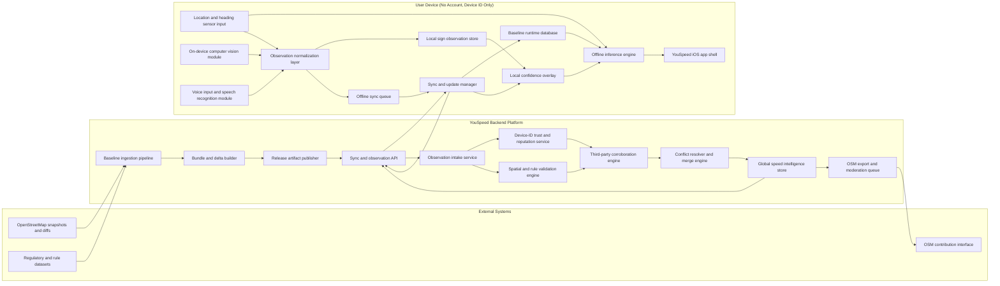

# YouSpeed High-Level Technical Architecture

This diagram captures the system components and data interactions described in `VISION.md`, including offline inference, crowdsourced observations, multi-source sync, and optional OSM feedback.

Detailed policy and UX behavior for local corrections is documented in:
- `paper/share/LOCAL_CORRECTIONS_STRATEGY.md`

Policy update: current implementation targets editor-mediated individual-contributor uploads (JOSM/Merkaartor), not direct app uploads and not centralized backend publishing.

Rendered variants for iteration:
- Full architecture PNG: `paper/share/TECHNICAL_ARCHITECTURE.png`
- Paper-scope PNG (highlighted): `paper/share/TECHNICAL_ARCHITECTURE_PAPER_SCOPE.png`

## Interaction Summary

1. External baseline data enters through ingestion, is transformed into bundle and delta artifacts, and is published for device sync.
2. The app performs offline inference from baseline runtime data plus a local confidence overlay.
3. Drivers contribute candidate observations through vision and voice; observations are normalized and stored locally first.
4. Candidate observations are synced by device ID (without user accounts) and pass trust, validation, corroboration, and merge steps before entering the global store.
5. Confirmed global intelligence flows back to devices as updates and can optionally be exported upstream to OSM through a moderated contribution path.
