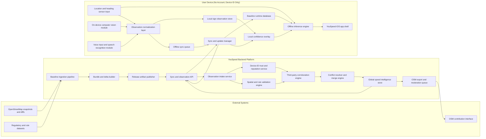

# YouSpeed High-Level Technical Architecture

This diagram captures the system components and data interactions described in `VISION.md`, including offline inference, crowdsourced observations, multi-source sync, and optional OSM feedback.

Detailed policy and UX behavior for local corrections is documented in:
- `paper/share/LOCAL_CORRECTIONS_STRATEGY.md`

Policy update: current implementation targets editor-mediated individual-contributor uploads (JOSM/Merkaartor), not direct app uploads and not centralized backend publishing.

## Current implementation status (2026-03-04)

- Production app path is local-first and offline-first: v3 bundle lookup, local overrides, editor-mediated export.
- Tunnel handling is per-fix and deterministic (`tunnel=yes` on the matched way toggles tunnel mode).
- In-city classification uses way-class precedence first (`residential`, `service`, `crossing`, `living_street`), then residential polygon containment.
- Country/region bundle routing is done by coverage bbox/poly metadata across downloaded bundles.
- The full cloud observation/corroboration stack in the diagram remains north-star architecture, not the current critical path.

Rendered variants for iteration:
- Full architecture PNG: `paper/share/TECHNICAL_ARCHITECTURE.png`
- Paper-scope PNG (highlighted): `paper/share/TECHNICAL_ARCHITECTURE_PAPER_SCOPE.png`

## Interaction Summary

1. Current critical path: external baseline data is packaged into regional v3 bundles and consumed on-device for offline inference.
2. Current critical path: local corrections are captured (voice/lock), reviewed, and exported as `.osc` for user upload in JOSM/Merkaartor.
3. Current critical path: app applies local-first overlay and bundle-based routing, then converges back through daily OSM diff ingestion.
4. Future path: optional device-observation sync, corroboration, and shared global cache layers can be activated once phase gates are met.
